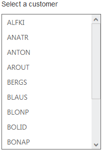
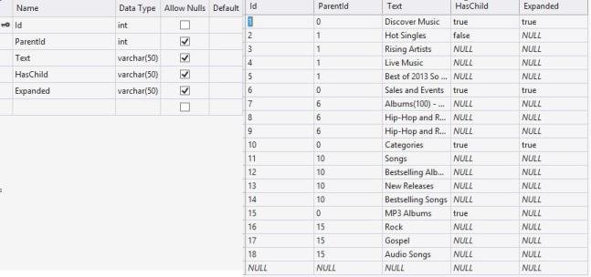
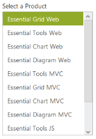

# Data-binding 

The ListBox is populated with the node information taken from a data source. The ListBox supports binding data sources containing hierarchical data and supports Object data, Remote data, XML Data, SQL Data and LinqToSql Data, for retrieving data from a specified data source.

## Data fields and configuration 

The following sub-properties provide you a way to bind either the local or remote data to the ListBox control.

<table>
<tr>
<th>
Name</th><th>
Description</th></tr>
<tr>
<td>
DataSource</td><td>
The data source contains the list of data for generating the ListBox items</td></tr>
<tr>
<td>
Query</td><td>
It specifies the query to retrieve the data from online server</td></tr>
<tr>
<td>
DataIdField</td><td>
It specifies the id of the tag</td></tr>
<tr>
<td>
DataTextField </td><td>
It specifies the text content of the tag</td></tr>
<tr>
<td>
DataValueField</td><td>
It specifies the value of the tag</td></tr>
<tr>
<td>
DataImageUrlField</td><td>
It’s defines the imageURL for the image location</td></tr>
<tr>
<td>
DataImageAttributesField</td><td>
It’s defines the image attributes such as height, width, styles and so on</td></tr>
<tr>
<td>
DataSpriteCSSField</td><td>
It defines the sprite CSS for the image tag.</td></tr>
<tr>
<td>
DataHtmlAttributesField </td><td>
It defines the html attributes such as id, class, styles for the item</td></tr>
<tr>
<td>
DataSelectedField  </td><td>
It defines the tag value to be selected initially</td></tr>
<tr>
<td>
ToolTipText</td><td>
It specifies the Tooltip text  of the tag</td></tr>
<tr>
<td>
DataTableNameField</td><td>
It defines the table name for tag value or display text while render with remote data</td></tr>
</table>

## Object Data

ListBox provides ObjectDataSource data binding support to populate ListBox. Therefore, the values can be mapped to the ListBox fields from an existing ObjectDataSource by using DataSourceID property.

The following steps explain the ObjectDataSource data binding to ListBox.

Define an ObjectDataSource in the web page and configure the data source elements. 



        protected void Page_Load(object sender, EventArgs e)

        {

listboxsample.DataSource = GetData();

        }

        private List<Languages> GetData()

        {

            List<Languages> data = new List<Languages>();

            data.Add(new Languages() { Name = "ASP.NET" });

            data.Add(new Languages() { Name = "ActionScript" });

            data.Add(new Languages() { Name = "Basic" });

            data.Add(new Languages() { Name = "C++" });

            data.Add(new Languages() { Name = "C#" });

            data.Add(new Languages() { Name = "dBase" });

            data.Add(new Languages() { Name = "Delphi" });

            data.Add(new Languages() { Name = "ESPOL" });

            data.Add(new Languages() { Name = "F#" });

            data.Add(new Languages() { Name = "FoxPro" });

            data.Add(new Languages() { Name = "Java" });

            data.Add(new Languages() { Name = "J#" });

            data.Add(new Languages() { Name = "Lisp" });

            data.Add(new Languages() { Name = "Logo" });

            data.Add(new Languages() { Name = "PHP" });

            return data;

        }

        public class Languages

        {

            public string Name;

        }



In the Design page, assign the values for DataTextField, DataValueField. In DataSourceID field assign the ID of the existing ObjectDataSource.



    

        Select a skill

    <ej:listbox id="listboxsample" runat="server" DataTextField="Name" DataValueField="Name"  Width="240"></ej:listbox>



The following screenshot is the output for ListBox control with ObjectDataSource data binding.

 

## Remote data 

You can bind the data for the ListBox from remote that can fetch the data from remote web service. You can pass the query string to filter the data that helps to avoid the extensive properties look up by using Query options. 

The following steps explain you the details of data binding from remote. 

In an ASPX page, add an element to configure ListBox.



    

        Select a customer

    <ej:listbox id="listboxsample" DataTextField="CustomerID"  runat="server" Width="240"></ej:listbox>





        protected void Page_Load(object sender, EventArgs e)

        {

listboxsample.DataSource = "http://mvc.syncfusion.com/Services/Northwnd.svc/";

            listboxsample.Query = "ej.Query().from('Customers').take(14)";

        }



Output of the above steps.

 

 

## SQL Data

ListBox provides extensive data binding support to populate ListBox nodes. Therefore the values can be mapped to the ListBox fields from an existing SQL data source by using DataSourceID property.

The following steps explain SQL data binding to ListBox.

Define an SQL data source in the web page and configure the data source as per your requirement. Use the following code example to create an SQL data table.

The following screenshot illustrates the sample database used.

 

In the Design page, assign the values for DataTextField, DataValueField. In DataSourceID field assign the ID of the existing SQL data source.



    

        Select a Transport

    

    <ej:listbox id="DrpDwnsql" runat="server" DataTextField="text" DataValueField="id"  DataSourceId="SqlDataSource1"></ej:listbox>

<asp:SqlDataSource ID="SqlDataSource1" runat="server" SelectCommand="SELECT * FROM [Vehicle]"  ConnectionString='<%$ ConnectionStrings:Linq_To_SQLConnectionString %>' ProviderName='<%$ ConnectionStrings:Linq_To_SQLConnectionString.ProviderName %>'>

</asp:SqlDataSource>



The following screenshot is the output for ListBox control with SQLdata binding.

 

## LinqToSQL Data

ListBox provides data binding support. Thus, you can bind the data from LinqToSQLData source. To achieve this, map the corresponding fields with their column names.

And also, provide support to add and customize the list item by using the appropriate data fields. 

The following steps explain you the details of data binding with ListBox. 

Define a Linq-to-SQL data source in the web page and configure the data source as per your requirement by using the database. In the following code example, an SQL table is used to create a DBML class.

The following screenshot illustrates the sample database used.

 

In the Design page, assign values for DataTextField, DataValueField. In DataSourceID field assign the ID of the existing Linq-to-SQL data source.



    

        Select an Album

    <ej:listbox id="DrpDwnsql" runat="server" DataTextField="Text" DataValueField="Id" DataSourceId="LinqDataSource1"></ej:listbox>

<asp:LinqDataSource ID="LinqDataSource1" runat="server" ContextTypeName="WebSampleBrowser.database.Linq_Common_DataDataContext"

    EntityTypeName="" TableName="Databindings"></asp:LinqDataSource>



Output of the above steps

## XML Data

ListBox provides XML data binding support to populate ListBox content. Therefore, the values can be mapped to the ListBox fields from an existing XML data by using DataSourceID property.

The following steps explain the XML data binding to ListBox.

In the Design page, assign the values for DataTextField, DataValueField. In DataSourceID field assign the ID of the existing XML datasource. 



    

        Select a Product

    <ej:listbox id="DrpDwnxml" DataMember="RootItem" DataTextField="Text" DataValueField="Text" runat="server" DataSourceId="XmlDataSource1" > </ej:listbox>

<asp:XmlDataSource ID="XmlDataSource1" runat="server" DataFile="~/App_Data/ListBoxXml.xml">

</asp:XmlDataSource>



Load the ListBox - xml data as follows.



<?xml version="1.0" encoding="utf-8" ?>

<items>

  <RootItem Text="Essential Grid Web" Expanded="True" Url="#">

    <Item Text="Binary Price : $595.00" Url="#"></Item>

    <Item Text="Source Price : $995.00" Url="#"></Item>

  </RootItem>

  <RootItem Text="Essential Tools Web" Expanded="True" Url="#">

    <Item Text="Binary Price : $495.00" Url="#"></Item>

    <Item Text="Source Price : $895.00" Url="#"></Item>

  </RootItem>

  <RootItem Text="Essential Chart Web" Url="#">

    <Item Text="Binary Price : $495.00" Url="#"></Item>

    <Item Text="Source Price : $895.00" Url="#"></Item>

  </RootItem>

  <RootItem Text="Essential Diagram Web" Url="#">

    <Item Text="Binary Price : $495.00" Url="#"></Item>

    <Item Text="Source Price : $895.00" Url="#"></Item>

  </RootItem>

  <RootItem Text="Essential Tools MVC" Url="#">

    <Item Text="Binary Price : $495.00" Url="#"></Item>

    <Item Text="Source Price : $895.00" Url="#"></Item>

  </RootItem>

  <RootItem Text="Essential Grid MVC" Url="#">

    <Item Text="Binary Price : $495.00" Url="#"></Item>

    <Item Text="Source Price : $895.00" Url="#"></Item>

  </RootItem>

  <RootItem Text="Essential Chart MVC" Url="#">

    <Item Text="Binary Price : $495.00" Url="#"></Item>

    <Item Text="Source Price : $895.00" Url="#"></Item>

  </RootItem>

  <RootItem Text="Essential Diagram MVC" Url="#">

    <Item Text="Binary Price : $495.00" Url="#"></Item>

    <Item Text="Source Price : $895.00" Url="#"></Item>

  </RootItem>

  <RootItem Text="Essential Tools JS" Url="#">

    <Item Text="Binary Price : $495.00" Url="#"></Item>

    <Item Text="Source Price : $895.00" Url="#"></Item>

  </RootItem>

  <RootItem Text="Essential Grid JS" Url="#">

    <Item Text="Binary Price : $495.00" Url="#"></Item>

    <Item Text="Source Price : $895.00" Url="#"></Item>

  </RootItem>

  <RootItem Text="Essential Chart JS" Url="#">

    <Item Text="Binary Price : $495.00" Url="#"></Item>

    <Item Text="Source Price : $895.00" Url="#"></Item>

  </RootItem>

  <RootItem Text="Essential Diagram JS" Url="#">

    <Item Text="Binary Price : $495.00" Url="#"></Item>

    <Item Text="Source Price : $895.00" Url="#"></Item>

  </RootItem>

</items>



The following screenshot is the output for ListBox control with XMLdata binding. 

