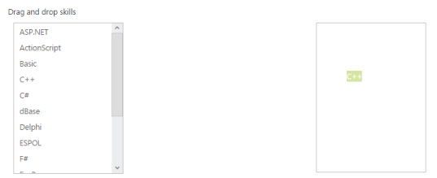

# Drag and Drop Support

ListBox widget provides the Drag and Drop support. A list item can be dragged from a ListBox control and can be dropped in any droppable element. To enable Drag and Drop support, set the AllowDragAndDropproperty as true. In control, enable the AllowDragAndDropproperty where you want to drop list Item.

The following steps explains you the behaviour of template support with ListBox.

In an ASPX page, add an elementto configure ListBox.



    

        Drag and drop skills

    

        <ej:listbox id="listboxsample" DataTextField="Name"  AllowDragAndDrop="true" runat="server" Width="240"></ej:listbox>

    

    

        <ej:listbox id="draganddrop" AllowDragAndDrop="true" runat="server" Width="240"></ej:listbox>

    





        protected void Page_Load(object sender, EventArgs e)

        {

            listboxsample.DataSource = GetData();

        }

        private List<Languages> GetData()

        {

            List<Languages> data = new List<Languages>();

            data.Add(new Languages() { Name = "ASP.NET" });

            data.Add(new Languages() { Name = "ActionScript" });

            data.Add(new Languages() { Name = "Basic" });

            data.Add(new Languages() { Name = "C++" });

            data.Add(new Languages() { Name = "C#" });

            data.Add(new Languages() { Name = "dBase" });

            data.Add(new Languages() { Name = "Delphi" });

            data.Add(new Languages() { Name = "ESPOL" });

            data.Add(new Languages() { Name = "F#" });

            data.Add(new Languages() { Name = "FoxPro" });

            data.Add(new Languages() { Name = "Java" });

            data.Add(new Languages() { Name = "J#" });

            data.Add(new Languages() { Name = "Lisp" });

            data.Add(new Languages() { Name = "Logo" });

            data.Add(new Languages() { Name = "PHP" });

            return data;

        }

        public class Languages

        {

            public string Name;

        }



Add the following class in CSS. 



    .control {

        margin-left: 20px;

    }

    .ctrllabel {

        padding-bottom: 3px;

    }

    .control2 {

        padding-left: 350px;

    }



Output of the above steps.

 

