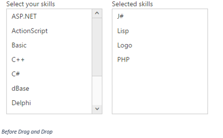
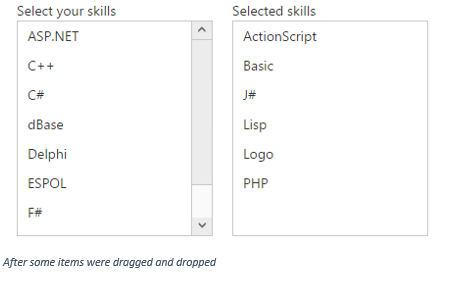
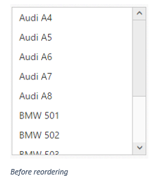
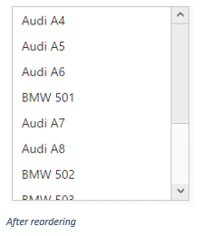

# Drag and Drop in ASP.NET Webforms ListBox

A list item can be moved from a widget to another ListBox widget. Also the order of list items can be changed. This can be achieved using the drag and drop support.

## Transferring a ListBox data to another ListBox

In some scenarios we might want to transfer a ListBox data to another ListBox. In the below steps we will see how to move skills from a ListBox widget to another.

Enable the drag and drop support through “AllowDrag” and “AllowDrop” properties.




        
Select your skills 

        <ej:ListBox ID="listbox1" runat="server" AllowDrag="true" ></ej:ListBox>
    

    

        
Selected skills 

        <ej:ListBox ID="listbox2" runat="server" AllowDrop="true"></ej:ListBox>
    

        





public partial class AllowDrag : System.Web.UI.Page

    {

        protected void Page_Load(object sender, EventArgs e)

        {

            List<Skills> data = new List<Skills>();

            List<SelectedSkills> selectedData = new List<SelectedSkills>();

            data.Add(new Skills() { Name = "ASP.NET" });

            data.Add(new Skills() { Name = "ActionScript" });

            data.Add(new Skills() { Name = "Basic" });

            data.Add(new Skills() { Name = "C++" });

            data.Add(new Skills() { Name = "C#" });

            data.Add(new Skills() { Name = "dBase" });

            data.Add(new Skills() { Name = "Delphi" });

            data.Add(new Skills() { Name = "ESPOL" });

            data.Add(new Skills() { Name = "F#" });

            data.Add(new Skills() { Name = "FoxPro" });

            data.Add(new Skills() { Name = "Java" });

            selectedData.Add(new SelectedSkills() { Name = "J#" });

            selectedData.Add(new SelectedSkills() { Name = "Lisp" });

            selectedData.Add(new SelectedSkills() { Name = "Logo" });

            selectedData.Add(new SelectedSkills() { Name = "PHP" });

            listbox1.DataSource = data;

            listbox2.DataSource = selectedData;

        }

    }

    public class Skills

    {

        public string Name;

    }

    public class SelectedSkills

    {

        public string Name;

    }




N> In the above example we have restricted “listbox1” as draggable element and the “listbox2” as droppable element. In this case we can’t drag an item from “listbox2” to “listbox1”. If we want to achieve two way drag and drop, we need to enable both AllowDrag and AllowDrop properties in both ListBox widgets configuration.

 
 
 

## Dynamically set data source on drag and drop

While moving the specific item from a ListBox to another only the DOM will be updated. We need to update the data source manually. So for this, we can use “ItemDrop” event to update the Datasource of the second ListBox widget based on the dropped items.

Both the ListBox widgets are bound to a remote data source.




        
Select your skills 

        <ej:ListBox ID="skills" runat="server" AllowDrag="true" ></ej:ListBox>
    

    

        
Selected skills 

        <ej:ListBox ID="selectedSkills" runat="server" AllowDrop="true"></ej:ListBox>
    

    
    





protected void Page_Load(object sender, EventArgs e)

        {

            skills.DataSource = "http://mvc.syncfusion.com/Services/Northwnd.svc/Orders";

            skills.Query = "ej.Query().take(10)";

            skills.AllowDrag = true;

            skills.DataTextField = "OrderID";

            selectedSkills.DataSource = "http://mvc.syncfusion.com/Services/Northwnd.svc/Orders";

            selectedSkills.Query = "ej.Query().take(10)";

            selectedSkills.AllowDrop = true;

            selectedSkills.DataTextField = "CustomerID";

            selectedSkills.ClientSideOnItemDrop = "itemDropped";

        }




In the “ClientSideOnItemDrop” event, we can implement “itemDropped” function to update the datasource of the second ListBox widget. The “ClientSideOnItemDrop” event’s argument contains the details of the dropped item.

## Reordering

Item reordering can be done within a ListBox widget by enabling both “AllowDrag” and “AllowDrop” properties.



<ej:ListBox ID="ListBox" runat="server" AllowDrag="true" AllowDrop="true">
        <Items>
            <ej:ListBoxItems Text="Audi A4"></ej:ListBoxItems>
            <ej:ListBoxItems Text="Audi A5"></ej:ListBoxItems>
            <ej:ListBoxItems Text="Audi A6"></ej:ListBoxItems>
            <ej:ListBoxItems Text="Audi A7"></ej:ListBoxItems>
            <ej:ListBoxItems Text="Audi A8"></ej:ListBoxItems>
            <ej:ListBoxItems Text="BMW 501"></ej:ListBoxItems>
            <ej:ListBoxItems Text="BMW 502"></ej:ListBoxItems>
            <ej:ListBoxItems Text="BMW 503"></ej:ListBoxItems>
            <ej:ListBoxItems Text="Batch"></ej:ListBoxItems>
            <ej:ListBoxItems Text="BMW 507"></ej:ListBoxItems>
        </Items>
    </ej:ListBox>



N> The item reordering can be done dynamically without mouse interaction. For that we have provided two APIs namely “[moveUp](http://help.syncfusion.com/js/api/ejlistbox)” and “[moveDown](http://help.syncfusion.com/js/api/ejlistbox)”.

