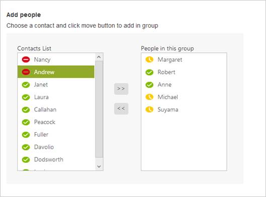
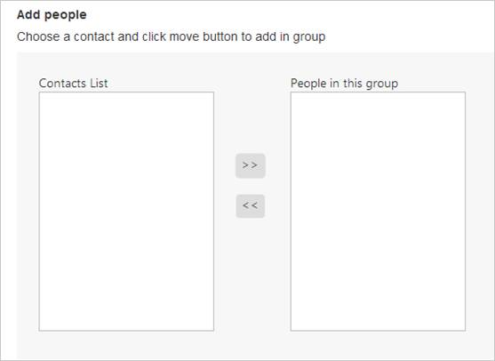
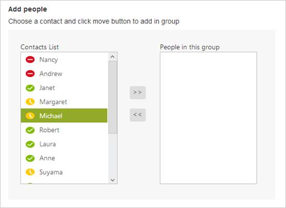
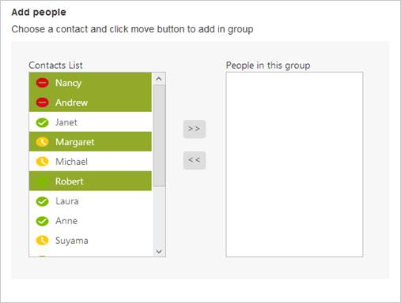

# Getting Started

This section explains briefly on how to create a ListBox control in your application.

Create your first ListBox in ASP.NET

Here you can learn how to customize ListBox in Contact Selection tool. This allows you to display the list of contacts, to select and move them to the next ListBox that has the selected items. The following example illustrates simulator of Group Creation tool like Skype messenger.

The following screenshot demonstrates the functionality of ListBox with Multi-Selection and Drag and Drop features.

In the above screenshot, you can select a list item from the first ListBox widget. After you select the item, you can move the selected item to the second ListBox widget. 

## Create ListBox Widget

Essential ASP.NET ListBox widget renders with built-in features.

The following steps are used to create ListBox control.  

You can create a WEB Project and add necessary Dll and script with the help of the given [ASP-Getting Started Documentation.](http://help.syncfusion.com/aspnet/listbox/getting-started)
Add the following code to the corresponding ASPX page to render the ListBox.



    <h5><b>Add people</b></h5>

    <h5>Choose a contact and click move button to add in group </h5>

    

        

            Contacts List

            <ej:listbox id="select" runat="server"></ej:listbox>

        

        

            <ej:button id="Add" runat="server" type="Button" text=">>" size="Normal" ShowRoundedCorner="true"></ej:button>

             

             

            <ej:button id="Remove" runat="server" type="Button" text="<<" size="Normal" ShowRoundedCorner="true"></ej:button>

        

        

            People in this group

              <ej:listbox id="selecteditems" runat="server"> </ej:listbox>

        

    



Add the following style section to the corresponding ASPX page for ListBox widgets alignment.



    #control {

        height: 300px;

        width: 500px;

        padding: 25px;

        background-color: #f7f7f7;

        display: flex;

    }

    #sample {

        height: 472px;

        width: 600px;

    }

    #selecteditems_container {

        float: right;

    }

    #select_container {

        float: left;

    }

    .middlebuttons {

        padding: 91px 25px 25px 25px;

    }

    #container1, #container2 {

        width: 200px;

    }

    img {

        padding-right: 10px;

        padding-top: 3px;

        width: 18px;

        height: 15px;

    }



Run the above code to render the resultant output.

### Configure ListBox with Items

To populate items inside ListBox, add the list items inside &lt;ul&gt; as &lt;li&gt;&lt;/li&gt; elements. Include the following &lt;li&gt; elements in your sample.



    <h5><b>Add people</b></h5>

    <h5>Choose a contact and click move button to add in group </h5>

    

        

            Contacts List

            <ej:listbox id="select" runat="server" targetid="icon">  </ej:listbox>

            <ul id="icon">

                <li>

                    Nancy

                </li>

                <li>

                    Andrew

                </li>

                <li>

                    Janet

                </li>

                <li>

                    Margaret

                </li>

                <li>

                    Michael

                </li>

                <li>

                    Robert

                </li>

                <li>

                    Laura

                </li>

                <li>

                    Anne

                </li>

                <li>

                    Suyama

                </li>

                <li>

                    Callahan

                </li>

                <li>

                    Peacock

                </li>

                <li>

                    Fuller

                </li>

                <li>

                    Davolio

                </li>

                <li>

                    Dodsworth

                </li>

                <li>

                    Louis

                </li>

            </ul>

        

        

            <ej:button id="Add" runat="server" type="Button" text=">>" size="Normal" ShowRoundedCorner="true"></ej:button>

             

             

            <ej:button id="Remove" runat="server" type="Button" text="<<" size="Normal" ShowRoundedCorner="true"></ej:button>

        

        

            People in this group

                      <ej:listbox id="selecteditems" runat="server"> </ej:listbox>

        

    

 



Run the above code to render ListBox. ListBox with Contact list items is displayed as follows.

### Enable Drag and Drop

You can drag an item from a ListBox and drop it in droppable element.To drag and drop a list item across controls or within a control, set the AllowDragAndDrop property as “True”. 



<ej:listbox id="select" runat="server" targetid="icon" AllowDragandDrop="true">  </ej:listbox>

<ej:listbox id="selecteditems" AllowDragAndDrop="true" runat="server"> </ej:listbox>



Run the above code example to render the following ListBox with Drag and drop feature. ListBox with Drag and Drop list items across controls is as follows.

### Enable Multiple Selection 

You can select multiple list items simultaneously in ListBox control, and move the multiple, selected items to the selection ListBox. To select multiple items in a ListBox, set the AllowMultiSelection property for the ListBox as “True”.



<ej:listbox id="select" runat="server" targetid="icon" AllowDragAndDrop="true" AllowMultiSelection="true">  </ej:listbox>

<ej:listbox id="selecteditems" AllowDragAndDrop="true" AllowMultiSelection="true" runat="server"> </ej:listbox>



Run the above code example to render the following ListBox with Multiple selection feature. ListBox control with Multiple Selection of list items is displayed as follows.

### Add items to a Second ListBox

You have to move the selected list items to the second ListBox by using addItem(value) method and remove existing item in the first ListBox by using removeItem() method.

The following code example explains how to add an item to a second ListBox.

Add the following code to the corresponding ASPX page to render ListBox.



    <h5><b>Add people</b></h5>

    <h5>Choose a contact and click move button to add in group </h5>

    

        

            Contacts List

            <ej:listbox id="select" runat="server" targetid="icon" AllowDragAndDrop="true" AllowMultiSelection="true">  </ej:listbox>

            <ul id="icon">

                <li>

                    Nancy

                </li>

                <li>

                    Andrew

                </li>

                <li>

                    Janet

                </li>

                <li>

                    Margaret

                </li>

                <li>

                    Michael

                </li>

                <li>

                    Robert

                </li>

                <li>

                    Laura

                </li>

                <li>

                    Anne

                </li>

                <li>

                    Suyama

                </li>

                <li>

                    Callahan

                </li>

                <li>

                    Peacock

                </li>

                <li>

                    Fuller

                </li>

                <li>

                    Davolio

                </li>

                <li>

                    Dodsworth

                </li>

                <li>

                    Louis

                </li>

            </ul>

        

        

            <ej:button id="Add" runat="server" type="Button" text=">>" size="Normal" ShowRoundedCorner="true" ClientSideOnClick="add"></ej:button>

             

             

            <ej:button id="Remove" runat="server" type="Button" text="<<" size="Normal" ShowRoundedCorner="true" ClientSideOnClick="remove"></ej:button>

        

        

            People in this group

                              <ej:listbox id="selecteditems" AllowDragAndDrop="true" AllowMultiSelection="true" runat="server"> </ej:listbox>

        

    



Add the mentioned code to the corresponding ASPX page to add an item to a secondListBox.



    function add(e) {

        var firstListBox = $('#select').data("ejListBox");

        var selecteditems = firstListBox.getSelectedItems();

        var len = selecteditems.length;

        for (i = 0; i < len; i++) {

            var value = $(selecteditems[i]).html();

            selecteditems[i].remove();

            var target = $('#selecteditems').data("ejListBox");

            target.addItem(value);

        }

    }

    function remove(e) {

        var firstListBox = $('#selecteditems').data("ejListBox");

        var selecteditem = firstListBox.getSelectedItems();

        var len = selecteditem.length;

        for (i = 0; i < len; i++) {

            var value = $(selecteditems[i]).html();

            selecteditem[i].remove();

            var target = $('#select').data("ejListBox");

            target.addItem(value);

        }

    }



Add the following style section to the corresponding ASPX page for ListBox widgets alignment.



    #control {

        height: 300px;

        width: 500px;

        padding: 25px;

        background-color: #f7f7f7;

        display: flex;

    }

    #sample {

        height: 472px;

        width: 600px;

    }

    #selecteditems_container {

        float: right;

    }

    #select_container {

        float: left;

    }

    .middlebuttons {

        padding: 91px 25px 25px 25px;

    }

    #container1, #container2 {

        width: 200px;

    }

    img {

        padding-right: 10px;

        padding-top: 3px;

        width: 18px;

        height: 15px;

    }



Run this code and you can see the output. Selected items from the first ListBox is moved to Second ListBox by using addItem() and removeItem() method and it is displayed in the following screenshot.

