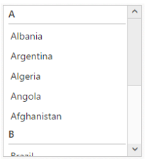

# Grouping

ListBox items can be grouped by providing a heading (header) for each set of items.
 
The grouped ListBox is created via data binding which is explained below. The data items can be categorized by using a specific field in the ListBox widget.

The grouping will be defined based on the “GroupBy” property in fields object.

In design page set the DataGroupBy property to group the list items. In the code behind create the data source and assign it as below.




        <ej:ListBox ID="country" runat="server" DataGroupBy="Category"></ej:ListBox>
    





 protected void Page_Load(object sender, EventArgs e)
        {

            List<Countries> countries = new List<Countries>();

            countries.Add(new Countries { Text = "Albania", Category = "A" });
            countries.Add(new Countries { Text = "Argentina", Category = "A" });
            countries.Add(new Countries { Text = "Algeria", Category = "A" });
            countries.Add(new Countries { Text = "Angola", Category = "A" });
            countries.Add(new Countries { Text = "Afghanistan", Category = "A" });
            countries.Add(new Countries { Text = "Bahrain", Category = "B" });
            countries.Add(new Countries { Text = "Brazil", Category = "B" });
            countries.Add(new Countries { Text = "Bangladesh", Category = "B" });
            countries.Add(new Countries { Text = "Burma", Category = "B" });
            countries.Add(new Countries { Text = "Barbados", Category = "B" });
            countries.Add(new Countries { Text = "Botswana", Category = "B" });
            countries.Add(new Countries { Text = "Belarus", Category = "B" });
            countries.Add(new Countries { Text = "Bolivia", Category = "B" });
            country.DataSource = countries;
        }

        public class Countries
        {
            public string Text { get; set; }
            public string Category { get; set; }
        }




