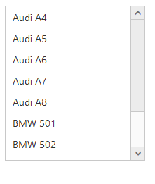

# Keyboard interaction

You can use Keyboard shortcut keys as an alternative to the mouse on using ListBox widget. ListBox Widget allows you to perform all kind of actions by using keyboard shortcuts.

<table>
<tr>
<th>
Shortcut Key</th><th>
Description</th></tr>
<tr>
<td>
Access key + j</td><td>
Focuses into the ListBox text box</td></tr>
<tr>
<td>
Up</td><td>
Moves to previous item in the ListBox</td></tr>
<tr>
<td>
Down</td><td>
Moves to next item in the ListBox</td></tr>
<tr>
<td>
Enter</td><td>
Selects the focused item</td></tr>
<tr>
<td>
Left </td><td>
Moves to previous item in the ListBox</td></tr>
<tr>
<td>
Right </td><td>
Moves to next item in the ListBox</td></tr>
<tr>
<td>
Home</td><td>
Navigates to the starting item </td></tr>
<tr>
<td>
End</td><td>
Navigates to the end item </td></tr>
</table>

### Configure keyboard interaction

The following steps explain you to enable keyboard interaction for a ListBox.

In an ASPX page, add an elementto configure ListBox widget and enable keyboard interaction by setting the accesskey property.



    

        Select a skill

    <ej:listbox id="listboxsample" runat="server" DataTextField="Name"></ej:listbox>





        protected void Page_Load(object sender, EventArgs e)

        {

            listboxsample.DataSource = GetData();

        }

        private List<Languages> GetData()

        {

            List<Languages> data = new List<Languages>();

            data.Add(new Languages() { Name = "ASP.NET" });

            data.Add(new Languages() { Name = "ActionScript" });

            data.Add(new Languages() { Name = "Basic" });

            data.Add(new Languages() { Name = "C++" });

            data.Add(new Languages() { Name = "C#" });

            data.Add(new Languages() { Name = "dBase" });

            data.Add(new Languages() { Name = "Delphi" });

            data.Add(new Languages() { Name = "ESPOL" });

            data.Add(new Languages() { Name = "F#" });

            data.Add(new Languages() { Name = "FoxPro" });

            data.Add(new Languages() { Name = "Java" });

            data.Add(new Languages() { Name = "J#" });

            data.Add(new Languages() { Name = "Lisp" });

            data.Add(new Languages() { Name = "Logo" });

            data.Add(new Languages() { Name = "PHP" });

            return data;

        }

        public class Languages

        {

            public string Name;

        }





$(function () {

        $(document).on("keydown", function (e) {

            if (e.altKey && e.keyCode === 74) { // j- key code.

                var target = $('#<%=listboxSample.ClientID%>').data("ejListBox");

                target.selectItemByIndex(1);

                $("#<%=listboxSample.ClientID%>" + "_container").focus();

            }

        });

    });



Run the sample, press Alt + J to focus in the ListBox widget that enables it and you can navigate by using arrow keys.

 

