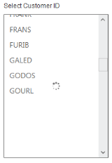

# Load-on-Demand support 

ListBox widget provides the Load-onDemand support, when binding the remote data for the ListBox. It loads partially, only a set of data from remote server loaded initially, and imports data further upon loading. To enable Load-onDemand support, set the EnableLoadOnDemand property as true. You can set ItemsCount that specifies number of items in the ListBox. You can load any number of items upon request with ItemRequest ClientSide Event.

The following steps explain you the behaviour of Load-onDemand support in ListBox.

In an ASPX page, add an element to configure ListBox.



    

        Select Customer ID

    

        <ej:listbox id="listboxsample" DataTextField="CustomerID"  ClientSideOnItemRequest="itemRequested" EnableLoadOnDemand="true"

ItemsCount="91" runat="server">

 </ej:listbox>

    





        protected void Page_Load(object sender, EventArgs e)

        {

            this.listboxsample.DataSource = "http://mvc.syncfusion.com/Services/Northwnd.svc/";

            this.listboxsample.Query = "ej.Query().from('Customers')";    

        }





function itemRequested(args) {

        var target = $("#<%=listboxsample.ClientID%>").data("ejListBox");

        target.model.query = ej.Query().from("Customers").range(args.start, args.start + 20);

        this.model.itemsCount = 20; //to load 20 items

    }



Output of the above steps.

 

