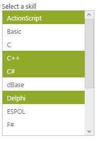
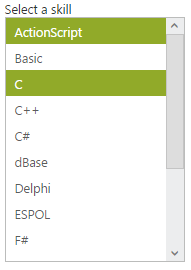

# Multiple Selection

## Allow multiple selections

ListBox widget allows you to select multiple values from the list Items by using AllowMultiSelection property. You can select multiple list items along with Control key and Shift key press. To select multiple values, set AllowMultiSelection value to true.

### Configuring multiple selection

The following steps explain you the configuration of the AllowMultiSelection for a ListBox.

In an ASPX page, add an element to configure ListBox.



    

        Select a skill

<ej:listbox id="listboxsample" DataTextField="Name" llowMultiSelection="true"

 runat="server" Width="240"></ej:listbox>

 





protected void Page_Load(object sender, EventArgs e)

        {

            listboxsample.DataSource = GetData();

        }

        private List<Languages> GetData()

        {

            List<Languages> data = new List<Languages>();

            data.Add(new Languages() { Name = "ASP.NET" });

            data.Add(new Languages() { Name = "ActionScript" });

            data.Add(new Languages() { Name = "Basic" });

            data.Add(new Languages() { Name = "C++" });

            data.Add(new Languages() { Name = "C#" });

            data.Add(new Languages() { Name = "dBase" });

            data.Add(new Languages() { Name = "Delphi" });

            data.Add(new Languages() { Name = "ESPOL" });

            data.Add(new Languages() { Name = "F#" });

            data.Add(new Languages() { Name = "FoxPro" });

            data.Add(new Languages() { Name = "Java" });

            data.Add(new Languages() { Name = "J#" });

            data.Add(new Languages() { Name = "Lisp" });

            data.Add(new Languages() { Name = "Logo" });

            data.Add(new Languages() { Name = "PHP" });

            return data;

        }

        public class Languages

        {

            public string Name;

        }



Output for ListBox control that provides multiple selections is as follows.

 

### Multiple selections through index 

You can select the list of items from the ListBox by using SelectedItemlist property. Its data type is array. To achieve this, set AllowMultiSelection property as true in ListBox. 

The following steps explains you the configuration of SelectedItemlist property in ListBox 

In an ASPX page, add an element to configure ListBox.



    

        Select a skill

<ej:listbox id="listboxsample" AllowMultiSelection="true" DataTextField="Name" runat="server" Width="240"></ej:listbox>

 





private List<int> indexList = new List<int>();

        protected void Page_Load(object sender, EventArgs e)

        {

            listboxsample.DataSource = GetData();

            indexList.Add(0);

            indexList.Add(3);

listboxsample.selectedItemlist = indexList;

        }

        private List<Languages> GetData()

        {

            List<Languages> data = new List<Languages>();

            data.Add(new Languages() { Name = "ActionScript" });

            data.Add(new Languages() { Name = "Basic" });

            data.Add(new Languages() { Name = "C++" });

            data.Add(new Languages() { Name = "C#" });

            data.Add(new Languages() { Name = "dBase" });

            data.Add(new Languages() { Name = "Delphi" });

            data.Add(new Languages() { Name = "ESPOL" });

            data.Add(new Languages() { Name = "F#" });

            data.Add(new Languages() { Name = "FoxPro" });

            data.Add(new Languages() { Name = "Java" });

            data.Add(new Languages() { Name = "J#" });

            data.Add(new Languages() { Name = "Lisp" });

            data.Add(new Languages() { Name = "Logo" });

            data.Add(new Languages() { Name = "PHP" });

            return data;

        }

        public class Languages

        {

            public string Name;

        }



Output of the above steps.

 

