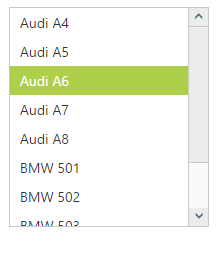
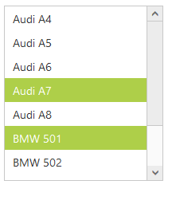
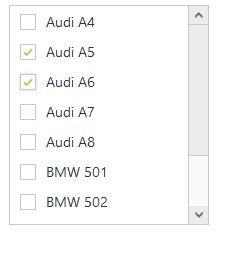

# Selection

The ListBox widget allows you to highlight the selected item. It allows multiple selection also.

## Selection on initialize	

By default, the ListBox widget allows single item selection. We can select specific item during initialization of the ListBox widget using the “SelectedIndex” property. 



       <ej:ListBox ID="ListBox" runat="server" SelectedIndex="2">
        <Items>
            <ej:ListBoxItems Text="Apache RTR"></ej:ListBoxItems>
            <ej:ListBoxItems Text="CBR 150-R"></ej:ListBoxItems>
            <ej:ListBoxItems Text="CBZ Xtreme"></ej:ListBoxItems>
            <ej:ListBoxItems Text="Discover"></ej:ListBoxItems>
            <ej:ListBoxItems Text="Dazzler"></ej:ListBoxItems>
            <ej:ListBoxItems Text="Flame"></ej:ListBoxItems>
            <ej:ListBoxItems Text="Fazer"></ej:ListBoxItems>
            <ej:ListBoxItems Text="FZ-S"></ej:ListBoxItems>
            <ej:ListBoxItems Text="Pulsar"></ej:ListBoxItems>
            <ej:ListBoxItems Text="Shine"></ej:ListBoxItems>
            <ej:ListBoxItems Text="R15"></ej:ListBoxItems>
            <ej:ListBoxItems Text="Unicorn"></ej:ListBoxItems>
        </Items>
    </ej:ListBox>



## Multiple selection

Multiple selection can be enabled using “AllowMultiSelection” property. You can select multiple list items using <kbd>“Ctrl”</kbd> and <kbd>“Shift”</kbd> keys.



<ej:ListBox ID="ListBox" runat="server" AllowMultiSelection="true">
        <Items>
            <ej:ListBoxItems Text="Audi A4"></ej:ListBoxItems>
            <ej:ListBoxItems Text="Audi A5"></ej:ListBoxItems>
            <ej:ListBoxItems Text="Audi A6"></ej:ListBoxItems>
            <ej:ListBoxItems Text="Audi A7"></ej:ListBoxItems>
            <ej:ListBoxItems Text="Audi A8"></ej:ListBoxItems>
            <ej:ListBoxItems Text="BMW 501"></ej:ListBoxItems>
            <ej:ListBoxItems Text="BMW 502"></ej:ListBoxItems>
            <ej:ListBoxItems Text="BMW 503"></ej:ListBoxItems>
            <ej:ListBoxItems Text="Batch"></ej:ListBoxItems>
            <ej:ListBoxItems Text="BMW 507"></ej:ListBoxItems>
        </Items>
    </ej:ListBox>
    


## Checkbox

The ListBox widget allows selection through checkbox. It can be enabled using “ShowCheckbox” property.
The specified items can be checked on initialize through “checkedIndices” property.

In design page add the ListBox and set the indices of the items to be checked in code behind.




<ej:ListBox ID="ListBox" runat="server">
        <Items>
            <ej:ListBoxItems Text="Audi A4"></ej:ListBoxItems>
            <ej:ListBoxItems Text="Audi A5"></ej:ListBoxItems>
            <ej:ListBoxItems Text="Audi A6"></ej:ListBoxItems>
            <ej:ListBoxItems Text="Audi A7"></ej:ListBoxItems>
            <ej:ListBoxItems Text="Audi A8"></ej:ListBoxItems>
            <ej:ListBoxItems Text="BMW 501"></ej:ListBoxItems>
            <ej:ListBoxItems Text="BMW 502"></ej:ListBoxItems>
            <ej:ListBoxItems Text="BMW 503"></ej:ListBoxItems>
            <ej:ListBoxItems Text="Batch"></ej:ListBoxItems>
            <ej:ListBoxItems Text="BMW 507"></ej:ListBoxItems>
        </Items>
    </ej:ListBox>
    




    protected void Page_Load(object sender, EventArgs e)
        {
            ListBox.ShowCheckbox = true;
            List<int> items = new List<int>();
            items.Add(1);
            items.Add(2);
            ListBox.checkedIndices = items;
        }




