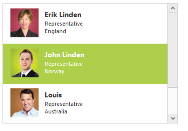

# Templates

The ListBox widget’s appearance can be customized based on different needs using templates. The desired templates can be defined using the “template” property.

In the design page set the template property and create the data source in code behind.




     <ej:ListBox ID="ListBox" runat="server" Width="350" Template='

 ${Text} 

 ${design} 

 ${country} 

'>
     </ej:ListBox>




public partial class Template : System.Web.UI.Page
        {
            protected void Page_Load(object sender, EventArgs e)
            {
                List<EmployeeSpecialists> employee = new List<EmployeeSpecialists>();
                employee.Add(new EmployeeSpecialists { Text = "Erik Linden", EmployeeImg = "3", Design = "Representative", Country = "England" });
                employee.Add(new EmployeeSpecialists { Text = "John Linden", EmployeeImg = "6", Design = "Representative", Country = "Norway" });
                employee.Add(new EmployeeSpecialists { Text = "Louis", EmployeeImg = "7", Design = "Representative", Country = "Australia" });
                employee.Add(new EmployeeSpecialists { Text = "Lawrence", EmployeeImg = "8", Design = "Representative", Country = "India" });
                selectExperts.DataSource = employee;
            }
        }
        public class EmployeeSpecialists
        {
            public string Text { get; set; }
            public string EmployeeImg { get; set; }
            public string Design { get; set; }
            public string Country { get; set; }
        }




Define the styles for the template as below.



    .image {
            margin: 0;
            padding: 3px 10px 3px 3px;
            border: 0 none;
            width: 60px;
            height: 60px;
            float: left;
        }

        .ename {
            font-weight: bold;
            padding: 6px 3px 1px 3px;
        }

        .e-design, .country {
            font-size: smaller;
            padding: 3px 3px 0px 0px;
        }



 