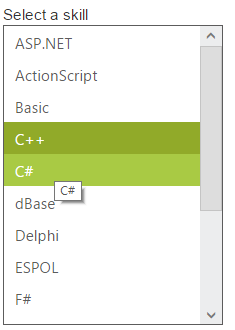

# Tooltip Support

The following steps explain you the configuration of tooltip properties in ListBox.

In an ASPX page, add an element to configure ListBox.



    

        Select a skill

    <ej:ListBox ID="listboxsample" EnableTooltip="true" runat="server" DataTextField="Value">

    </ej:ListBox>





protected void Page_Load(object sender, EventArgs e)

    {

        listboxsample.DataSource = GetData();

        listboxsample.ListBoxFields.ToolTipText = "Tooltip";

    }

    private List<ListboxData> GetData()

    {

        List<ListboxData> data = new List<ListboxData>();

        data.Add(new ListboxData() { Value = "ASP.NET", Tooltip = "ASP.NET" });

        data.Add(new ListboxData() { Value = "ActionScript", Tooltip = "ActionScript" });

        data.Add(new ListboxData() { Value = "Basic", Tooltip = "Basic" });

        data.Add(new ListboxData() { Value = "C++", Tooltip = "C++" });

        data.Add(new ListboxData() { Value = "C#", Tooltip = "C#" });

        data.Add(new ListboxData() { Value = "dBase", Tooltip = "dBase" });

        data.Add(new ListboxData() { Value = "Delphi", Tooltip = "Delphi" });

        data.Add(new ListboxData() { Value = "ESPOL", Tooltip = "ESPOL" });

        data.Add(new ListboxData() { Value = "F#", Tooltip = "F#" });

        data.Add(new ListboxData() { Value = "FoxPro", Tooltip = "FoxPro" });

        data.Add(new ListboxData() { Value = "Java", Tooltip = "Java" });

        data.Add(new ListboxData() { Value = "J#", Tooltip = "J#" });

        data.Add(new ListboxData() { Value = "Lisp", Tooltip = "Lisp" });

        data.Add(new ListboxData() { Value = "Logo", Tooltip = "Logo" });

        data.Add(new ListboxData() { Value = "PHP", Tooltip = "PHP" });

        return data;

    }

    class ListboxData

    {

        public string Value, Tooltip;

    }



Output of the above steps.

