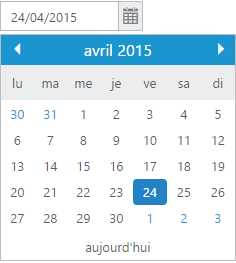
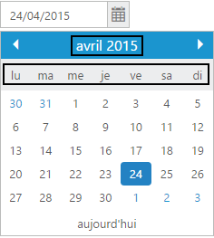
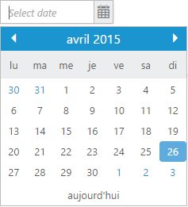
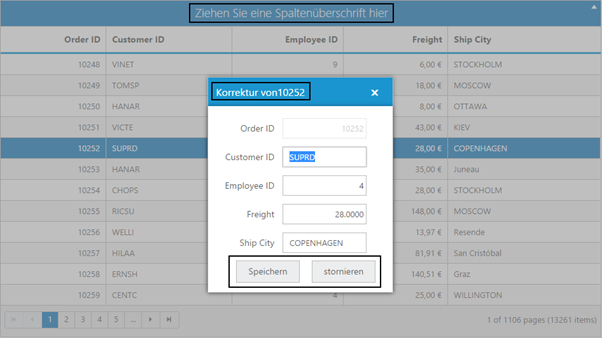

# Localization

In general, Localization is a term that defines the translation of any product or components to suit the different languages or cultures followed in various countries. It mainly emphasis on the process of translating the product to make it adaptive to the native or local cultural needs of a specific region in the world. All our Syncfusion Components has been provided with the built-in Localization support, so that it will be able to adapt based on the culture-specific locale defined for it. The en-US locale is currently being used in all the Syncfusion components by default.

If you need to make the Syncfusion components to follow a user-specified culture, then you need to define the locale property of it with a particular culture code declared by JQuery globalize script. 

For example, you can see our Syncfusion DatePicker control localized in fr-FR culture as shown below,

To localize any of our Syncfusion components into a particular culture, it is necessary to refer the below specified scripts in your application,

1. jquery.globalize.min.js (Mandatory for processing specific source-side actions globally)
2. Other culture-specific script files, to which specific culture you need to adapt any of our Syncfusion control. [Refer the below note]

N> For example, to translate our control content from default English to German language, then you need to refer the globalize.culture.de-DE.min.js file in your application, after the reference of jquery.globalize.min.js file. 
N> <installed location>\ Syncfusion\Essential Studio\13.1.0.21\JavaScript\assets\external\cultures\minified 
N> For example, If you have installed the Essential Studio package within C:\Program Files (x86), then navigate to the below location,
N> C:\Program Files (x86)\Syncfusion\Essential Studio\13.1.0.21\JavaScript\assets\external\cultures\minified
N> All the culture-specific script files are available within the above specified location – once you have installed Essential Studio in your machine, therefore it is not necessary to download these files explicitly.

## Localizing the Syncfusion components 

Define the locale property which is applicable for all the Syncfusion components with the required culture codes. Usually, the culture codes are defined in short forms like en-US for English culture, de-DE for German culture, fr-FR for French culture and so on. The below sample code shows how to define the locale property for DatePicker control,



    <ej:DatePicker ID="MyDatePicker" runat="server" locale="fr-FR" buttonText="aujourd'hui"></ej:DatePicker>



The Syncfusion components can be localized on two ways,

i.	Built-in localized words  
ii.	Applying the user-defined localized words collection.

### Use of Built-in localized words in the DatePicker control

The date formats, day names and month names are automatically translated into the specific culture based on the culture-code assigned to the locale property, as these date related common conversions are processed as built-in within the source. Here, the above code will render the DatePicker control in French culture, as shown below,

#### Steps for defining locale property in the DatePicker control [Uses built-in localized texts]

1.	Refer the Getting Started document for creating an ASP.NET web application with Syncfusion component from the link [here](https://help.syncfusion.com/aspnet/getting-started). Now, we will see the steps to localize the DatePicker control into fr-FR culture.

2.	The very first requirement to localize the DatePicker control into fr-FR culture is to refer the globalize.culture.fr-FR.min.js file in your Site.Master page.

3.	All the required culture files will be available in the below specified location, once you have installed the Essential Studio package in your system. 

N> <installed location>\ Syncfusion\Essential Studio\13.1.0.21\JavaScript\assets\external\cultures\minified 
N> For example, If you have installed the Essential Studio package within C:\Program Files (x86), then navigate to the below location,
N> C:\Program Files (x86)\Syncfusion\Essential Studio\13.1.0.21\JavaScript\assets\external\cultures\minified

4.	Copy the required file globalize.culture.fr-FR.min.js into the Scripts folder of your application and then refer it along with the other script and css references in the head section of Site.Master page as shown below,



<head>
    <meta charset="utf-8" />
    <title><%: Page.Title %> - My ASP.NET Application</title>
    …
    …
    <link href="Content/ej/web/default-theme/ej.web.all.min.css" rel="stylesheet" />

    

    

    

    

    

    

    

</head>



5.	Now define the locale property for the DatePicker control with the appropriate culture-code [fr-FR] in the Default.aspx page as shown below,



    <ej:DatePicker ID="MyDatePicker" runat="server" locale="fr-FR" buttonText="aujourd'hui"></ej:DatePicker>



6.	Now build and run the application by pressing F5, you can see something similar to the below screenshot in your web browser where the DatePicker widget displays the localized texts as shown below,

### Applying the user-defined localized words collection in Grid control

Unlike DatePicker, there are other Syncfusion components like Grid, Gantt, FileExplorer and Schedule which defines a collection of custom localized-text for each culture. In order to apply those localized label collections appropriately for each custom-texts, we need to define separately a collection of culture based translated words for each culture as shown below,

[As an example, we will see here, how to define the culture-specific localized words for the text present within the Syncfusion Grid component. Likewise, the same is applicable for other controls like Gantt, Schedule and so on.]



    



N> Based on the components and specific-culture names used in the application, we can define the localized words for it using the below syntax within the script section,

                
 
    ej.ComponentName.locale[Culture-Code] = { … };



In the above syntax,

-	ComponentName can be name of any Syncfusion control used in the application like Grid, Gantt, Schedule, and FileExplorer and so on.
-	Culture-Code should be enclosed within the double quotes and should denote the destined culture to which the control should be localized.
 
For example, to define the localized words for the grid control in fr-FR culture, it can be done as follows,



      ej.Grid.locale["fr-FR"] = { … };



#### Steps for defining locale property in the Grid control [Uses collection of localized text]

1.	Refer the Getting Started for ASP.NET document for creating an ASP.NET web application with Syncfusion component from the link here. Now, the steps to localize the Grid control into de-DE culture are as follows.

2.	The very first requirement to localize the Grid control into de-DE culture is to refer the globalize.culture.de-DE.min.js file in your HTML application.

3.	All the required culture files will be available in the below specified location, once you have installed the Essential Studio package in your system. 

N> <installed location>\ Syncfusion\Essential Studio\13.1.0.21\JavaScript\assets\external\cultures\minified 
N> For example, If you have installed the Essential Studio package within C:\Program Files (x86), then navigate to the below location,
N> C:\Program Files (x86)\Syncfusion\Essential Studio\13.1.0.21\JavaScript\assets\external\cultures\minified

4.	Copy the required file globalize.culture.de-DE.min.js into the Scripts folder of your application and then refer it along with the other script and css references in the head section of the Site.Master page as shown below,



    <head>
        <meta charset="utf-8" />
        <title><%: Page.Title %> - My ASP.NET Application</title>
        …
        …
        <link href="Content/ej/web/default-theme/ej.web.all.min.css" rel="stylesheet" />

        

        

        

        

        

        

        
   </head>



5.	Define the collection of custom localized-words for the de-De culture within the script section in the Default.aspx page as shown below,



    



6.	Now define the locale property for the Grid control with the appropriate culture-code [de-DE] in the Default.aspx page as shown below,



    <ej:Grid ID="OrdersGrid" runat="server" AllowGrouping="True" AllowPaging="True" Locale="de-DE">
        <GroupSettings EnableDropAreaAutoSizing="False"></GroupSettings>
        <DataManager URL="http://mvc.syncfusion.com/Services/Northwnd.svc/Orders/"></DataManager>
        <Columns>
            <ej:Column Field="OrderID" HeaderText="Order ID" IsPrimaryKey="True" TextAlign="Right" Width="75" />
            <ej:Column Field="CustomerID" HeaderText="Customer ID" Width="90" />
            <ej:Column Field="EmployeeID" HeaderText="Employee ID" TextAlign="Right" Width="80" />
            <ej:Column Field="Freight" HeaderText="Freight" TextAlign="Right" Width="75" Format="{0:C}" />
            <ej:Column Field="ShipCity" HeaderText="Ship City" Width="90" />
        </Columns>
    </ej:Grid>



7.	Now build and run the application by pressing F5. You can see something similar to the below screenshot in your web browser where the Grid control displays the appropriate localized texts. Now double click on any of the row – the edit record dialog too pops-up with the localized words as shown below,

