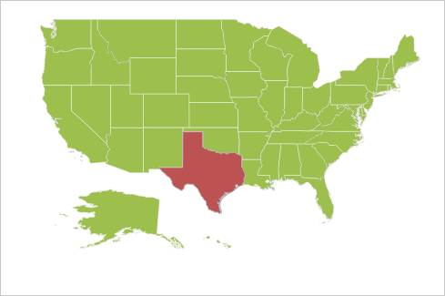
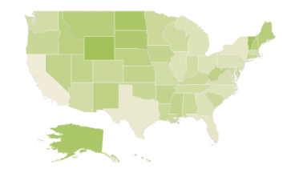
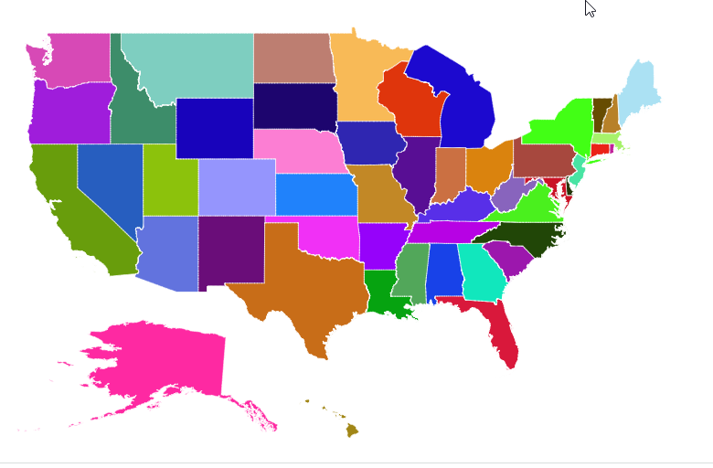
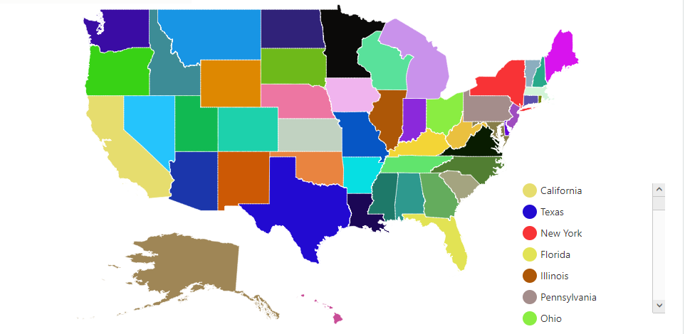
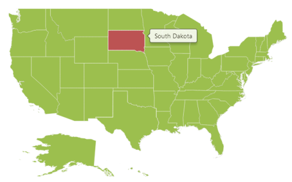

# Customization

Maps control supports color customization to determine the exact combination of colors for shapes displayed in Maps and tooltip support to display additional information of shape data.

## Shapes Color Customization

The Map control highly supports the customization of the shape’s color. The shape’s color can be customized using the following ways:

1. Using the Fill, Stroke and StrokeThickness properties.
2. Color Mapping support.
3. Color Palette support.

## Shape Settings 

The ShapeSettings defines the basic customization settings of shapes in the map. 

The important property that makes an impact on shape colors is AutoFill. This AutoFill property is available in the ShapeSettings. 

* Fill - It is used to set the fill color of the shapes in the map.
* Stroke - It is used to set the border color of the shape in the map.
* StrokeThickness - It is used to set the border thickness of the shape in the map.
* HighlightColor - It is used to set the mouse hover color for shapes in the map.
* HighlightBorderWidth - It is used to set the mouse hover border width for shapes in the map.
* SelectionColor - It is used to set the selection color for shapes in the map.

The above properties of ShapeSettings are applied only when AutoFill property value is false. By map, AutoFill property value is false.



  <ej:Map ID="map" runat="server">

        <Layers>

            <ej:ShapeLayer EnableMouseHover = "false" >

                <ShapeSettings Fill = "#9CBF4E" StrokeThickness = "0.5" Stroke = "White" HighlightColor = "#BC5353" ValuePath = "name" HighlightStroke = "White" AutoFill = "false"/>

            </ej:ShapeLayer>

        </Layers>

    </ej:Map> 



_Map_

## Color Mapping

The Color Mapping support enables the customization of shape colors based on the underlying value of shape received from bounded data.

* ColorValuePath - It renders the field value that is to be fetched from data for each shape used for determining the shape color.
* ValuePath - It renders the field value that is to be fetched from data for each shape. This support also provides a tree map-like impact on the map UI. The various types of Color Mapping supported in maps are listed as follows.
* Range Color Mapping - It is used to differentiate the shape’s fill based on its underlying value and color ranges. 

The properties of Range color mapping are listed in the following table.

_Property Table_

<table>
<tr>
<th>
Property</th><th>
Type</th><th>
Description</th></tr>
<tr>
<td>
From</td><td>
Double</td><td>
Gets or sets start value</td></tr>
<tr>
<td>
To</td><td>
Double</td><td>
Gets or sets end value</td></tr>
<tr>
<td>
Color</td><td>
Color</td><td>
Gets or sets the colors to be applied for specific range value containing shapes when enableGradient property value is false.</td></tr>
<tr>
<td>
Label</td><td>
String</td><td>
Gets or sets the label for legend when mode property value is ‘default’.</td></tr>
<tr>
<td>
GradientColors</td><td>
Array</td><td>
Gets or sets the start point and end point gradient colors to be applied for specific range value containing shapes when enableGradient property value is set to true.</td></tr>
</table>



    <ej:Map ID="map" runat="server" >

        <Layers>

            <ej:ShapeLayer ShapeDataPath = "name" ShapePropertyPath = "name"  ShowMapItems = "false" >                

                <ShapeSettings Fill = "#9CBF4E" StrokeThickness = "0.1" Stroke = "white ValuePath = "population" EnableGradient = "true">

                </ShapeSettings>                    

            </ej:ShapeLayer>

        </Layers>        

    </ej:Map>   




        protected void Page_Load(object sender, EventArgs e)

        {

(this.map.Layers[0] as ShapeLayer).ShapeSettings.ColorMappings = new ColorMapping() {

                MappingCollection = new List<object>()

                {

                    new RangeColorMapping() { From = 500000, To = 1000000, GradientColors = new List<string>() { "#9CBF4E", "#B8CE7B" } },

                    new RangeColorMapping() { From = 1000001, To = 5000000, GradientColors = new List<string>() { "#B8CE7B", "#CBD89A" } },

                    new RangeColorMapping() { From = 5000001, To = 10000000, GradientColors = new List<string>() { "#CBD89A", "#DEE2B9" } },

                    new RangeColorMapping() { From = 10000001, To = 40000000, GradientColors = new List<string>() { "#DEE2B9", "#F1ECD8" } }

                }

            };

        } 



When the underlying object value is 700000, then the fill color of the corresponding shape is set between #9CBF4E and #B8CE7B. 

When the underlying value is below any of the given sorted range or above the sorted range, then the Fill is set from Fill.

_Map with fill_

* Equal Color Mapping - The Equal color mapping is used to differentiate the shape’s fill based on its underlying value and color. The properties of Equal color mapping is listed in the following table.

_Property table_

<table>
<tr>
<th>
Property</th><th>
Type</th><th>
Description</th></tr>
<tr>
<td>
Value</td><td>
String</td><td>
Gets or sets the value.</td></tr>
<tr>
<td>
Color</td><td>
String</td><td>
Gets or sets the color for mapping.</td></tr>
</table>

In equal color mapping, value property contains the values of the field set in ColorValuePath property of shape settings.

Here “Map.aspx.cs” is populated with data of USA Election in “Map.aspx.cs” to provide election data as input datasource.



    <ej:Map ID="map" runat="server">    

        <Layers>

            <ej:ShapeLayer ShapeDataPath = "State" ShapePropertyPath= "name">

                <ShapeSettings AutoFill = "false" Stroke = "white" ValuePath = "Electors" ColorValuePath = "Candidate>

                     <ColorMappings>

                             <MappingCollection>

                                 <ej:EqualColorMapping Value = "Romney" Color = "#D84444"></ej:EqualColorMapping>

                                 <ej:EqualColorMapping Value = "Obama" Color = "#316DB5"></ej:EqualColorMapping>

                             </MappingCollection>

                     </ColorMappings>

                </ShapeSettings>             

            </ej:ShapeLayer>

        </Layers>

    </ej:Map>



_Map with fill color_

## Binding color from the datasource

By using `ColorPath` property, you can bind the specific field in the datasource to the map, and the shapes will be rendered based the color values available from the field you bind. 

N> While setting color for map by using `ColorPath` property, do not set any other color mapping hence color mapping is having higher priority than `ColorPath`. 



    <ej:Map ID="map" runat="server">    

        <Layers>

            <ej:ShapeLayer ShapeDataPath = "State" ShapePropertyPath= "name">

                <ShapeSettings AutoFill = "false" Stroke = "white" ValuePath = "Electors" ColorPath = "shapeFill">
                     
                </ShapeSettings>             

            </ej:ShapeLayer>

        </Layers>

    </ej:Map>



 

While binding color path for map, it is possible to render legend for each shape in the map. To achieve this, set the `TextPath` for legend. `TextPath` contains another field name in the datasource. As per the text, content in the field legend will be generated. 



    <ej:Map ID="map" runat="server">    

        <Layers>

            <ej:ShapeLayer ShapeDataPath = "State" ShapePropertyPath= "name">

                <ShapeSettings AutoFill = "false" Stroke = "white" ValuePath = "Electors" ColorPath = "shapeFill">
                     
                </ShapeSettings> 

                <LegendSettings showLegend = "true" Textpath = "fill">            
                
                </ej:LegendSettings>

            </ej:ShapeLayer>

        </Layers>

    </ej:Map>



 

            

## ColorPalette

When AutoFill property is set to true, shapes are filled with default colors from built-in palettes or custom palette.

## ColorPalette

The ColorPalette property determines whether the auto fill colors are fetched from built-in color palettes or custom palette.

The ColorPalette property can be set with Palette1, Palette2, Palette3 and CustomPalette values where Palette1, Palette2 and Palette3 are built-in color palettes and default value for this property is “Palette1”.



       <ej:Map ID="map" runat="server" >    

         <Layers>

            <ej:ShapeLayer ShapeDataPath = "Name" ShapePropertyPath= "name" >

               <ShapeSettings StrokeThickness="0.5" Stroke = "white" AutoFill="true" />

            </ej:ShapeLayer>

        </Layers>

    </ej:Map> 



 

_Map with color palette property_

## CustomPalette

The CustomPalette property is used to set an array of colors to be auto filled in shapes.

This property is enabled only when ColorPalette property value is set to “CustomPalette”.



protected void Page_Load(object sender, EventArgs e)

        {

            (this.map.Layers[0] as ShapeLayer).DataSource = Election_Result.GetUSPopulationData();

            (this.map.Layers[0] as ShapeLayer).ShapeData = this.GetUSA();

            (this.map.Layers[0] as ShapeLayer).ShapeSettings = new ShapeSettings()

            {

                ColorPalette = ColorPalette.CustomPalette,

                CustomPalette= new List<string>(){

                          "#E51400", "#A4C400", "#730202",

                          "#008B00", "#EF6535",

                          "#1BA0E2", "#C63477", "#0050EF",

                          "#BF004D", "#AA00FF"}; 

            }

        } 



_Map with custom palette_

## Tooltip

The tooltip is displayed only when you set ShowTooltip to “true” in the shape layers. By default, it takes the property of the bound object that is referred in the ValuePath and displays its content on hovering the corresponding shape. 



    <ej:Map  ID =“map” runat =“server” >

         <Layers>

            <ej:ShapeLayer ShowTooltip="true" LayerType="Geometry" ShapeDataPath="name" ShapePropertyPath="name">

            // …

         <Layers>

    </ ej:Map > 



_Map with Tooltip_

## Tooltip Template

The TooltipTemplate property is used for customizing the template for tooltip.



   <ej:Map ID="map" runat="server" >    

         <Layers>

            <ej:ShapeLayer ShowTooltip="true" TooltipTemplate="template">

            </ej:ShapeLayer>

        </Layers>

    </ej:Map>

       



The following screenshot illustrates a map control displaying a Tooltip with template.

_Map with tooltip template_

### Customize map background

The Map background can be customized by using the `Background` property of the Map. 



    <ej:Map  ID =“map” runat =“server” Background="skyblue">

    </ ej:Map > 



### Base Map Index 

Specifies the index of the map to determine the shape layer to be displayed, you can use `BaseMapIndex` property and the default value is 0.



    <ej:Map  ID =“map” runat =“server” BaseMapIndex="0">

    </ ej:Map > 



### Center Position 

Specify the `centerPosition` where map should be displayed



    <ej:Map  ID =“map” runat =“server” BaseMapIndex="0" centerPosition= "">

    </ ej:Map > 



### Label Settings

The `labelSettings` defines the basic customization settings of labels in the map. 

The below properties are used for `labelSettings`

* `enableSmartLabel` - enable or disable the enableSmartLabel property.
* `labelLength` - set the labelLength property.
* `labelPath` - set the labelPath property.
* `showLabels` - The property specifies whether to show labels or not
* `smartLabelSize` - set the smartLabelSize property.



    <ej:Map  ID =“map” runat =“server” BaseMapIndex="0" centerPosition= "">

    <Layers>

            <ej:ShapeLayer ShowTooltip="true" TooltipTemplate="template">

             <LabelSettings ShowLabels = "true" LabelPath = "iso_3166_2" EnableSmartLabel = "true"></LabelSettings>

            </ej:ShapeLayer>

    </Layers>

    </ ej:Map > 



