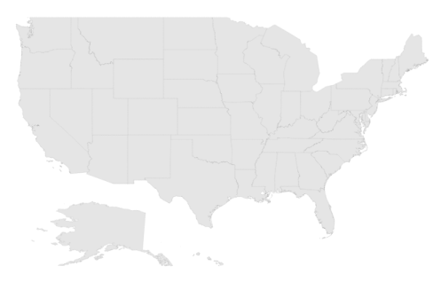
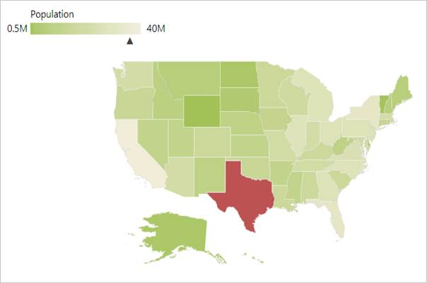

# Getting Started

This section explains briefly about how to create Maps in your application with ASP.NET.

## Create your first Map in ASP.NET

You can configure an Essential ASP.NET Map with simple steps. In this example, you can learn how to configure USA population map with customized appearance and tooltip.

Map
{:.caption}

### Create a simple ASP.NET Application

To begin, create a new ASP.NET Web application with necessary Dll’s and Scripts.

### Referencing Syncfusion Assemblies

The following assemblies need to be referenced in your application for using Essential Map ASP

1. Syncfusion.EJ.dll
2. Syncfusion.EJ.Web.dll

Follow the steps given below to deploy the application in the development server by referencing the assembly in **GAC**.

* Web.config file should be configured according to the referenced assemblies.
* To deploy your application, you have to ensure that the above referenced assemblies (in your web.config files) are present in the GAC.

And, add the Syncfusion namespace in the Web.config file.

N> If you are referring Syncfusion assemblies manually from bin folder to create ASP Maps, then remove Culture, Version and PublicKeyToken attributes used in all files.

###  Adding script reference

By default, Syncfusion JavaScript source files has been included into the EJ.Web assembly as an embedded source. So we no need to refer jQuery and Syncfusion scripts externally. For debugging purpose want to refer script files externally, set false to **LoadEJResourcesFromAssembly** in Web.config file as shows in the below image and refer jQuery and Syncfusion script files.



    <!--  jquery script  -->
    

    <!-- Essential JS UI widget -->
    



N> If you are using the Essential Studio below 13.4.0.53 version, then you need to refer **jQuery.globalize.js** script file along with the above references to render the Maps control.

### Initialize Map

1.Add the following code in the default.aspx file to create the maps control in View page.



<ej:Map ID="Container" runat="server" >
</ej:Map>



### Preparing Shape Data

The Shape Data collection describing geographical shape information can be obtained from [GEOJSON format shapes](http://www.syncfusion.com/uploads/user/uploads/Maps_GeoJSON.zip).

In this example, USA shape is used as shape data by utilizing the “United States of America.json” file in the following folder structure obtained from downloaded Maps_GeoJSON folder.

..\ Maps_GeoJSON\All Countries with States

You can store the “United States of America.json” file in App_Data folder as “usa.json”. Then, read the complete contents in “usa.json” file and assign to new MapData object in “Map.aspx.cs” in the following folder location.



        public object GetUSA()

        {

            string allText = System.IO.File.ReadAllText(Server.MapPath("~/App_Data/USA.json"));

            JavaScriptSerializer ser = new JavaScriptSerializer();

            ser.MaxJsonLength = int.MaxValue;

            return new MapData(allText);

        }



### Prepare DataSource

The dataSource is populated with USA population data inside the controller relative to shape data. For your better understanding, “Map.aspx.cs” is populated with data of USA Population in “Map.aspx.cs”. Refer to both shape data and datasource as illustrated in the following “Map.aspx.cs”,



       public List<CountyPopulationData> GetUSPopulationData()

        {

            List<CountyPopulationData> populationData = new List<CountyPopulationData>

            {

new CountyPopulationData(){ Name= "California", Population=38332521},

new CountyPopulationData(){ Name= "Texas", Population=26448193},

new CountyPopulationData(){ Name= "New York", Population=19651127},

new CountyPopulationData(){ Name= "Florida", Population=19552860},

new CountyPopulationData(){ Name= "Illinois", Population=12882135},

new CountyPopulationData(){ Name= "Pennsylvania", Population=12773801},

new CountyPopulationData(){ Name= "Ohio", Population=11570808},

new CountyPopulationData(){ Name= "Georgia", Population=9992167},

new CountyPopulationData(){ Name= "Michigan", Population=9895622},

new CountyPopulationData(){ Name= "North Carolina", Population=9848060},

new CountyPopulationData(){ Name= "New Jersey", Population=8899339},

new CountyPopulationData(){ Name= "Virginia", Population=8260405},

new CountyPopulationData(){ Name= "Washington", Population=6971406},

new CountyPopulationData(){ Name= "Massachusetts", Population=6692824},

new CountyPopulationData(){ Name= "Arizona", Population=6626624},

new CountyPopulationData(){ Name= "Indiana", Population=6570902},

new CountyPopulationData(){ Name= "Tennessee", Population=6495978},

new CountyPopulationData(){ Name= "Missouri", Population=6044171},

new CountyPopulationData(){ Name= "Maryland", Population=5928814},

new CountyPopulationData(){ Name= "Wisconsin", Population=5742713},

new CountyPopulationData(){ Name= "Minnesota", Population=5420380},

new CountyPopulationData(){ Name= "Colorado", Population=5268367},

new CountyPopulationData(){ Name= "Alabama", Population=4833722},

new CountyPopulationData(){ Name= "South Carolina", Population=4774839},

new CountyPopulationData(){ Name= "Louisiana", Population=4625470},

new CountyPopulationData(){ Name= "Kentucky", Population=4395295},

new CountyPopulationData(){ Name= "Oregon", Population=3930065},

new CountyPopulationData(){ Name= "Oklahoma", Population=3850568},

new CountyPopulationData(){ Name= "Puerto Rico", Population=3615086},

new CountyPopulationData(){ Name= "Connecticut", Population=3596080},

new CountyPopulationData(){ Name= "Iowa", Population=3090416},

new CountyPopulationData(){ Name= "Mississippi", Population=2991207},

new CountyPopulationData(){ Name= "Arkansas", Population=2959373},

new CountyPopulationData(){ Name= "Utah", Population=2900872},

new CountyPopulationData(){ Name= "Kansas", Population=2893957},

new CountyPopulationData(){ Name= "Nevada", Population=2790136},

new CountyPopulationData(){ Name= "New Mexico", Population=2085287},

new CountyPopulationData(){ Name= "Nebraska", Population=1868516},

new CountyPopulationData(){ Name= "West Virginia", Population=1854304},

new CountyPopulationData(){ Name= "Idaho", Population=1612136},

new CountyPopulationData(){ Name= "Hawaii", Population=1404054},

new CountyPopulationData(){ Name= "Maine", Population=1328302},

new CountyPopulationData(){ Name= "New Hampshire", Population=1323459},

new CountyPopulationData(){ Name= "Rhode Island", Population=1051511},

new CountyPopulationData(){ Name= "Montana", Population=1015165},

new CountyPopulationData(){ Name= "Delaware", Population=925749},

new CountyPopulationData(){ Name= "South Dakota", Population=844877},

new CountyPopulationData(){ Name= "Alaska", Population=735132},

new CountyPopulationData(){ Name= "North Dakota", Population=723393},

new CountyPopulationData(){ Name= "District of Columbia", Population=646449},

new CountyPopulationData(){ Name= "Vermont", Population=626630},

new CountyPopulationData(){ Name= "Wyoming", Population=582658}

            };

            return populationData;

        }

   [Serializable]
    public class CountyPopulationData

    {

        public string name;

        public string Name

        {

            get { return name; }

            set { name = value; }

        }

        public double population;

        public double Population

        {

            get { return population; }

            set { population = value; }

        }

    }

        protected void Page_Load(object sender, EventArgs e)

        {

            (this.map.Layers[0] as ShapeLayer).DataSource = Election_Result.GetUSPopulationData();

            (this.map.Layers[0] as ShapeLayer).ShapeData = this.GetUSA();

        }



### Initializing Map

1. Create an HTML file and add necessary script and CSS files in Head tag as illustrated in the following code example.

   ~~~ html

        <html xmlns="http://www.w3.org/1999/xhtml">

        <head>

	    <title> Getting Started with Maps </title>

        <!--  jquery script  -->

                

                <!-- Essential JS UI widget -->

               

               <!-- JS Render widget -->

               

        </head>

        <body>
        </body>
        </html>

   ~~~

2. Create a 
 tag and set the height and width to determine the map size and add map element to render Maps in body tag.

   ~~~ html

        <html>

        <body>

        

        <ej:Map ID=“map” runat="server"  EnableAnimation ="true" >

        </ej:Map>

        

        </body>

        </html>

   ~~~

3. Populate data in Map.aspx.cs file as illustrated in the following code example.

   ~~~ cs

        public partial class Default: Page

        {

        protected void Page_Load(object sender, EventArgs e)

        {

            (this.map.Layers[0] as ShapeLayer).DataSource = Election_Result.GetUSPopulationData();

            (this.map.Layers[0] as ShapeLayer).ShapeData = this.GetUSA();

        }

        public object GetUSA()

        {

            string allText = System.IO.File.ReadAllText(Server.MapPath("~/App_Data/USA.json"));

            JavaScriptSerializer ser = new JavaScriptSerializer();

            ser.MaxJsonLength = int.MaxValue;

            return new MapData(allText);

        }

        }

   ~~~

The above code renders a map with default properties and shape input provided through data in layers.

Map with default properties
{:.caption}

### Data Binding in Map

The following properties in shape layers is used for binding data in Maps control.

* DataSource
* ShapeDataPath
* ShapePropertyPath

### DataSource

The DataSource property accepts collection values as input. For example, you can provide the list of objects as input.

### ShapeDataPath

The ShapeDataPath property is used to refer the data ID in DataSource. For example, population MapData contains data ids ‘Name’ and ‘Population’. The ShapeDataPath and the ShapePropertyPath properties are related to each other (refer to ShapePropertyPath for more details).

### ShapePropertyPath

The ShapePropertyPath property is similar to the ShapeDataPath that refers the column name in the Data property of shape layers to identify the shape. When the values of the ShapeDataPath property in the DataSource property and the value of ShapePropertyPath in the Data property match, then the associated object from the DataSource is bound to the corresponding shape.





     <ej:Map ID=“map” runat="server"  EnableAnimation ="true" >
		<Layers>
			<ej:ShapeLayer LayerType="Geometry" ShapeDataPath = "name" ShapePropertyPath= "name">
			</ej:ShapeLayer>
		</Layers>
	 </ej:Map>





     public partial class Default: Page
	 {
		protected void Page_Load(object sender, EventArgs e)
		{
		(this.map.Layers[0] as ShapeLayer).DataSource = Election_Result.GetUSPopulationData();
		(this.map.Layers[0] as ShapeLayer).ShapeData = this.GetUSA();
		}
	 }




### Customizing Map Appearance

You can customize the shape’s color by using Fill, Stroke and StrokeThickness properties in ShapeSettings.





    <ej:Map ID=“map” runat="server"  EnableAnimation ="true" >

		<Layers>

			<ej:ShapeLayer LayerType="Geometry" EnableSelection = "false" ShapeDataPath = "name" ShapePropertyPath= "name" EnableMouseHover = "true">

				<ShapeSettings Fill = "Gray" StrokeThickness = "0.5" Stroke = "white" ValuePath = "name" HightlightStroke = "White" HightlightColor = "#BC5353" HightlightBorderWidth = "1">

				</ShapeSettings>

			</ej:ShapeLayer>

		</Layers>

	</ej:Map>





    protected void Page_Load(object sender, EventArgs e)
	{
		(this.map.Layers[0] as ShapeLayer).DataSource = Election_Result.GetUSPopulationData();

		(this.map.Layers[0] as ShapeLayer).ShapeData = this.GetUSA();
	}





Customized Map
{:.caption}

### Customizing Map Appearance by Range

The Range color mapping is used to differentiate the shape’s fill based on its underlying value and color ranges. The From and To properties defines the value ranges and the GradientColors property defines the equivalent color ranges respective to their value ranges.

N> The EnableGradient property value should be true to apply gradient colors for maps.





    <ej:Map ID=“map” runat="server" ">

        <Layers>

            <ej:ShapeLayer LayerType="Geometry" EnableMouseHover = "true" EnableSelection = "true" ShowTooltip = "true" TooltipTemplate = "template" ShapeDataPath = "name" ShapePropertyPath= "name" ShowMapItems = "false" >

            <ShapeSettings AutoFill = "false" HighlightBorderWidth = "1" StrokeThickness = "0.5" Stroke = "white" HighlightColor = "#DAD1CF" HighlightStroke = "#1A5D65" ValuePath = "name" SelectionColor = "#FFC200" SelectionStroke = "white" SelectionStrokeWidth = "2.5">

                    <ColorMappings>

                        <MappingCollection>

                            <ej:RangeColorMapping From = "500000" To = "1000000" Color = "#9BC585"></ej:RangeColorMapping>

                            <ej:RangeColorMapping From = "1000001" To = "5000000" Color = "#D2DB9A"></ej:RangeColorMapping>

                            <ej:RangeColorMapping From = "5000001" To = "10000000" Color = "#A4D4BF"></ej:RangeColorMapping>

                            <ej:RangeColorMapping From = "10000001" To = "10000000" Color = "#E0C68F"></ej:RangeColorMapping>

                        </MappingCollection>

                    </ColorMappings>

                </ShapeSettings>

            </ej:ShapeLayer>

        </Layers>

    </ej:Map>





        protected void Page_Load(object sender, EventArgs e)

        {

            (this.map.Layers[0] as ShapeLayer).DataSource = Election_Result.GetUSPopulationData();

            (this.map.Layers[0] as ShapeLayer).ShapeData = this.GetUSA();

        }





The following screenshot illustrates a map with gradient color property enable.

Customized Map by range
{:.caption}

### Enable Tooltip

The tooltip is displayed only when ShowTooltip is set to ‘True’ in the shape layers. By default, it takes the property of the bound object that is referred in the ValuePath and displays its content on hovering the corresponding shape. The TooltipTemplate property is used for customizing the template for tooltip.





    <ej:Map ID=“map” runat="server"  EnableAnimation ="true" >

        <Layers>

            <ej:ShapeLayer ShowTooltip = "true">

               <ShapeSettings ValuePath = "name">

                </ShapeSettings>

            </ej:ShapeLayer>

        </Layers>

    </ej:Map>





        protected void Page_Load(object sender, EventArgs e)

        {

            (this.map.Layers[0] as ShapeLayer).DataSource = Election_Result.GetUSPopulationData();

            (this.map.Layers[0] as ShapeLayer).ShapeData = this.GetUSA();

        }





The following screenshot illustrates a Map control displaying a Tooltip.

Map with tooltip
{:.caption}

### Legend

A Legend can be made visible by setting the ShowLegend property in LegendSettings.

### Interactive Legend

The legends can be made interactive with an arrow mark indicating the exact range color in the legend, when the mouse hovers the corresponding shapes. You can enable this option by setting Mode property in LegendSettings value as _‘_Interactive’. The default value of Mode property is ‘Default’ to enable the normal legend.

### Title for Interactive Legend

You can use Title property to provide title for interactive legend.

### Label for Interactive Legend

You can use LeftLabel and RightLabel property to provide left and right labels for interactive legend.





<ej:Map ID=“map” runat="server"  EnableAnimation ="true" >

         <ZoomSettings EnableZoom = "true" Level = "1.2"></ ZoomSettings>

         <Layers>

                <LegendSettings ShowLegend="true" Position="BottomLeft" Height="15" Width = "150" Type = "Layers" Mode="Interactive" Title = "Population" LeftLabel = "0.5 M" RightLabel = "40 M"></LegendSettings>

            </ej:ShapeLayer>

        </Layers>

    </ej:Map>





        protected void Page_Load(object sender, EventArgs e)

        {

            (this.map.Layers[0] as ShapeLayer).DataSource = Election_Result.GetUSPopulationData();

            (this.map.Layers[0] as ShapeLayer).ShapeData = this.GetUSA();

        }





The following screenshot illustrates a map displaying an interactive legend.

Map with interactive Legend
{:.caption}

