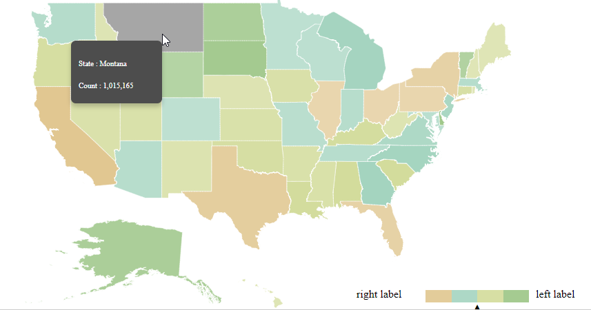

# RTL

Right-to-Left or RTL describes the ability of application to handle and responds you to communicate with a right-to-left language, such as Arabic or Japanese. enableRTL property is used to change the rendering format to “Right-to-Left”. By default, legend and tooltip will be rendered as “Left-to-Right” in Maps.



    <ej:Map ID="map" runat="server" EnableRTL="true" >    

    </ej:Map>



In default legend, after setting `EnableRTL` is set as true, legend text will be rendered first, and then legend icon will be rendered. 

## Interactive legend

If `EnableRTL` is set as true, then whole interactive legend will be rendered from right-to-left, which means left label will be rendered at right side, and right label will be rendered at left side. Also, navigation arrow position will be changed to right side.

## Tooltip

If `EnableRTL` is set as true, tooltip will be rendered at the left side of the mouse cursor. 

