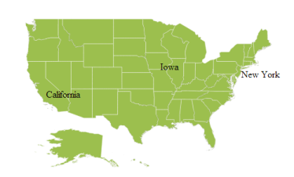
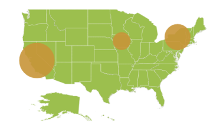
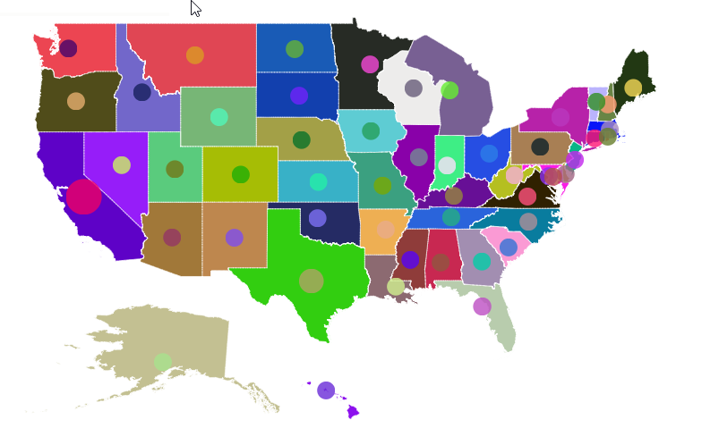
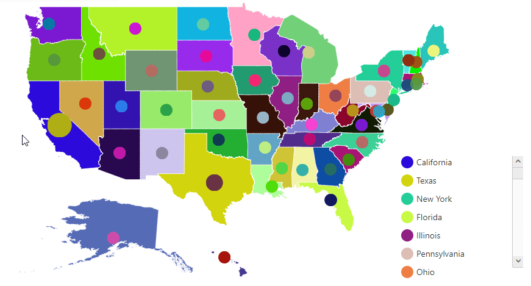
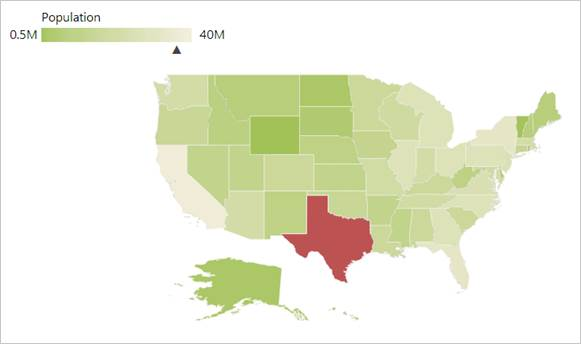
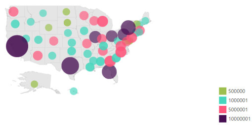

# Map Elements

Map control contains a set of map elements, including shapes, bubbles, markers, legend, labels and data items that can be visualized with customized appearance showing additional information on the map using bound data.

## Markers 

Markers are notes that is used to leave some message on the map. 

There are two ways to set marker for map.

1. Using markers and marker template
2. Adding marker objects to map.

### Markers 

The Markers property has a list of objects that contains the data for Annotation. You can visualize these data by using MarkerTemplate property.




   
 public class Syncfusion_LocationData    
 {       
 public static List<MapMarker> GetSyncfusionLocationData()       
 {         
 List<MapMarker> syncfusionLocationData = new List<MapMarker>            
 {            

 new LocationData {Name = "Chennai", Country = "India", Latitude =13.0839 , Longitude = 80.27 , Description = "Syncfusion's branch office is located in AnnaNagar, Chennai", Address ="EYMARD Complex AJ 217 4th Avenue Shanthi Colony Anna Nagar Chennai-40 India" },               

 new LocationData {Name = "North Carolina", Country = "United States", Latitude =35.5 , Longitude = -80 , Description = "Syncfusion's corporate office is located in Research Triangle Park North Carolina", Address ="Company Headquarters 2501 Aerial Center Parkway Suite 200 Morrisville NC 27560 USA" },            };            return syncfusionLocationData;        }    }                protected void Page_Load(object sender, EventArgs e)        {            (this.map.Layers[0] as ShapeLayer).ShapeData = GetWorldMap();            (this.map.Layers[0] as ShapeLayer).Markers = Syncfusion_LocationData.GetSyncfusionLocationData();        }</td></tr>





   <ej:Map ID="map" runat="server" >    

        <Layers>

            <ej:ShapeLayer/>               

        </Layers>

    </ej:Map>

    

              <svg height="100" width="100">

<circle cx="20" cy="20" r="10" stroke="black" stroke-width="1"

           fill="red" />

	</svg> 

    





Map with markers
{:.caption} 

### Adding Marker objects to map

Without Datasource, n number of markers can be added to shape layers with Markers property. Each marker object contains the following list of properties.

* Label - Text that displays some information about the annotation in text format.
* Latitude - Latitude point determine the Y-axis position of annotation.
* Longitude - Longitude point determine the X-axis position of annotation.



  

        protected void Page_Load(object sender, EventArgs e)

        {

            (this.map.Layers[0] as ShapeLayer).ShapeData = GetWorldMap();

            (this.map.Layers[0] as ShapeLayer).Markers = Syncfusion_LocationData.GetSyncfusionLocationData();

        } 

     public class Syncfusion_LocationData

     {

        public static List<MapMarker> GetSyncfusionLocationData()

        {

            List<MapMarker> syncfusionLocationData = new List<MapMarker>

            {

                new LocationData {Name = "Chennai", Country = "India", Latitude =13.0839 , Longitude = 80.27 , Description = "Syncfusion's branch office is located in AnnaNagar, Chennai", Address ="EYMARD Complex AJ 217 4th Avenue Shanthi Colony Anna Nagar Chennai-40 India" },

                new LocationData {Name = "North Carolina", Country = "United States", Latitude =35.5 , Longitude = -80 , Description = "Syncfusion's corporate office is located in Research Triangle Park North Carolina", Address ="Company Headquarters 2501 Aerial Center Parkway Suite 200 Morrisville NC 27560 USA" },

            };

            return syncfusionLocationData;

        }

    } 



Map with label
{:.caption} 

## Bubbles 

Bubbles in the Maps control represent the underlying data values of the map. Bubbles are scattered throughout the map shapes that contain bound values.

Bubbles are included when data binding and the BubbleSettings is set to the shape layers. 

Properties available in bubble setting

Property table

<table>
<tr>
<th>
Property</th><th>
Type</th><th>
Description</th></tr>
<tr>
<td>
MaxValue</td><td>
String</td><td>
Get or sets the maximum height and width of the bubble.</td></tr>
<tr>
<td>
MinValue</td><td>
String</td><td>
Gets or sets the minimum height and width of the bubble.</td></tr>
<tr>
<td>
ColorValuePath</td><td>
String</td><td>
Get or sets the field value that is to be fetched from data for each bubble used for determining the bubble color.</td></tr>
<tr>
<td>
ValuePath</td><td>
String</td><td>
Gets or sets the field value that is to be fetched from data for each bubble.</td></tr>
<tr>
<td>
ColorMappings</td><td>
Collection of RangeColorMapping</td><td>
Gets or sets the tree map colors.</td></tr>
<tr>
<td>
Color</td><td>
String</td><td>
Gets or sets the fill color for bubbles.</td></tr>
<tr>
<td>
ShowTooltip</td><td>
Boolean</td><td>
Enable or disable the tooltip for bubbles.</td></tr>
<tr>
<td>
TooltipTemplate</td><td>
String</td><td>
Gets or sets the tooltip template for bubbles.</td></tr>
</table>

Adding Bubbles to a Map

To add bubbles to a map, the bubble marker setting is added to the shape file layer. Create the Model and ViewModel as illustrated in the Data Binding topic and add the following code. Also set the MaxValue, MinValue, and ValuePath properties as illustrated in the following code sample.

N> Tooltip and Color Mappings for bubble is to be set as similar to tooltip and color mappings set in layers and ShapeSettings. For more details, refer Tooltip and Color Mappings section.



  <ej:Map ID="map" runat="server" >    

         <Layers>

            <ej:ShapeLayer  EnableMouseHover="true">

             <ShapeSettings Fill = "#9CBF4E" StrokeThickness = "0.5" Stroke = "white">

              </ShapeSettings>

              <BubbleSettings   ShowBubble=”true” ValuePath = "Population" MinValue = "20" MaxValue = "40" Color = "#C99639">

              </BubbleSettings>

            </ej:ShapeLayer>

        </Layers>

    </ej:Map>



 

Map with bubbles
{:.caption} 

You can set color for each bubble by using `ColorPath` property in bubble settings. 

N> While settings color for bubbles by using `ColorPath`, do not set any other color mapping hence color mapping is having higher priority than `ColorPath`. 



  <ej:Map ID="map" runat="server" >    

         <Layers>

            <ej:ShapeLayer  EnableMouseHover="true">

             <ShapeSettings Fill = "#9CBF4E" StrokeThickness = "0.5" Stroke = "white" ColorPath="shapeFill">

              </ShapeSettings>

              <BubbleSettings   ShowBubble=”true” ValuePath = "Population" MinValue = "20" MaxValue = "40" Color = "#C99639" ColorPath="fill">

              </BubbleSettings>

            </ej:ShapeLayer>

        </Layers>

    </ej:Map>



While binding `ColorPath` for bubbles, it is possible to render the legend for each bubble. To achieve this, set the `TextPath` for legend. `TextPath` contains another field name in the datasource. As per the text, content in the field legend will be generated. 



  <ej:Map ID="map" runat="server" >    

         <Layers>

            <ej:ShapeLayer  EnableMouseHover="true">

             <ShapeSettings Fill = "#9CBF4E" StrokeThickness = "0.5" Stroke = "white" ColorPath="shapeFill">

              </ShapeSettings>

              <BubbleSettings   ShowBubble=”true” ValuePath = "Population" MinValue = "20" MaxValue = "40" Color = "#C99639" ColorPath="fill">

              </BubbleSettings>

              <LegendSettings ShowLegend="true” Height="20" Width = "60" PositionX="80" PositionY="90" TextPath="name">

            </LegendSettings>

            </ej:ShapeLayer>

        </Layers>

    </ej:Map>



## Legend

A legend is a key used on a map, contains swatches of symbols with descriptions. It provides valuable information for interpreting what the map is displaying you, and can be represented in various colors, shapes or other identifiers based on the data. It gives a breakdown of what each symbol represents throughout the map.

### Visibility of Legend

The Legends can be made visible by setting the ShowLegend property of LegendSettings. 

### Positioning of Legend

The legend can be positioned in two ways.

1. Absolute Position.
2. Dock Position.

### Absolute Position

Based on the margin values of X and Y-axes, the Map legends can be positioned with the support of PositionX and PositionY properties available in LegendSettings. For positioning the legend based on margins corresponding to a map, Position value is set as ‘None’.

### Dock Position

The map legends can be positioned in following locations within the container.

1. TopLeft
2. TopCenter
3. TopRight
4. CenterLeft
5. Center
6. CenterRight
7. BottomLeft
8. BottomRight
9. BottomCenter
10. BottomRight
11. None

You can set this option by using Position property in LegendSettings.

### Legend Size

The map legend size can be modified using Height and Width properties in LegendSettings.

### Legend for Shapes

The Layer shape type legends can be generated for each color mappings in shape settings. 

N>  Here, Equal Color Mapping code sample for shapeSettings with color mappings is referred.



    <ej:Map ID="map" runat="server" >    

         <Layers>

            <ej:ShapeLayer>

            <LegendSettings ShowLegend="true” Height="20" Width = "60" PositionX="80" PositionY="90">

            </LegendSettings>

            </ej:ShapeLayer>

        </Layers>

    </ej:Map>



Map with legend
{:.caption} 

### Interactive Legend

The legends can be made interactive with an arrow mark indicating the exact range color in the legend when the mouse hovers over the corresponding shapes. You can enable this option by setting Mode property in LegendSettings value as “Interactive” and default value of Mode property is “Default” to enable the normal legend.

### Title for Interactive Legend

You can provide the title for interactive legend by using Title property in LegendSettings.

### Label for Interactive Legend

You can provide the left and right labels to interactive legend by using LeftLabel and RightLabel properties in LegendSettings. 

N>  Here, Range Color Mapping code snippet for shapeSettings with color mappings is referred.



    <ej:Map ID="map" runat="server" >    

       <Layers>

            <ej:ShapeLayer>

                <LegendSettings ShowLegend="true" Position="TopLeft" Height="15" Width = "150" Type = "Layers" Mode="Interactive" Title = "Population" LeftLabel = "0.5 M" RightLabel = "40 M">

                </LegendSettings>

            </ej:ShapeLayer>

        </Layers>

    </ej:Map>



Map with interactive legend
{:.caption} 

### Bubble Legend

A bubble legend feature is used to provide the key (legend) for another map element bubble. You can activate the Bubble legend by setting the enum “Type” in LegendSettings as “bubble” and this enables you to easily identify what value a particular bubble is representing.



    <ej:Map ID="map" runat="server" >    

       <Layers>

            <ej:ShapeLayer>

                <LegendSettings ShowLegend="true" Position="TopLeft" Height="15" Width = "150" Type = "Bubbles” Title = "Population">

                </LegendSettings>

              <BubbleSettings ShowBubble=”true” ValuePath = "Population" MinValue = "20" MaxValue = "40">

              </BubbleSettings>

                    <ColorMappings>

                        <MappingCollection>

                            <ej:RangeColorMapping From = "500000" To = "1000000" Color = "#9BC585"></ej:RangeColorMapping>

                            <ej:RangeColorMapping From = "1000001" To = "5000000" Color = "#D2DB9A"></ej:RangeColorMapping>

                            <ej:RangeColorMapping From = "5000001" To = "10000000" Color = "#A4D4BF"></ej:RangeColorMapping>

                            <ej:RangeColorMapping From = "10000001" To = "10000000" Color = "#E0C68F"></ej:RangeColorMapping>

                        </MappingCollection>

                    </ColorMappings>

            </ej:ShapeLayer>

        </Layers>

    </ej:Map>



Bubble Legend
{:.caption} 