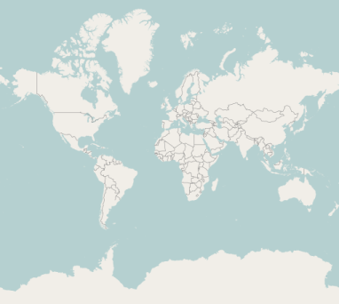

# Map Providers

Map control support map providers such as OpenStreetMap that can be added to any layers in maps.

## Open Street Map

OpenStreetMap is a map of the entire world. The OpenStreetMap allows you to view, edit and use geographical data in a collaborative way from any place on the Earth.

## Enable OSM

You can enable this feature by setting the LayerType property value as "OSM".



    <ej:Map ID="osmMap" runat="server" >    

        <Layers>

            <ej:ShapeLayer LayerType="OSM" UrlTemplate="http://a.tile.thunderforest.com/landscape/level/tileX/tileY.png" >

            </ej:ShapeLayer>

        </Layers>

    </ej:Map> 



## URL Template

The UrlTemplate property determines the format of tile map. You can specify the template for the tile layer. 

Open street Map
{:.caption} 

## Bing Map

Bing Map is a key feature in accessing the external geospatial imagery services for deep-zoom satellite view. 

## Enable Bing Maps

You can enable this feature by defining the LayerType as “bing”.



    <ej:Map ID="Bing" runat="server" >    

        <Layers>

            <ej:ShapeLayer LayerType="bing" Key="// …bingMapkey">

            </ej:ShapeLayer>

        </Layers>

    </ej:Map>



## Key

The bing Map Key is provided as input to this key property. The Bing Map key can be obtained from [http://www.microsoft.com/maps/create-a-bing-maps-key.aspx](http://www.microsoft.com/maps/create-a-bing-maps-key.aspx). 

Bing map
{:.caption} 

