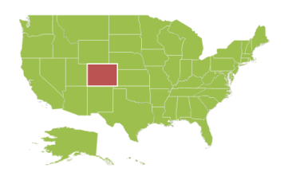
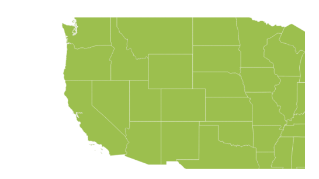
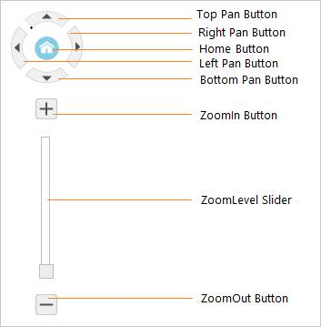

# User Interaction

Options like zooming, panning and map selection enable the effective interaction on Map elements.

## Map Selection

Each shape in the Map can be selected and deselected during interaction with shapes. 

The SelectionColor property is used to get or set the selected shape color. The SelectionStroke and SelectionStrokeWidth properties are used to customize the selected shape border.

You can select the shape by tapping the shape. The single selection is enabled by the EnableSelection property of shape layer. When EnableSelection is set to false, the shapes cannot be selected. 



    <ej:Map ID="map" runat="server" >    

         <Layers>

             < ej:ShapeLayer EnableSelection = "true" >

                <ShapeSettings Fill = "#9CBF4E" StrokeThickness = "0.5" Stroke = "white"   SelectionColor = "#BC5353"  SelectionStrokeWidth = "2" SelectionStroke = "white">

                </ShapeSettings>                

            </ej:ShapeLayer>

        </Layers>

    </ej:Map> 



Map with enable selection property
{:.caption} 

## MultiSelection

This feature enables you to select multiple Map shapes on mouse taps accompanied by "**Control**" key press. For this feature to get enabled, set the property `SelectionMode` as "**Multiple**" along with the `EnableSelection` property.



 <ej:Map ID="map" runat="server" >    

         <Layers>

             < ej:ShapeLayer EnableSelection = "true" SelectionMode = "Multiple">
                // ...
            </ej:ShapeLayer>

        </Layers>

    </ej:Map>     



Map with selectionMode property
{:.caption} 

## Dragging On Selection

This feature enables you to select the shapes by dragging over the shapes. While dragging over the shapes, a rectangle is generated and the shapes that come within the rectangle is selected.
You can enable this feature by setting the property `DraggingOnSelection` in the `Layers` to **true**.



 <ej:Map ID="map" runat="server" >    

         <Layers>

             < ej:ShapeLayer DraggingOnSelection = "true">
                // ...
            </ej:ShapeLayer>

        </Layers>

    </ej:Map>     



Map with draggingOnSelection property
{:.caption}
 
## Zooming

The zooming feature enables you to zoom in and out of the Map to show in-depth information. It is controlled by the Level property of the Map. When the zoom level of the Map control is increased, the Map is zoomed in. When the zoom level is decreased, then the Map is zoomed out.

## Properties Related to Zooming

The following properties are related to the zooming feature of the Maps control:

1. Level
2. EnableZoom
3. MinValue
4. MaxValue

## Level

The level property determines the Map’s scale size when zooming. The default value of level is 1. 

N>  Level cannot be less than 1.

## EnableZoom

The EnableZoom property enables or disables the zooming feature. 

## MinValue

The MinValue property is used to set the minimum zoom level of the Map. 

## MaxValue

The MaxValue property is used to set the maximum zoom level of the Map.



   <ej:Map ID="map" runat="server" >    

         <ZoomSettings EnableZoom="true"  MinValue="1" Level=”1” MaxValue="20"></ZoomSettings>

        <Layers>

            </ej:ShapeLayer>

        </Layers>

    </ej:Map> 



## Additional Options to Zoom the Map

Maps can be zoomed by using the following options also,

* Zoom method.
* Mouse scroll.
* Mouse double tap.
* Shape selection
* Position

## By using Zoom method

You can zoom the Maps by using zoom method. The zoom method contains parameter zoom value. The Map can be zoomed or scaled based on zoom value parameter.



$("#map").ejMap("zoom", 2);



## By using mouse scroll

You can zoom the map with mouse events by using mouse scroll. When the mouse is scrolled up, the Map is zoomed in and when the mouse is scrolled down, the Map is zoomed out.

## By using mouse double tap

When the Map is double-tapped by using mouse, the zoom in operation is performed. 

 

Map with zoom
{:.caption} 

## By using Shape Selection

Map shape is zoomed to the whole map area, on the shape selected. Animation can be applied for that zooming with the EnableAnimation property as true. 

You can enable this feature by setting the EnableZoomOnSelection property value as ‘_true_’. 

When EnableZoomOnSelection property is set to true, then zooming of the Map control is muted on double click.



	<ej:Map ID="map" runat="server" >    

<ZoomSettings EnableZoom = "true" EnableZoomOnSelection="true"></ZoomSettings>

	 </ej:Map> 



##  By using Position

Depending on the latitude and longitude, you can zoom the Map to the exact position. All locations are considered as latitude and longitude values and the exact location is considered as Map coordinates.

The navigateTo is a method defined that allows you to zoom the Map control to the given location. This method contains three attributes as follows.

Attribute Table

<table>
<tr>
<th>
Attribute</th><th>
Type</th><th>
Description</th></tr>
<tr>
<td>
Latitude</td><td>
Double</td><td>
Latitude point of the position </td></tr>
<tr>
<td>
Longitude</td><td>
Double</td><td>
Longitude point of the position</td></tr>
<tr>
<td>
Level</td><td>
Double</td><td>
Zoom level of the map</td></tr>
</table>





## Panning 

The panning feature enables the Map navigation. The EnablePan property is used to enable or disable the panning support.



    <ej:Map ID="map" runat="server" EnablePan=”true”>    

    </ej:Map> 



## Navigation Control

Navigation control is built-in with Maps control. With Navigation control, Maps can be panned in any direction and zoomed. It is possible to show or hide the NavigationControl by EnableNavigation property.

## Structure of the Navigation Control

Structure of the Navigation Control
{:.caption} 



    <ej:Map ID="map" runat="server" >    

         <NavigationControl EnableNavigation="true">

        </NavigationControl>

    </ej:Map> 



## Zoom with Navigation Control

With Navigation control, the Maps can be zoomed. When you click the ZoomIn button, the Map is zoomed in and when you click the ZoomOut button the Map is zoomed out.

## Panning with Navigation Control

Maps can be panned with Pan buttons (TopPan button, RightPan button, BottomPan button, and LeftPan button). When you click a particular Pan button, the Map is panned on the respective directions.

## Navigation Control Positions

The Navigation control can be positioned in two ways.

* Absolute Position
* Dock Position

## Absolute Position

Based on the margin values of X and Y-axes, the navigation control can be positioned with the help of the X and Y properties available in AbsolutePosition. For positioning the navigation control based on margins corresponding to a Map, DockPosition value is set as ‘None’.

## Dock Position

The navigation control can be positioned in the following locations within the container.

* TopLeft
* TopCenter
* TopRight
* CenterLeft
* Center
* CenterRight
* BottomLeft
* BottomRight
* BottomCenter
* BottomRight
* None

You can set this option by using the DockPosition property in NavigationControl.



   <ej:Map ID="map" runat="server" Background="white" EnableAnimation="true">    

         <NavigationControl EnableNavigation="true" DockPosition="None" Orientation="Vertical">

            <AbsolutePosition X="5" Y="10"/>

        </NavigationControl>

    </ej:Map> 



