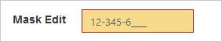
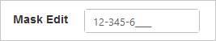
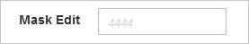
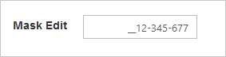

# Appearance and styling

## Theme

The MaskEditTextbox control’s style and appearance can be controlled based on CSS classes. In order to apply styles to the MaskEditTextbox control, you need to refer two files namely; ej.widgets.core.min.css and ej.theme.min.css. When the file ej.widgets.all.min.css is referred, then it is not necessary to include the files ej.widgets.core.min.css and ej.theme.min.css in your project, as ej.widgets.all.min.css is the combination of these two. 

By default, there are 13 themes support available for MaskEditTextbox control namely

* default-theme
* bootstrap
* flat-azure-dark
* fat-lime
* flat-lime-dark
* flat-saffron
* flat-saffron-dark
* gradient-azure
* gradient-azure-dark
* gradient-lime
* gradient-lime-dark
* gradient-saffron
* gradient-saffron-dark

## CSS Class

The CSS properties can be customized by using the CssClass in the MaskEditTextbox. You can customize the MaskEditTextbox with various CSS properties to appear like your likable control.

### Configure CSS Class

The following steps explains the implementation of CssClass in the MaskEditTextbox.



<ej:MaskEdit ID="mask" MaskFormat="99-999-99999" cssClass="customCss" runat="server"> </ej:MaskEdit>



Customize the CSS properties in custom CSS class.



        .customCss .e-box {

            border-color: #9d241b;

        }

        .customCss .e-input {

            background-color: #f6db8d;            

        }

        .customCss .e-select {

            background-color: #ecf6ac;

            border-color: #3c36e7;

        }



The output for MaskEditTextbox after applying “CssClass”.

### Rounded Corner Support

The MaskEditTextbox provides you with rounded corner support that the appearance differs from normal MaskEditTextbox control. The default value for ShowRoundedCorner property is false in the MaskEditTextbox.

### Configure Rounded Corner Support

The following steps explains the implementation of ShowRoundedCorner in the MaskEditTextbox.



<ej:MaskEdit ID="mask" MaskFormat="99-999-99999"  Value="1234567" ShowRoundedCorner="true" runat="server"> </ej:MaskEdit>



The output for MaskEditTextbox when “ShowRoundedCorner” is “true”.

### Water Mark Text Support

The MaskEditTextbox provides water mark text support that you can display the initial value in the control by water mark. The default value for WatermarkText property is the empty string (“”) in the MaskEditTextbox.

#### Configure Water Mark Text

The following steps explains the implementation of WatermarkText in theMaskEditTextbox.

Add the following code in your ASPX page to render the MaskEditTextbox control.



<ej:MaskEdit ID="mask" MaskFormat="99-999-99999" WaterMarkText="4444" runat="server"> </ej:MaskEdit>



The output for the MaskEditTextbox after applying “WatermarkText”.

 

### Text Alignment Support

The Mask Edit Textbox provides the text alignment support that you can set the alignment of text in the control by using TextAlign property. The default value for TextAlign property is left in the MaskEditTextbox.

#### Configure Text Alignment

The following steps explains the implementation of TextAlign in the MaskEditTextbox.

Add the following code in your ASPX page to render the Textbox control.



<ej:MaskEdit ID="mask" MaskFormat="99-999-99999" Value="1234567" TextAlign="Right" runat="server"> </ej:MaskEdit>



The output for MaskEditTextbox when “TextAlign” is “right”.

 

