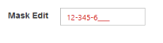
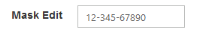

# Configure Persistence Support 

The following steps explains the implementation of EnablePersistence in MaskEditTextbox.



<ej:MaskEdit ID="mask" MaskFormat="99-999-99999" EnablePersistence="true" runat="server"> </ej:MaskEdit>



The output for MaskEditTextbox with EnablePersistence before page load and after page load are as follows.

 

## Enabled or Disabled

The MaskEditTextbox control have an option to enable or disable its element. You can set the Enabled property as true to enable the MaskEditTextbox control. Enabled property accepts Boolean value. By default the value of enabled is set as true.

### Configure Enabled or Disabled 

The following steps explains the implementation of Enabled in MaskEditTextbox.



<ej:MaskEdit ID="mask" MaskFormat="99-999-99999" Enabled="true" runat="server"> </ej:MaskEdit>



The output for MaskEditTextbox when “Enabled” is “true” and “Enabled” is “false”.

 

### Adjusting Textbox Size

The MaskEditTextbox size can be modified by using the Height and Width property. You can customize the size of MaskEditTextbox by using these properties.

#### Configure Height and Width 

The following steps explains the implementation of Height and Width in MaskEditTextbox.



<ej:MaskEdit ID="mask" MaskFormat="99-999-99999" Width="100" Height="20" runat="server"> </ej:MaskEdit>



The output for MaskEditTextbox after setting the “Height” and “Width”.

### Define Value

The value of MaskEditTextbox can be assigned by using the Value property. The default value for Value property is null.

#### Configure Value

The following steps explains the implementation of Value in MaskEditTextbox.



<ej:MaskEdit ID="Mask" Value="1234567" runat="server"></ej:MaskEdit>



The output for MaskEditTextbox with Value.

### Read Only Support

The MaskEditTextbox supports read only option. When enabling read only property to the control, the value can’t be changed or editable in the MaskEditTextbox. You can set the ReadOnly property as true to enable this option.

#### Configure Read Only

The following steps explains the implementation of ReadOnly in MaskEditTextbox.

Add the following code example in your ASPX page to render the MaskEditTextbox control.



<ej:MaskEdit ID="mask" MaskFormat="99-999-99999"  ReadOnly="true" runat="server"> </ej:MaskEdit>



The output for MaskEditTextbox when “ReadOnly” is “true”. The MaskEditTextbox values can not be edited or changed.

### Error Visibility

The MaskEdit Textbox have an option to show the error value with red color text. It is used to validate the Mask Edit value. You can set the ShowError property as true to enable this option.

#### Configure Error Visibility

The following steps explains the implementation of ShowError in Mask Edit Textbox.

Add the following code example in your ASPX page to render the Textbox control.



<ej:MaskEdit ID="mask" MaskFormat="99-999-99999" Value="1234567" ShowError="true" runat="server"> </ej:MaskEdit>



The output for Textbox when “ShowError” is “true”. 

