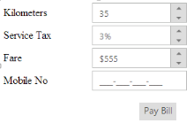
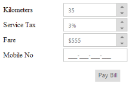
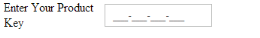

# Getting Started

## Create your first MaskEdit in ASP.NET

Essential ASP.NET MaskEdit control provides you restricted data input as well as formatted data output and it allows you to enter input with standard format. From the following guidelines you can create a MaskEdit control for standard input format. The following example illustrates you on how to use the MaskEdit control to enter a standard mobile number in a textbox.

The following screenshot illustrates the functionality of a MaskEdit. Here, Mobile Number textbox contains a MaskEdit control, only predefined text format is allowed. The input mask prevents you from entering invalid characters into the control.

 

## Create a MaskEdit control

You can create an ASP.NETProject and add the necessary assemblies and scripts with the help of the given [ASP.NET Web Forms-Getting Started](/aspnet/maskedittextbox/getting-started) Documentation.

Add the following code to the corresponding ASPX page to render the MaskEdit control.

Refer to the following link to know details on TextBoxes controls.

<http://help.syncfusion.com/js/angularjs>



<div class="frame">

        <div class="control">

            <table class="editors">

                <tbody>

                    <tr>

                        <td>

                            <label>

                                Kilometers</label>

                        </td>

                        <td>

                            <ej:NumericTextBox ID="Numeric" Value="35"runat="server">

                            </ej:NumericTextBox>

                        </td>

                    </tr>

                    <tr>

                        <td>

                            <label>

                                Service Tax</label>

                        </td>

                        <td>

                            <ej:PercentageTextBox ID="Percent" Value="3"runat="server">

                            </ej:PercentageTextBox>

                        </td>

                    </tr>

                    <tr>

                        <td>

                            <label>

                                Fare</label>

                        </td>

                        <td>

                            <ej:CurrencyTextBox ID="Currency" Value="555"runat="server">

                            </ej:CurrencyTextBox>

                        </td>

                    </tr>

                    <tr>

                        <td>

                            <label>

                                Mobile No</label>

                        </td>

                        <td>

                            <ej:MaskEdit InputMode="Text" Value="99-999-99999"MaskFormat="aaaa-aaaa-aaaa-aaaa"

                                ID="MaskEdit" runat="server">

                            </ej:MaskEdit>

                        </td>

                    </tr>

                </tbody>

            </table>

            <div class="pay-bill">

                <ej:Button ID="Pbill" Type="Button" runat="server" Text="Pay Bill">

                </ej:Button>

            

        

    
                                   



     Add the following style code to format the textbox.



        .frame

        {

            width: 300px;

        }

        .editors

        {

            max-width: 400px;

        }

        .control .pay-bill

        {

            margin-left: 208px;

            margin-top: 15px;

        }

        .editors label

        {

            display: block;

            width: 130px;

        }

        .control

        {

            margin-top: 10px;

        }

        .ctrl-label

        {

            padding-bottom: 3px;

        }



### Set Mask Value

The following code example is used to set mask value.



<ej:MaskEdit InputMode="Text" Value="99-999-99999" MaskFormat="99-999-99999"ID="MaskEdit" runat="server">

</ej:MaskEdit>



Execute the above code to render the following output.

Create Product Key Validation App using Mask Edit Control

In real-time, when you install Microsoft applications, you need to enter the product key for security. The value of product key format is predefined and that is done by using MaskEdit control.

Add the following code example in the <body> tag.



        <table>

            <tbody>

                <tr>

                    <td>

                        <label>

                            Enter your product key</label>

                    </td>

                    <td>

                        <ej:MaskEdit InputMode="Text" MaskFormat="aaaa-aaaa-aaaa-aaaa"

                            ID="MaskEdit" runat="server">

                        </ej:MaskEdit>

                    </td>

                </tr>

            </tbody>

        </table>

    



The following screenshot shows the output for the above code example.

 

