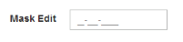
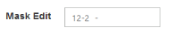
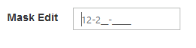
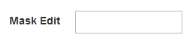

# Mask Edit Properties

## Setting Custom Character

The MaskEdit provides the option to use custom character. The specified character can be allowed to enter in the Mask Edit Textbox by using the CustomCharacter property.

## HidePromptOnLeave

The MaskEdit Textbox provides the option to hide the prompt when focus out from the control. The mask prompt is visible when you focus again to the control. The default value of HidePromptOnLeave is false.

## Defining Input Mode

The MaskEdit supports two type of inputs such as text and password that have been assigned by using the enum values ej.InputMode.Text and ej.InputMode.Password. The default value for InputMode is text in MaskEdit.

## Setting Mask Format

The MaskEdit provides the option to define the MaskFormat to the value. The default value for MaskFormat property is empty string.

The following table contains new mask characters and its functionalities. 

<table>
<tr>
<th>
Mask Character</th><th>
Functionalities</th></tr>
<tr>
<td>
A</td><td>
Alphanumeric characters placeholder(entry required)</td></tr>
<tr>
<td>
a</td><td>
Alphanumeric characters placeholder(entry optional)</td></tr>
<tr>
<td>
9</td><td>
Digit placeholder (entry optional)</td></tr>
<tr>
<td> > </td><td>
Convert all the characters that follow to uppercase.</td></tr>
<tr>
<td>
<</td><td>
Convert all the characters that follow to lowercase.</td></tr>
<tr>
<td>
C</td><td>
Character or space placeholder (entry optional).</td></tr>
<tr>
<td>
?</td><td>
Letter placeholder. For example: a – z or A – Z.</td></tr>
<tr>
<td>
&</td><td>
Character or space placeholder. It accepts the character except ANSI characters in the following ranges: 32-126 and 128-255.</td></tr>
<tr>
<td>
\\</td><td>
Which treats next character in mask string as literal.</td></tr>
<tr>
<td>
N/#</td><td>
Digit placeholder(entry required)</td></tr>
</table>

The following steps explains the implementation of MaskEdit Properties.

Add the following code example in your ASPX page to render the Textbox control.



<ej:MaskEdit ID="mask" MaskFormat="99-999-CCCC" Value="123456" CustomCharacter="r" HidePromptOnLeave="true" InputMode="Text"  runat="server"> </ej:MaskEdit>



The output for Mask Edit Textbox with its properties.

MaskEdit with MaskFormat
{:.caption}

 

MaskEdit with HidePromptOnLeave
{:.caption}

MaskEdit with prompt focus
{:.caption}

 

MaskEdit with InputMode text
{:.caption}

 

MaskEdit with CustomCharacter
{:.caption}