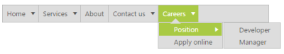
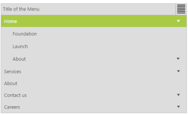
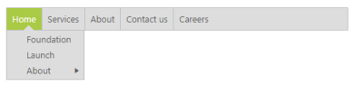
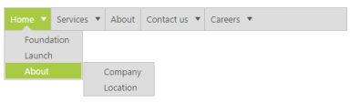

# Behavior Settings 

## Height

Specifies the Height of the root menu. You can customize the height of the Menu control by using height property. 

You can specify the height of the Menu control in the ASPX page as follows.



        <ej:Menu ID="MenuControl" Height="50" runat="server">

            <Items>

                <ej:MenuItem Id="Home" Text="Home">

                    <Items>

                        <ej:MenuItem Text="Foundation"></ej:MenuItem>

                    </Items>

                    <Items>

                        <ej:MenuItem Text="Launch"></ej:MenuItem>

                    </Items>

                    <Items>

                        <ej:MenuItem Text="About">

                            <Items>

                                <ej:MenuItem Text="Company"></ej:MenuItem>

                            </Items>

                            <Items>

                                <ej:MenuItem Text="Location"></ej:MenuItem>

                            </Items>

                        </ej:MenuItem>

                    </Items>

                </ej:MenuItem>

                <ej:MenuItem Id="Services" Text="Services">

                    <Items>

                        <ej:MenuItem Text="Consulting"></ej:MenuItem>

                    </Items>

                    <Items>

                        <ej:MenuItem Text="Outsourcing"></ej:MenuItem>

                    </Items>

                </ej:MenuItem>

                <ej:MenuItem Id="About" Text="About"></ej:MenuItem>

                <ej:MenuItem Id="Contact" Text="Contact us">

                    <Items>

                        <ej:MenuItem Text="Contact Number"></ej:MenuItem>

                    </Items>

                    <Items>

                        <ej:MenuItem Text="Email"></ej:MenuItem>

                    </Items>

                </ej:MenuItem>

                <ej:MenuItem Id="Careers" Text="Careers">

                    <Items>

                        <ej:MenuItem Text="Position">

                            <Items>

                                <ej:MenuItem Text="Developer"></ej:MenuItem>

                            </Items>

                            <Items>

                                <ej:MenuItem Text="Manager"></ej:MenuItem>

                            </Items>

                        </ej:MenuItem>

                    </Items>

                    <Items>

                        <ej:MenuItem Text="Apply online"></ej:MenuItem>

                    </Items>

                </ej:MenuItem>

            </Items>

        </ej:Menu>



## Width

Specifies the Width of the main menu. You can customize the height of the Menu control by using width property.

You can specify the width of the Menu control in the ASPX page as follows.



        <ej:Menu ID="MenuControl" Width="700" runat="server">

            <Items>

                <ej:MenuItem Id="Home" Text="Home">

                    <Items>

                        <ej:MenuItem Text="Foundation"></ej:MenuItem>

                    </Items>

                    <Items>

                        <ej:MenuItem Text="Launch"></ej:MenuItem>

                    </Items>

                    <Items>

                        <ej:MenuItem Text="About">

                            <Items>

                                <ej:MenuItem Text="Company"></ej:MenuItem>

                            </Items>

                            <Items>

                                <ej:MenuItem Text="Location"></ej:MenuItem>

                            </Items>

                        </ej:MenuItem>

                    </Items>

                </ej:MenuItem>

                <ej:MenuItem Id="Services" Text="Services">

                    <Items>

                        <ej:MenuItem Text="Consulting"></ej:MenuItem>

                    </Items>

                    <Items>

                        <ej:MenuItem Text="Outsourcing"></ej:MenuItem>

                    </Items>

                </ej:MenuItem>

                <ej:MenuItem Id="About" Text="About"></ej:MenuItem>

                <ej:MenuItem Id="Contact" Text="Contact us">

                    <Items>

                        <ej:MenuItem Text="Contact Number"></ej:MenuItem>

                    </Items>

                    <Items>

                        <ej:MenuItem Text="Email"></ej:MenuItem>

                    </Items>

                </ej:MenuItem>

                <ej:MenuItem Id="Careers" Text="Careers">

                    <Items>

                        <ej:MenuItem Text="Position">

                            <Items>

                                <ej:MenuItem Text="Developer"></ej:MenuItem>

                            </Items>

                            <Items>

                                <ej:MenuItem Text="Manager"></ej:MenuItem>

                            </Items>

                        </ej:MenuItem>

                    </Items>

                    <Items>

                        <ej:MenuItem Text="Apply online"></ej:MenuItem>

                    </Items>

                </ej:MenuItem>

            </Items>

        </ej:Menu>



## Open on click

Specifies the sub menu items to show or open only on click operation. It accepts the Boolean value. Its default value is false. When you set “OpenOnClick” property to true then the submenu items open only on click. By default the submenu opens when you hover on menu items.

Add the following code example in the ASPX page. 



        <ej:Menu ID="MenuControl" Width="500" OpenOnClick="true" runat="server">

            <Items>

                <ej:MenuItem Id="Home" Text="Home">

                    <Items>

                        <ej:MenuItem Text="Foundation"></ej:MenuItem>

                    </Items>

                    <Items>

                        <ej:MenuItem Text="Launch"></ej:MenuItem>

                    </Items>

                    <Items>

                        <ej:MenuItem Text="About">

                            <Items>

                                <ej:MenuItem Text="Company"></ej:MenuItem>

                            </Items>

                            <Items>

                                <ej:MenuItem Text="Location"></ej:MenuItem>

                            </Items>

                        </ej:MenuItem>

                    </Items>

                </ej:MenuItem>

                <ej:MenuItem Id="Services" Text="Services">

                    <Items>

                        <ej:MenuItem Text="Consulting"></ej:MenuItem>

                    </Items>

                    <Items>

                        <ej:MenuItem Text="Outsourcing"></ej:MenuItem>

                    </Items>

                </ej:MenuItem>

                <ej:MenuItem Id="About" Text="About"></ej:MenuItem>

                <ej:MenuItem Id="Contact" Text="Contact us">

                    <Items>

                        <ej:MenuItem Text="Contact Number"></ej:MenuItem>

                    </Items>

                    <Items>

                        <ej:MenuItem Text="Email"></ej:MenuItem>

                    </Items>

                </ej:MenuItem>

                <ej:MenuItem Id="Careers" Text="Careers">

                    <Items>

                        <ej:MenuItem Text="Position">

                            <Items>

                                <ej:MenuItem Text="Developer"></ej:MenuItem>

                            </Items>

                            <Items>

                                <ej:MenuItem Text="Manager"></ej:MenuItem>

                            </Items>

                        </ej:MenuItem>

                    </Items>

                    <Items>

                        <ej:MenuItem Text="Apply online"></ej:MenuItem>

                    </Items>

                </ej:MenuItem>

            </Items>

        </ej:Menu>



Output screenshot for the above code example is as follows.

 

## Animation

AnimationType is used to enable or disable the Animation while hover or click on menu items. Its value type is string. It accepts two values such as “None” and “Default”. Support to disable the Animation Type while hover or click on menu items is none. Support to enable the AnimationType while hover or click on menu items is default. 

Add the following code example in the ASPX page. 



        <ej:Menu ID="MenuControl" Width="500" AnimationType="Default" runat="server">

            <Items>

                <ej:MenuItem Id="Home" Text="Home">

                    <Items>

                        <ej:MenuItem Text="Foundation"></ej:MenuItem>

                    </Items>

                    <Items>

                        <ej:MenuItem Text="Launch"></ej:MenuItem>

                    </Items>

                    <Items>

                        <ej:MenuItem Text="About">

                            <Items>

                                <ej:MenuItem Text="Company"></ej:MenuItem>

                            </Items>

                            <Items>

                                <ej:MenuItem Text="Location"></ej:MenuItem>

                            </Items>

                        </ej:MenuItem>

                    </Items>

                </ej:MenuItem>

                <ej:MenuItem Id="Services" Text="Services">

                    <Items>

                        <ej:MenuItem Text="Consulting"></ej:MenuItem>

                    </Items>

                    <Items>

                        <ej:MenuItem Text="Outsourcing"></ej:MenuItem>

                    </Items>

                </ej:MenuItem>

                <ej:MenuItem Id="About" Text="About"></ej:MenuItem>

                <ej:MenuItem Id="Contact" Text="Contact us">

                    <Items>

                        <ej:MenuItem Text="Contact Number"></ej:MenuItem>

                    </Items>

                    <Items>

                        <ej:MenuItem Text="Email"></ej:MenuItem>

                    </Items>

                </ej:MenuItem>

                <ej:MenuItem Id="Careers" Text="Careers">

                    <Items>

                        <ej:MenuItem Text="Position">

                            <Items>

                                <ej:MenuItem Text="Developer"></ej:MenuItem>

                            </Items>

                            <Items>

                                <ej:MenuItem Text="Manager"></ej:MenuItem>

                            </Items>

                        </ej:MenuItem>

                    </Items>

                    <Items>

                        <ej:MenuItem Text="Apply online"></ej:MenuItem>

                    </Items>

                </ej:MenuItem>

            </Items>

        </ej:Menu>



Output screenshot for the above code example is as follows.

 

## Title text

Specifies the title to the responsive menu. You can provide title to the Menu control by using TitleText property. 

You can specify the title of the Menu control in the ASPX page as follows.



        <ej:Menu ID="MenuControl" Width="500" TitleText="Title of the Menu" runat="server">

            <Items>

                <ej:MenuItem Id="Home" Text="Home">

                    <Items>

                        <ej:MenuItem Text="Foundation"></ej:MenuItem>

                    </Items>

                    <Items>

                        <ej:MenuItem Text="Launch"></ej:MenuItem>

                    </Items>

                    <Items>

                        <ej:MenuItem Text="About">

                            <Items>

                                <ej:MenuItem Text="Company"></ej:MenuItem>

                            </Items>

                            <Items>

                                <ej:MenuItem Text="Location"></ej:MenuItem>

                            </Items>

                        </ej:MenuItem>

                    </Items>

                </ej:MenuItem>

                <ej:MenuItem Id="Services" Text="Services">

                    <Items>

                        <ej:MenuItem Text="Consulting"></ej:MenuItem>

                    </Items>

                    <Items>

                        <ej:MenuItem Text="Outsourcing"></ej:MenuItem>

                    </Items>

                </ej:MenuItem>

                <ej:MenuItem Id="About" Text="About"></ej:MenuItem>

                <ej:MenuItem Id="Contact" Text="Contact us">

                    <Items>

                        <ej:MenuItem Text="Contact Number"></ej:MenuItem>

                    </Items>

                    <Items>

                        <ej:MenuItem Text="Email"></ej:MenuItem>

                    </Items>

                </ej:MenuItem>

                <ej:MenuItem Id="Careers" Text="Careers">

                    <Items>

                        <ej:MenuItem Text="Position">

                            <Items>

                                <ej:MenuItem Text="Developer"></ej:MenuItem>

                            </Items>

                            <Items>

                                <ej:MenuItem Text="Manager"></ej:MenuItem>

                            </Items>

                        </ej:MenuItem>

                    </Items>

                    <Items>

                        <ej:MenuItem Text="Apply online"></ej:MenuItem>

                    </Items>

                </ej:MenuItem>

            </Items>

        </ej:Menu>



The following screenshot displays the output of the above code example.

 

## Show root level arrows

Specifies the main menu items arrows only to be displayed when it contains child menu items. You can use “ShowRootLevelArrows” property to show the arrows of main menu items only when it contains child menu items. This property accepts Boolean value. Its default value is true. 

Add the following code example in the ASPX page.



 <ej:Menu ID="MenuControl" Width="500" ShowRootLevelArrows="false" runat="server">

            <Items>

                <ej:MenuItem Id="Home" Text="Home">

                    <Items>

                        <ej:MenuItem Text="Foundation"></ej:MenuItem>

                    </Items>

                    <Items>

                        <ej:MenuItem Text="Launch"></ej:MenuItem>

                    </Items>

                    <Items>

                        <ej:MenuItem Text="About">

                            <Items>

                                <ej:MenuItem Text="Company"></ej:MenuItem>

                            </Items>

                            <Items>

                                <ej:MenuItem Text="Location"></ej:MenuItem>

                            </Items>

                        </ej:MenuItem>

                    </Items>

                </ej:MenuItem>

                <ej:MenuItem Id="Services" Text="Services">

                    <Items>

                        <ej:MenuItem Text="Consulting"></ej:MenuItem>

                    </Items>

                    <Items>

                        <ej:MenuItem Text="Outsourcing"></ej:MenuItem>

                    </Items>

                </ej:MenuItem>

                <ej:MenuItem Id="About" Text="About"></ej:MenuItem>

                <ej:MenuItem Id="Contact" Text="Contact us">

                    <Items>

                        <ej:MenuItem Text="Contact Number"></ej:MenuItem>

                    </Items>

                    <Items>

                        <ej:MenuItem Text="Email"></ej:MenuItem>

                    </Items>

                </ej:MenuItem>

                <ej:MenuItem Id="Careers" Text="Careers">

                    <Items>

                        <ej:MenuItem Text="Position">

                            <Items>

                                <ej:MenuItem Text="Developer"></ej:MenuItem>

                            </Items>

                            <Items>

                                <ej:MenuItem Text="Manager"></ej:MenuItem>

                            </Items>

                        </ej:MenuItem>

                    </Items>

                    <Items>

                        <ej:MenuItem Text="Apply online"></ej:MenuItem>

                    </Items>

                </ej:MenuItem>

            </Items>

        </ej:Menu>



The following screenshot displays the output of the above code example.

 

## Show sub level arrows

Specifies the sub menu items arrows only to be displayed when it contains child menu items. You can use “ShowSubLevelArrows” property to show the arrows of sub menu items only when it contains child menu items. This property accepts Boolean value. Its default value is true. 

Add the following code example in the ASPX page.



        <ej:Menu ID="MenuControl" Width="500" ShowSubLevelArrows="false" runat="server">

            <Items>

                <ej:MenuItem Id="Home" Text="Home">

                    <Items>

                        <ej:MenuItem Text="Foundation"></ej:MenuItem>

                    </Items>

                    <Items>

                        <ej:MenuItem Text="Launch"></ej:MenuItem>

                    </Items>

                    <Items>

                        <ej:MenuItem Text="About">

                            <Items>

                                <ej:MenuItem Text="Company"></ej:MenuItem>

                            </Items>

                            <Items>

                                <ej:MenuItem Text="Location"></ej:MenuItem>

                            </Items>

                        </ej:MenuItem>

                    </Items>

                </ej:MenuItem>

                <ej:MenuItem Id="Services" Text="Services">

                    <Items>

                        <ej:MenuItem Text="Consulting"></ej:MenuItem>

                    </Items>

                    <Items>

                        <ej:MenuItem Text="Outsourcing"></ej:MenuItem>

                    </Items>

                </ej:MenuItem>

                <ej:MenuItem Id="About" Text="About"></ej:MenuItem>

                <ej:MenuItem Id="Contact" Text="Contact us">

                    <Items>

                        <ej:MenuItem Text="Contact Number"></ej:MenuItem>

                    </Items>

                    <Items>

                        <ej:MenuItem Text="Email"></ej:MenuItem>

                    </Items>

                </ej:MenuItem>

                <ej:MenuItem Id="Careers" Text="Careers">

                    <Items>

                        <ej:MenuItem Text="Position">

                            <Items>

                                <ej:MenuItem Text="Developer"></ej:MenuItem>

                            </Items>

                            <Items>

                                <ej:MenuItem Text="Manager"></ej:MenuItem>

                            </Items>

                        </ej:MenuItem>

                    </Items>

                    <Items>

                        <ej:MenuItem Text="Apply online"></ej:MenuItem>

                    </Items>

                </ej:MenuItem>

            </Items>

        </ej:Menu>



The following screenshot display the output of the above code example.

 

