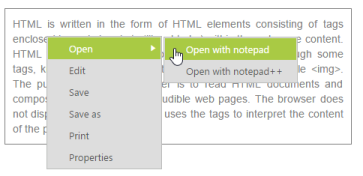
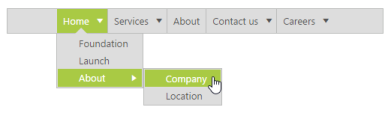
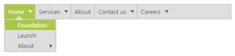

# Context Menu support in ASP.NET Webforms Menu

A context menu is a type of menu in a graphical user interface (GUI) that appears when you perform right click operation. In this menu control you can use a context menu by specifying the type of menu as ContextMenu. A context also provides the supports for nested level of menu items.

Before using the context menu, provide the target area for, in which place the context menu can appear. 

In the following code example, a context menu is created for the division that contains text. Here, when you perform right click operation, the menu appears with menu items such as, open, edit, etc.

Add the following code example in your ASPX page.



        HTML is written in the form of HTML elements consisting of tags enclosed in angle

        brackets (like

        <html>

        ),within the web page content. HTML tags most commonly come in pairs like and ,although

        some tags, known as empty elements, are unpaired, for example

        . The purpose of a web browser is to read HTML documents and compose them into

        visible or audible web pages. The browser does not display the HTML tags, but uses

        the tags to interpret the content of the page.

    

    <ej:Menu ID="Menu1" MenuType="ContextMenu" OpenOnClick="false" runat="server" ContextMenuTarget="#target">

        <Items>

            <ej:MenuItem Text="Open">

                <Items>

                    <ej:MenuItem Text="Open with notepad"></ej:MenuItem>

                </Items>

                <Items>

                    <ej:MenuItem Text="Open with notepad++"></ej:MenuItem>

                </Items>

            </ej:MenuItem>

        </Items>

        <Items>

            <ej:MenuItem Text="Edit"></ej:MenuItem>

        </Items>

        <Items>

            <ej:MenuItem Text="Save"></ej:MenuItem>

        </Items>

        <Items>

            <ej:MenuItem Text="Save as"></ej:MenuItem>

        </Items>

        <Items>

            <ej:MenuItem Text="Print"></ej:MenuItem>

        </Items>

        <Items>

            <ej:MenuItem Text="Properties"></ej:MenuItem>

        </Items>

    </ej:Menu>



Add the following code example in your style section



    .textarea {

        border: 1px solid;

        padding: 10px;

        position: relative;

        text-align: justify;

        width: 463px;

        color: gray;

        margin: 0 auto;

    }



The following screenshot displays the output of the above code example.

 

## HideContextMenu

Hides the context menu control. 

Add the following code example in your ASPX page.



        HTML is written in the form of HTML elements consisting of tags enclosed in angle

        brackets (like

        <html>

        ),within the web page content. HTML tags most commonly come in pairs like and ,although

        some tags, known as empty elements, are unpaired, for example

        . The purpose of a web browser is to read HTML documents and compose them into

        visible or audible web pages. The browser does not display the HTML tags, but uses

        the tags to interpret the content of the page.

    

    <ej:Menu ID="MenuControl" MenuType="ContextMenu" OpenOnClick="false" runat="server" ContextMenuTarget="#target">

        <Items>

            <ej:MenuItem Text="Open">

                <Items>

                    <ej:MenuItem Text="Open with notepad"></ej:MenuItem>

                </Items>

                <Items>

                    <ej:MenuItem Text="Open with notepad++"></ej:MenuItem>

                </Items>

            </ej:MenuItem>

        </Items>

        <Items>

            <ej:MenuItem Text="Edit"></ej:MenuItem>

        </Items>

        <Items>

            <ej:MenuItem Text="Save"></ej:MenuItem>

        </Items>

        <Items>

            <ej:MenuItem Text="Save as"></ej:MenuItem>

        </Items>

        <Items>

            <ej:MenuItem Text="Print"></ej:MenuItem>

        </Items>

        <Items>

            <ej:MenuItem Text="Properties"></ej:MenuItem>

        </Items>

    </ej:Menu>



Add the following code example in your style section



    .textarea {

        border: 1px solid;

        padding: 10px;

        position: relative;

        text-align: justify;

        width: 463px;

        color: gray;

        margin: 0 auto;

    }



Add the following script code in the sample in order to hide the context menu.



    $(document).ready(function () {

        var menuObj = $("#<%=MenuControl.ClientID%>").data("ejMenu");

        //To enable Menu item using item id

        menuObj.hideContextMenu();

    });



## ShowContextMenu

Shows the context menu control.

Add the following code example in your ASPX page.



        HTML is written in the form of HTML elements consisting of tags enclosed in angle

        brackets (like

        <html>

        ),within the web page content. HTML tags most commonly come in pairs like and ,although

        some tags, known as empty elements, are unpaired, for example

        . The purpose of a web browser is to read HTML documents and compose them into

        visible or audible web pages. The browser does not display the HTML tags, but uses

        the tags to interpret the content of the page.

    

    <ej:Menu ID="MenuControl" MenuType="ContextMenu" OpenOnClick="false" runat="server" ContextMenuTarget="#target">

        <Items>

            <ej:MenuItem Text="Open">

                <Items>

                    <ej:MenuItem Text="Open with notepad"></ej:MenuItem>

                </Items>

                <Items>

                    <ej:MenuItem Text="Open with notepad++"></ej:MenuItem>

                </Items>

            </ej:MenuItem>

        </Items>

        <Items>

            <ej:MenuItem Text="Edit"></ej:MenuItem>

        </Items>

        <Items>

            <ej:MenuItem Text="Save"></ej:MenuItem>

        </Items>

        <Items>

            <ej:MenuItem Text="Save as"></ej:MenuItem>

        </Items>

        <Items>

            <ej:MenuItem Text="Print"></ej:MenuItem>

        </Items>

        <Items>

            <ej:MenuItem Text="Properties"></ej:MenuItem>

        </Items>

    </ej:Menu>



Add the following code example in your style section



    .textarea {

        border: 1px solid;

        padding: 10px;

        position: relative;

        text-align: justify;

        width: 463px;

        color: gray;

        margin: 0 auto;

    }



Add the following script code in the sample in order to show the context menu.



    $(document).ready(function () {

        var menuObj = $("#<%=MenuControl.ClientID%>").data("ejMenu");

        //To enable Menu item using item id

        menuObj.showContextMenu();

    });



## Center Menu

You can align the Menu items to center by setting “EnableCenterAlign” property as true. “EnableCenterAlign” property accepts Boolean value. By default, its value is false. When you set to true, the root menu items are aligned in center.

Add the following code example in ASPX section.



        <ej:Menu ID="MenuControl" Width="500" EnableCenterAlign="true" runat="server">

            <Items>

                <ej:MenuItem Id="Home" Text="Home">

                    <Items>

                        <ej:MenuItem Text="Foundation"></ej:MenuItem>

                    </Items>

                    <Items>

                        <ej:MenuItem Text="Launch"></ej:MenuItem>

                    </Items>

                    <Items>

                        <ej:MenuItem Text="About">

                            <Items>

                                <ej:MenuItem Text="Company"></ej:MenuItem>

                            </Items>

                            <Items>

                                <ej:MenuItem Text="Location"></ej:MenuItem>

                            </Items>

                        </ej:MenuItem>

                    </Items>

                </ej:MenuItem>

                <ej:MenuItem Id="Services" Text="Services">

                    <Items>

                        <ej:MenuItem Text="Consulting"></ej:MenuItem>

                    </Items>

                    <Items>

                        <ej:MenuItem Text="Outsourcing"></ej:MenuItem>

                    </Items>

                </ej:MenuItem>

                <ej:MenuItem Id="About" Text="About"></ej:MenuItem>

                <ej:MenuItem Id="Contact" Text="Contact us">

                    <Items>

                        <ej:MenuItem Text="Contact Number"></ej:MenuItem>

                    </Items>

                    <Items>

                        <ej:MenuItem Text="Email"></ej:MenuItem>

                    </Items>

                </ej:MenuItem>

                <ej:MenuItem Id="Careers" Text="Careers">

                    <Items>

                        <ej:MenuItem Text="Position">

                            <Items>

                                <ej:MenuItem Text="Developer"></ej:MenuItem>

                            </Items>

                            <Items>

                                <ej:MenuItem Text="Manager"></ej:MenuItem>

                            </Items>

                        </ej:MenuItem>

                    </Items>

                    <Items>

                        <ej:MenuItem Text="Apply online"></ej:MenuItem>

                    </Items>

                </ej:MenuItem>

            </Items>

        </ej:Menu>



The following screenshot displays the output of the above code example.

 

## RTL Support

The EnableRTL option allows the Menu control to display it in the right to left direction. By default, this option is set to “false” in the Menu control.

The following code example depicts how to enable the RTL property of the Menu control,



        <ej:Menu ID="MenuControl" Width="500" EnableRTL="true" runat="server">

            <Items>

                <ej:MenuItem Id="Home" Text="Home">

                    <Items>

                        <ej:MenuItem Text="Foundation"></ej:MenuItem>

                    </Items>

                    <Items>

                        <ej:MenuItem Text="Launch"></ej:MenuItem>

                    </Items>

                    <Items>

                        <ej:MenuItem Text="About">

                            <Items>

                                <ej:MenuItem Text="Company"></ej:MenuItem>

                            </Items>

                            <Items>

                                <ej:MenuItem Text="Location"></ej:MenuItem>

                            </Items>

                        </ej:MenuItem>

                    </Items>

                </ej:MenuItem>

                <ej:MenuItem Id="Services" Text="Services">

                    <Items>

                        <ej:MenuItem Text="Consulting"></ej:MenuItem>

                    </Items>

                    <Items>

                        <ej:MenuItem Text="Outsourcing"></ej:MenuItem>

                    </Items>

                </ej:MenuItem>

                <ej:MenuItem Id="About" Text="About"></ej:MenuItem>

                <ej:MenuItem Id="Contact" Text="Contact us">

                    <Items>

                        <ej:MenuItem Text="Contact Number"></ej:MenuItem>

                    </Items>

                    <Items>

                        <ej:MenuItem Text="Email"></ej:MenuItem>

                    </Items>

                </ej:MenuItem>

                <ej:MenuItem Id="Careers" Text="Careers">

                    <Items>

                        <ej:MenuItem Text="Position">

                            <Items>

                                <ej:MenuItem Text="Developer"></ej:MenuItem>

                            </Items>

                            <Items>

                                <ej:MenuItem Text="Manager"></ej:MenuItem>

                            </Items>

                        </ej:MenuItem>

                    </Items>

                    <Items>

                        <ej:MenuItem Text="Apply online"></ej:MenuItem>

                    </Items>

                </ej:MenuItem>

            </Items>

        </ej:Menu>



The following screenshot displays the output for the above code example.

 

## Separators

Separators can be added to menu items to display a horizontal bars between menu items. Separators are similar to borders and cannot be selected.**enableSeparator** is the property that is used to display the separators in the Menu control. It accepts Boolean type value. Its default value is true.

Add the following code example in the ASPX page.



        <ej:Menu ID="MenuControl" Width="500" EnableSeparator="true" runat="server">

            <Items>

                <ej:MenuItem Id="Home" Text="Home">

                    <Items>

                        <ej:MenuItem Text="Foundation"></ej:MenuItem>

                    </Items>

                    <Items>

                        <ej:MenuItem Text="Launch"></ej:MenuItem>

                    </Items>

                    <Items>

                        <ej:MenuItem Text="About">

                            <Items>

                                <ej:MenuItem Text="Company"></ej:MenuItem>

                            </Items>

                            <Items>

                                <ej:MenuItem Text="Location"></ej:MenuItem>

                            </Items>

                        </ej:MenuItem>

                    </Items>

                </ej:MenuItem>

                <ej:MenuItem Id="Services" Text="Services">

                    <Items>

                        <ej:MenuItem Text="Consulting"></ej:MenuItem>

                    </Items>

                    <Items>

                        <ej:MenuItem Text="Outsourcing"></ej:MenuItem>

                    </Items>

                </ej:MenuItem>

                <ej:MenuItem Id="About" Text="About"></ej:MenuItem>

                <ej:MenuItem Id="Contact" Text="Contact us">

                    <Items>

                        <ej:MenuItem Text="Contact Number"></ej:MenuItem>

                    </Items>

                    <Items>

                        <ej:MenuItem Text="Email"></ej:MenuItem>

                    </Items>

                </ej:MenuItem>

                <ej:MenuItem Id="Careers" Text="Careers">

                    <Items>

                        <ej:MenuItem Text="Position">

                            <Items>

                                <ej:MenuItem Text="Developer"></ej:MenuItem>

                            </Items>

                            <Items>

                                <ej:MenuItem Text="Manager"></ej:MenuItem>

                            </Items>

                        </ej:MenuItem>

                    </Items>

                    <Items>

                        <ej:MenuItem Text="Apply online"></ej:MenuItem>

                    </Items>

                </ej:MenuItem>

            </Items>

        </ej:Menu>



The following screenshot displays the output for the above code example.

 

Add the following code example in the ASPX page to display the Menu control without Separator by setting EnableSeparator as false.



        <ej:Menu ID="MenuControl" Width="500" EnableSeparator="false" runat="server">

            <Items>

                <ej:MenuItem Id="Home" Text="Home">

                    <Items>

                        <ej:MenuItem Text="Foundation"></ej:MenuItem>

                    </Items>

                    <Items>

                        <ej:MenuItem Text="Launch"></ej:MenuItem>

                    </Items>

                    <Items>

                        <ej:MenuItem Text="About">

                            <Items>

                                <ej:MenuItem Text="Company"></ej:MenuItem>

                            </Items>

                            <Items>

                                <ej:MenuItem Text="Location"></ej:MenuItem>

                            </Items>

                        </ej:MenuItem>

                    </Items>

                </ej:MenuItem>

                <ej:MenuItem Id="Services" Text="Services">

                    <Items>

                        <ej:MenuItem Text="Consulting"></ej:MenuItem>

                    </Items>

                    <Items>

                        <ej:MenuItem Text="Outsourcing"></ej:MenuItem>

                    </Items>

                </ej:MenuItem>

                <ej:MenuItem Id="About" Text="About"></ej:MenuItem>

                <ej:MenuItem Id="Contact" Text="Contact us">

                    <Items>

                        <ej:MenuItem Text="Contact Number"></ej:MenuItem>

                    </Items>

                    <Items>

                        <ej:MenuItem Text="Email"></ej:MenuItem>

                    </Items>

                </ej:MenuItem>

                <ej:MenuItem Id="Careers" Text="Careers">

                    <Items>

                        <ej:MenuItem Text="Position">

                            <Items>

                                <ej:MenuItem Text="Developer"></ej:MenuItem>

                            </Items>

                            <Items>

                                <ej:MenuItem Text="Manager"></ej:MenuItem>

                            </Items>

                        </ej:MenuItem>

                    </Items>

                    <Items>

                        <ej:MenuItem Text="Apply online"></ej:MenuItem>

                    </Items>

                </ej:MenuItem>

            </Items>

        </ej:Menu>



The following screenshot displays the output for the above code example. 

