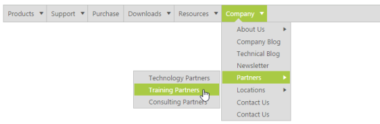
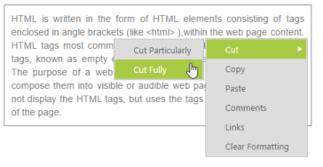

# Customizing the Submenu direction

You can customize the direction to open the sub menu items by using SubMenuDirection property. SubMenuDirection accepts the type as string or enum. It accepts the value as “Left” and “Right”. 

In the following code example, the Sub menus are open in the Left side of the menu.

Add the following code example in your ASPX page.



<ej:Menu ID="syncfusionProducts" SubMenuDirection="Left" runat="server">

        <Items>

            <ej:MenuItem Id="Products" Text="Products">

                <Items>

                    <ej:MenuItem Text="ASP.NET"></ej:MenuItem>

                </Items>

                <Items>

                    <ej:MenuItem Text="ASP.NET MVC"></ej:MenuItem>

                </Items>

                <Items>

                    <ej:MenuItem Text="Mobile MVC"></ej:MenuItem>

                </Items>

                <Items>

                    <ej:MenuItem Text="Silverlight"></ej:MenuItem>

                </Items>

                <Items>

                    <ej:MenuItem Text="Windows Forms"></ej:MenuItem>

                </Items>

                <Items>

                    <ej:MenuItem Text="Windows Phone"></ej:MenuItem>

                </Items>

                <Items>

                    <ej:MenuItem Text="WinRT (XMAL)"></ej:MenuItem>

                </Items>

                <Items>

                    <ej:MenuItem Text="WPF"></ej:MenuItem>

                </Items>

                <Items>

                    <ej:MenuItem Text="Orubase Studio"></ej:MenuItem>

                </Items>

                <Items>

                    <ej:MenuItem Text="Metro Studio"></ej:MenuItem>

                </Items>

                <Items>

                    <ej:MenuItem Text="What's New">

                        <Items>

                            <ej:MenuItem Text="WinRT (XMAL)"></ej:MenuItem>

                        </Items>

                        <Items>

                            <ej:MenuItem Text="WPF"></ej:MenuItem>

                        </Items>

                        <Items>

                            <ej:MenuItem Text="Silverlight"></ej:MenuItem>

                        </Items>

                        <Items>

                            <ej:MenuItem Text="Windows Forms"></ej:MenuItem>

                        </Items>

                        <Items>

                            <ej:MenuItem Text="ASP.NET MVC"></ej:MenuItem>

                        </Items>

                        <Items>

                            <ej:MenuItem Text="ASP.NET"></ej:MenuItem>

                        </Items>

                    </ej:MenuItem>

                </Items>

            </ej:MenuItem>

            <ej:MenuItem Id="Support" Text="Support">

                <Items>

                    <ej:MenuItem Text="Direct-Trac Support"></ej:MenuItem>

                </Items>

                <Items>

                    <ej:MenuItem Text="Community Forums"></ej:MenuItem>

                </Items>

                <Items>

                    <ej:MenuItem Text="Knowledge Base"></ej:MenuItem>

                </Items>

                <Items>

                    <ej:MenuItem Text="Online Documentation"></ej:MenuItem>

                </Items>

                <Items>

                    <ej:MenuItem Text="Services">

                        <Items>

                            <ej:MenuItem Text="Consulting"></ej:MenuItem>

                        </Items>

                        <Items>

                            <ej:MenuItem Text="Taining"></ej:MenuItem>

                        </Items>

                    </ej:MenuItem>

                </Items>

                <Items>

                    <ej:MenuItem Text="Community Forums"></ej:MenuItem>

                </Items>

            </ej:MenuItem>

            <ej:MenuItem Id="Purchase" Text="Purchase"></ej:MenuItem>

            <ej:MenuItem Id="Downloads" Text="Downloads">

                <Items>

                    <ej:MenuItem Text="Evaluation"></ej:MenuItem>

                </Items>

                <Items>

                    <ej:MenuItem Text="Free E-Books"></ej:MenuItem>

                </Items>

                <Items>

                    <ej:MenuItem Text="Metro Studio"></ej:MenuItem>

                </Items>

                <Items>

                    <ej:MenuItem Text="Latest Version"></ej:MenuItem>

                </Items>

                <Items>

                    <ej:MenuItem Text="Version History"></ej:MenuItem>

                </Items>

            </ej:MenuItem>

            <ej:MenuItem Id="Resources" Text="Resources">

                <Items>

                    <ej:MenuItem Text="Technology Resource Portal">

                        <Items>

                            <ej:MenuItem Text="E-books"></ej:MenuItem>

                        </Items>

                        <Items>

                            <ej:MenuItem Text="White Papers"></ej:MenuItem>

                        </Items>

                    </ej:MenuItem>

                </Items>

                <Items>

                    <ej:MenuItem Text="Case Studies"></ej:MenuItem>

                </Items>

                <Items>

                    <ej:MenuItem Text="Bouchers & Datasheets"></ej:MenuItem>

                </Items>

                <Items>

                    <ej:MenuItem Text="FAQ"></ej:MenuItem>

                </Items>

            </ej:MenuItem>

            <ej:MenuItem Id="Company" Text="Company">

                <Items>

                    <ej:MenuItem Text="About Us">

                        <Items>

                            <ej:MenuItem Text="More About Us"></ej:MenuItem>

                        </Items>

                        <Items>

                            <ej:MenuItem Text="Management"></ej:MenuItem>

                        </Items>

                        <Items>

                            <ej:MenuItem Text="News & Events"></ej:MenuItem>

                        </Items>

                        <Items>

                            <ej:MenuItem Text="Customer Quotes"></ej:MenuItem>

                        </Items>

                        <Items>

                            <ej:MenuItem Text="Customer Lists"></ej:MenuItem>

                        </Items>

                        <Items>

                            <ej:MenuItem Text="Case Studies"></ej:MenuItem>

                        </Items>

                        <Items>

                            <ej:MenuItem Text="Awards"></ej:MenuItem>

                        </Items>

                        <Items>

                            <ej:MenuItem Text="Media Kit"></ej:MenuItem>

                        </Items>

                    </ej:MenuItem>

                </Items>

                <Items>

                    <ej:MenuItem Text="Company Blog"></ej:MenuItem>

                </Items>

                <Items>

                    <ej:MenuItem Text="Technical Blog"></ej:MenuItem>

                </Items>

                <Items>

                    <ej:MenuItem Text="Newsletter"></ej:MenuItem>

                </Items>

                <Items>

                    <ej:MenuItem Text="Partners">

                        <Items>

                            <ej:MenuItem Text="Technology Partners"></ej:MenuItem>

                        </Items>

                        <Items>

                            <ej:MenuItem Text="Training Partners"></ej:MenuItem>

                        </Items>

                        <Items>

                            <ej:MenuItem Text="Consulting Partners"></ej:MenuItem>

                        </Items>

                    </ej:MenuItem>

                </Items>

                <Items>

                    <ej:MenuItem Text="Locations">

                        <Items>

                            <ej:MenuItem Text="RDU"></ej:MenuItem>

                        </Items>

                        <Items>

                            <ej:MenuItem Text="Chennai"></ej:MenuItem>

                        </Items>

                    </ej:MenuItem>

                </Items>

                <Items>

                    <ej:MenuItem Text="Contact Us"></ej:MenuItem>

                </Items>

                <Items>

                    <ej:MenuItem Text="Contact Us"></ej:MenuItem>

                </Items>

            </ej:MenuItem>

        </Items>

    </ej:Menu>



The output for the above code example is as follows.

 

You can achieve auto positioning for Context Menu also. Use the following code example for context menu in order to open the submenu items of context menu in the left side.

Add the following code example in your ASPX page.



        HTML is written in the form of HTML elements consisting of tags enclosed in angle

        brackets (like

        <html>

        ),within the web page content. HTML tags most commonly come in pairs like and ,although

        some tags, known as empty elements, are unpaired, for example

        . The purpose of a web browser is to read HTML documents and compose them into

        visible or audible web pages. The browser does not display the HTML tags, but uses

        the tags to interpret the content of the page.

    

    <ej:Menu ID="Menu1" MenuType="ContextMenu" OpenOnClick="false" SubMenuDirection="Left" runat="server" ContextMenuTarget="#target">

        <Items>

            <ej:MenuItem Text="Cut">

                <Items>

                    <ej:MenuItem Text="Cut Particularly"></ej:MenuItem>

                </Items>

                <Items>

                    <ej:MenuItem Text="Cut Fully"></ej:MenuItem>

                </Items>

            </ej:MenuItem>

        </Items>

        <Items>

            <ej:MenuItem Text="Copy"></ej:MenuItem>

        </Items>

        <Items>

            <ej:MenuItem Text="Paste"></ej:MenuItem>

        </Items>

        <Items>

            <ej:MenuItem SpriteCssClass="separator"></ej:MenuItem>

        </Items>

        <Items>

            <ej:MenuItem Text="Comments"></ej:MenuItem>

        </Items>

        <Items>

            <ej:MenuItem Text="Links"></ej:MenuItem>

        </Items>

        <Items>

            <ej:MenuItem Text="Clear Formatting"></ej:MenuItem>

        </Items>

    </ej:Menu>



Add the following code example in your style section.



    .textarea {

        border: 1px solid;

        padding: 10px;

        position: relative;

        text-align: justify;

        width: 463px;

        color: gray;

        margin: 0 auto;

    }



The output for the above code example is as follows.

 

