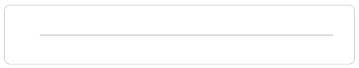
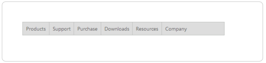

# Getting Started 

## Create Syncfusion Menu in ASP.NET

The ASP.NET Menu supports you to display a Menu of list-out items. This Menu is based on UL-LI hierarchy, where the sub-list items can be rendered as the sub-menu items. You can also render the Menu control with local and remote data source.  From the following guideline, you can learn how to customize the Menu control for a website. In this case, Syncfusion’s website Menu is used to explain this topic. The following screenshot displays the appearance of Menu.

 

### Create a Menu

You can create an ASP Project and add necessary assembly and script with the help of the given [ASP-Getting Started](http://help.syncfusion.com/aspnet/menu/getting-started) Documentation. Add the following code to the corresponding ASPX page for Menu rendering.



   <ej:Menu ID="SyncfusionProducts" runat="server" Width="615px">

   </ej:Menu>



Initialize the Menu control with the following CSS.



  .frame

  {

      border: 1px solid #BBBCBB;

      border-radius: 10px 10px 10px 10px;

      padding: 50px;

      margin-top: 40px;

      width: 700px;

      height: 50px;

      margin-left: 100px;

  }



Output of above steps

 

### Configure parent Menu items

Every Menu contains a list of Menu items with list of sub level Menu items. From the following guide lines, you can learn how to initialize the root level elements of Menu control with MenuItem binding.  Initialize the Menu with MenuItem as illustrated in the following code example. 



        <ej:Menu ID="SyncfusionProducts" Width="615" runat="server">

            <Items>

                <ej:MenuItem Id="Products" Text="Products">

                </ej:MenuItem>

                <ej:MenuItem Id="Support" Text="Support">

                </ej:MenuItem>

                <ej:MenuItem Id="Purchase" Text="Purchase">

                </ej:MenuItem>

                <ej:MenuItem Id="Downloads" Text="Downloads">

                </ej:MenuItem>

                <ej:MenuItem Id="Resources" Text="Resources">

                </ej:MenuItem>

                <ej:MenuItem Id="Company" Text="Company">

                </ej:MenuItem>

            </Items>

        </ej:Menu>

    



The following screenshot displays the resultant output Menu without sub menu item.

 

### Initialize sub-level Menu items

Every Menu items can have a list of sub level Menu items. From the following guideline, you can learn how to initialize the sub level items of Menu control. Add MenuItem inside Items to create a sub child.

The following code example describes how to initialize first level sub menu items of product Menu item.



 

    <ej:Menu ID="Menu1" Width="515" runat="server">

        <Items>

            <ej:MenuItem Id="MenuItem1" Text="Products">

                <Items>

                    <ej:MenuItem Text="ASP.NET">

                    </ej:MenuItem>

                </Items>

                <Items>

                    <ej:MenuItem Text="ASP.NET MVC">

                    </ej:MenuItem>

                </Items>

                <Items>

                    <ej:MenuItem Text="Mobile MVC">

                    </ej:MenuItem>

                </Items>

                <Items>

                    <ej:MenuItem Text="Silverlight">

                    </ej:MenuItem>

                </Items>

                <Items>

                    <ej:MenuItem Text="Windows Forms">

                    </ej:MenuItem>

                </Items>

                <Items>

                    <ej:MenuItem Text="Windows Phone">

                    </ej:MenuItem>

                </Items>

                <Items>

                    <ej:MenuItem Text="WinRT (XMAL)">

                    </ej:MenuItem>

                </Items>

                <Items>

                    <ej:MenuItem Text="WPF">

                    </ej:MenuItem>

                </Items>

                <Items>

                    <ej:MenuItem Text="Orubase Studio">

                    </ej:MenuItem>

                </Items>

            </ej:MenuItem>

            <ej:MenuItem Id="MenuItem2" Text="Support">

                <Items>

                    <ej:MenuItem Text="Direct-Trac Support">

                    </ej:MenuItem>

                </Items>

                <Items>

                    <ej:MenuItem Text="Community Forums">

                    </ej:MenuItem>

                </Items>

                <Items>

                    <ej:MenuItem Text="Knowledge Base">

                    </ej:MenuItem>

                </Items>

                <Items>

                    <ej:MenuItem Text="Online Documentation">

                    </ej:MenuItem>

                </Items>

                <Items>

                    <ej:MenuItem Text="Services">

                    </ej:MenuItem>

                </Items>

                <Items>

                    <ej:MenuItem Text="Community Forums">

                    </ej:MenuItem>

                </Items>

            </ej:MenuItem>

            <ej:MenuItem Id="MenuItem3" Text="Purchase">

            </ej:MenuItem>

            <ej:MenuItem Id="MenuItem4" Text="Downloads">

                <Items>

                    <ej:MenuItem Text="Evaluation">

                    </ej:MenuItem>

                </Items>

                <Items>

                    <ej:MenuItem Text="Free E-Books">

                    </ej:MenuItem>

                </Items>

                <Items>

                    <ej:MenuItem Text="Metro Studio">

                    </ej:MenuItem>

                </Items>

                <Items>

                    <ej:MenuItem Text="Latest Version">

                    </ej:MenuItem>

                </Items>

                <Items>

                    <ej:MenuItem Text="Version History">

                    </ej:MenuItem>

                </Items>

            </ej:MenuItem>

            <ej:MenuItem Id="MenuItem5" Text="Resources">

                <Items>

                    <ej:MenuItem Text="Technology Resource Portal">

                    </ej:MenuItem>

                </Items>

                <Items>

                    <ej:MenuItem Text="Case Studies">

                    </ej:MenuItem>

                </Items>

                <Items>

                    <ej:MenuItem Text="Bouchers & Datasheets">

                    </ej:MenuItem>

                </Items>

                <Items>

                    <ej:MenuItem Text="FAQ">

                    </ej:MenuItem>

                </Items>

            </ej:MenuItem>

            <ej:MenuItem Id="MenuItem6" Text="Company">

                <Items>

                    <ej:MenuItem Text="About Us">

                    </ej:MenuItem>

                </Items>

                <Items>

                    <ej:MenuItem Text="Company Blog">

                    </ej:MenuItem>

                </Items>

                <Items>

                    <ej:MenuItem Text="Technical Blog">

                    </ej:MenuItem>

                </Items>

                <Items>

                    <ej:MenuItem Text="Newsletter">

                    </ej:MenuItem>

                </Items>

                <Items>

                    <ej:MenuItem Text="Partners">

                    </ej:MenuItem>

                </Items>

                <Items>

                    <ej:MenuItem Text="Locations">

                    </ej:MenuItem>

                </Items>

                <Items>

                    <ej:MenuItem Text="Contact Us">

                    </ej:MenuItem>

                </Items>

            </ej:MenuItem>

        </Items>

    </ej:Menu>



Execute the above code example to render the following output Menu with sub menu item.

### Define multiple level Menu items

You can define the sub-menu items to multiple levels in Menu control. Add MenuItem inside Items to render sub level Menu item for the Menu item.

To initialize multiple level sub menu items use the following code example.



<!--Use the below codes with above HTML -->

<ej:MenuItem Id="Support" Text="Support">

    <Items>

        <ej:MenuItem Text="Direct-Trac Support">

        </ej:MenuItem>

    </Items>

    <Items>

        <ej:MenuItem Text="Community Forums">

        </ej:MenuItem>

    </Items>

    <Items>

        <ej:MenuItem Text="Knowledge Base">

        </ej:MenuItem>

    </Items>

    <Items>

        <ej:MenuItem Text="Online Documentation">

        </ej:MenuItem>

    </Items>

    <Items>

        <ej:MenuItem Text="Services">

            <Items>

                <ej:MenuItem Text="Consulting">

                </ej:MenuItem>

            </Items>

            <Items>

                <ej:MenuItem Text="Taining">

                </ej:MenuItem>

            </Items>

        </ej:MenuItem>

    </Items>

    <Items>

        <ej:MenuItem Text="Community Forums">

        </ej:MenuItem>

    </Items>

</ej:MenuItem>



The following screenshot is the resultant output Menu with multiple level sub menu item.

 

By following the above mentioned steps, you can render the Menu control with multiple level sub items. You can simply customize the Menu in an efficient manner.

