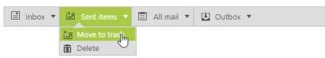

## Icons and navigating

Icons are the images that are to be displayed in the Menu control. To specify the menu with icons, you can use sprite property to display the icons. 

Add the following code example in your ASPX page.



<ej:Menu ID="menujson" DataIdField="id" DataParentIdField="parentId" DataTextField="text" DataSpriteCssField="sprite" runat="server"></ej:Menu>



In code behind add the following code example.



public partial class Menu : System.Web.UI.Page

{

    protected void Page_Load(object sender, EventArgs e)

    {

        List<icons> menu = new List<icons>();

        menu.Add(new icons { id = 1, text = "Inbox", parentId = null, sprite = "mailicon sprite-root" });

        menu.Add(new icons { id = 2, text = "Sent items", parentId = null, sprite = "mailicon sprite-sentitems" });

        menu.Add(new icons { id = 3, text = "All mail", parentId = null, sprite = "mailicon sprite-notes" });

        menu.Add(new icons { id = 4, text = "Outbox", parentId = null, sprite = "mailicon sprite-outbox" });

        menu.Add(new icons { id = 11, parentId = "1", text = "Mark as unread", sprite = "mailicon sprite-folder" });

        menu.Add(new icons { id = 12, parentId = "1", text = "Forward", sprite = "mailicon sprite-drafts" });

        menu.Add(new icons { id = 13, parentId = "1", text = "Mark as favourite", sprite = "mailicon sprite-folder" });

        menu.Add(new icons { id = 14, parentId = "1", text = "Mark as important", sprite = "mailicon sprite-folder" });

        menu.Add(new icons { id = 15, parentId = "2", text = "Move to trash", sprite = "mailicon sprite-junk" });

        menu.Add(new icons { id = 16, parentId = "2", text = "Delete", sprite = "mailicon sprite-deleted" });

        menu.Add(new icons { id = 17, parentId = "3", text = "New mail", sprite = "mailicon sprite-folder" });

        menu.Add(new icons { id = 18, parentId = "3", text = "Read mail", sprite = "mailicon sprite-folder" });

        menu.Add(new icons { id = 19, parentId = "3", text = "Unread mail", sprite = "mailicon sprite-folder" });

        menu.Add(new icons { id = 20, parentId = "4", text = "Discard draft", sprite = "mailicon sprite-drafts" });

        menu.Add(new icons { id = 21, parentId = "4", text = "Send again", sprite = "mailicon sprite-folder" });

        menu.Add(new icons { id = 22, parentId = "4", text = "Delete", sprite = "mailicon sprite-deleted" });

        menujson.DataSource = menu;

    }

    public class icons

    {

        public string text { get; set; }

        public string sprite { get; set; }

        public int id { get; set; }

        public string parentId { get; set; }

    }

}



Add the following code example in your style section.



    #<%=menujson.ClientID%> {

        margin-left: 50px;

    }

    .e-menu li > ul > li > a {

        padding: 3px 24px 3px 35px;

    }

    .mailicon {

        background-image: url("Content/mailicons.png");

        height: 18px;

        left: 2px;

        top: 4px;

        width: 24px;

    }

    .sprite-root { background-position: -25px -49px; }

    .sprite-deleted { background-position: -24px -152px; }

    .sprite-drafts { background-position:-24px -83px; }

    .sprite-folder { background-position: -24px -464px; }

    .sprite-inbox { background-position: -25px -13px; }

    .sprite-junk { background-position: -23px -187px; }

    .sprite-notes { background-position: -26px -394px; }

    .sprite-outbox { background-position: -24px -500px; }

    .sprite-sentitems{ background-position: -26px -118px; }



The following screenshot displays the output for the above code example on Menu with Icons.  

{  | markdownify }
{:.image }

