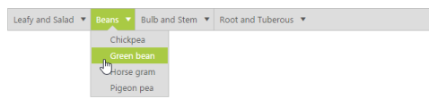

# Integration 

## AngularJS binding

AngularJS is an open-source web application Framework. AngularJS extends HTML with new attributes. AngularJS is a JavaScript framework. You can add it to an ASPX page with a <script> tag. AngularJS extends HTML attributes with Directives, and binds data to HTML with Expressions. The support is achieved by an integration JS library file. You can know more about the AngularJS support in the following link location.

<http://help.syncfusion.com/js/angularjs>

Sometime you can use menu value for retrieving information from the database by performing related action that is selected in menu. You can achieve this after the selected menu action is performed in the server side.

In the following example, a Menu control for mail application is created. In this, when you click mail Inbox development, the selected development value is sent to the database. Normally a mail database contains different types of mails like HR team, Accounts team, etc. Whereas, in this example, the mail from development team is only retrieved from the database. Then the result is updated in the necessary page.

Add the following code example in your ASPX page.



<asp:Content ID="BodyContent" runat="server" ContentPlaceHolderID="MainContent">

  

    

       <ul id="angularMenu" ej-menu e-fields-dataSource="dataList" e-fields-id="id" e-fields-parentId="parentId"

                    e-fields-text="text" e-fields-spriteCssClass="sprite">

           </ul>

        

    



Add the following code example to configure AngularJS for the menu control



    var data = [

            { id: 1, text: "Mail", parentId: null },

            { id: 2, text: "Calender", parentId: null },

            { id: 3, text: "Notes", parentId: null },

            { id: 4, text: "Contacts", parentId: null },

    //first level child

            {id: 11, parentId: 1, text: "Inbox", sprite: "mail sprite-inbox" },

            { id: 12, parentId: 1, text: "Drafts", sprite: "mail sprite-drafts" },

            { id: 13, parentId: 1, text: "Sent items", sprite: "mail sprite-sent-items" },

            { id: 14, parentId: 1, text: "Deleted", sprite: "mail sprite-deleted" },

            { id: 15, parentId: 1, text: "Junk mails", sprite: "mail sprite-junk" },

            { id: 16, parentId: 1, text: "Personal", sprite: "mail sprite-folders" },

            { id: 17, parentId: 2, text: "My Calender", sprite: "mail sprite-calendar" },

            { id: 18, parentId: 2, text: "Team", sprite: "mail sprite-calendar" },

            { id: 19, parentId: 2, text: "Others", sprite: "mail sprite-calendar" },

            { id: 20, parentId: 3, text: "My Reference", sprite: "mail sprite-folder" },

            { id: 21, parentId: 3, text: "Team Meeting", sprite: "mail sprite-folder" },

            { id: 22, parentId: 3, text: "Others", sprite: "mail sprite-folder" },

            { id: 23, parentId: 4, text: "Suggested", sprite: "mail sprite-contacts" },

            { id: 24, parentId: 4, text: "My Team", sprite: "mail sprite-contacts" },

            { id: 25, parentId: 4, text: "Others", sprite: "mail sprite-contacts" },

    //second level child

            {id: 111, parentId: 11, text: "Development", sprite: "mail sprite-folders" },

            { id: 111, parentId: 11, text: "Supports", sprite: "mail sprite-folders" },

            { id: 111, parentId: 11, text: "HR Team", sprite: "mail sprite-folders" },

            { id: 112, parentId: 12, text: "Support Template", sprite: "mail sprite-folders" },

            { id: 112, parentId: 12, text: "Personal", sprite: "mail sprite-folders" }

            ];

    angular.module('menuApp', ['ejangular']).controller('MenuCtrl', function ($scope) {

        $scope.dataList = data;

    });          



Add the following code example in your style section.



#angularMenu{

            margin-left: 50px;

        }

        [class^="sprite-"],

        [class*="sprite-"] 

        {

            background-image: url("mail/mails.png");

            height: 25px;

            left: 2px;

            top: 4px;

            width: 24px;

        }

        .sprite-calendar

        {

            background-position: -25px -255px;

        }

        .sprite-contacts

        {

            background-position: -26px -429px;

        }

        .sprite-deleted

        {

            background-position: -24px -152px;

        }

        .sprite-drafts

        {

            background-position:-24px -83px;

        }

        .sprite-folder

        {

            background-position: -24px -464px;

        }

        .sprite-folders

        {

            background-position: -24px -222px;

        }

        .sprite-inbox

        {

            background-position: -25px -13px;

        }

        .sprite-junk

        {

            background-position: -23px -187px;

        }

        .sprite-notes

        {

            background-position: -26px -394px;

        }

        .sprite-outbox

        {

            background-position: 0 -414px;

            width: 16px;

            height: 16px;

        }

        .sprite-root

        {

            background-position: -25px -49px;

        }

        .sprite-sent-items

        {

            background-position: -26px -118px;

        }

        .e-menu-res-wrap{display:none;height:32px;overflow:hidden}



The following screenshot displays the output of the above code example.      

 

## KnockoutJS binding

KnockoutJS is a MVVM library that allows the separation of concerns. Essential ASP.NET Web Form provides full support for KnockoutJS. The KnockoutJS support is achieved by an integration JS library file. Add the following code example for Knockout binding Menu rendering.

When you use KO with your applications, you can get the following benefits. 

You can connect UI elements with data model anytime. 

* You can easily create complex dynamic data model.  
* You can automatically update UI when Data Model is changed and when UI is changed, Data Model is changed automatically. 

Add the following code example in your ASPX page. 



<ul id="menuko" data-bind="ejMenu :{fields:{dataSource:dataList,id:'id',text:'text',parentId:'parentId',spriteCssClass:'sprite'}}"></ul>



Add the following script code to provide KO support .



   $(document).ready(function () {

        // declaration

        var menu=[

            { id: 1, text: "Leafy and Salad", parentId: null },

            { id: 2, text: "Beans", parentId: null },

            { id: 3, text: "Bulb and Stem", parentId: null },

            { id: 4, text: "Root and Tuberous", parentId: null },

            //first level child

            { id: 11, parentId: 1, text: "Cabbage" },

            { id: 12, parentId: 1, text: "Pea" },

            { id: 13, parentId: 1, text: "Spinach" },

            { id: 14, parentId: 1, text: "Wheat grass" },

            { id: 15, parentId: 1, text: "Yarrow" },

            { id: 16, parentId: 2, text: "Chickpea" },

            { id: 17, parentId: 2, text: "Green bean" },

            { id: 18, parentId: 2, text: "Horse gram" },

            { id: 19, parentId: 2, text: "Pigeon pea" },

            { id: 20, parentId: 3, text: "Garlic" },

            { id: 21, parentId: 3, text: "Garlic Chives" },

            { id: 22, parentId: 3, text: "Onion" },

            { id: 24, parentId: 3, text: "Lotus root" },

            { id: 25, parentId: 3, text: "Nopal" },

            { id: 26, parentId: 3, text: "Shallot" },

            { id: 27, parentId: 4, text: "Beetroot" },

            { id: 28, parentId: 4, text: "Carrot" },

            { id: 29, parentId: 4, text: "Ginger" },

            { id: 30, parentId: 4, text: "Potato" },

            { id: 31, parentId: 4, text: "Turmeric" },

            { id: 32, parentId: 4, text: "Radish" }

            ];

       window.viewModel = { 

                dataList: ko.observableArray(menu),               

            };	        		

            ko.applyBindings(viewModel);                       

        });



The following screenshot displays the output of the above code example.             

 

