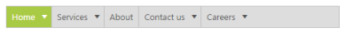

# Keyboard Navigation

The menu control also provides the support for keyboard navigation. In the menu control, it is possible to control the entire menu control items by using the provided shortcut keys. 

The various keyboard shortcuts available within the Menu control are discussed in the following table, 

<table>
<tr>
<th>
Keys</th><th>
Usage</th></tr>
<tr>
<td>
Esc</td><td>
Closes the opened Menu control.</td></tr>
<tr>
<td>
Enter</td><td>
Selects the focused item.</td></tr>
<tr>
<td>
Up/left/down/right arrow keys</td><td>
Navigates up or previous item.</td></tr>
<tr>
<td>
Down</td><td>
Navigates down or next item.</td></tr>
<tr>
<td>
Left</td><td>
Navigates to previous group.</td></tr>
<tr>
<td>
Right</td><td>
Navigates to next group.</td></tr>
</table>

Add the following code example for Keyboard navigation in your Menu control.



        <ej:Menu ID="MenuControl" MenuType="NormalMenu" Width="500" runat="server">

            <Items>

                <ej:MenuItem Id="Home" Text="Home">

                    <Items>

                        <ej:MenuItem Text="Foundation"></ej:MenuItem>

                    </Items>

                    <Items>

                        <ej:MenuItem Text="Launch"></ej:MenuItem>

                    </Items>

                    <Items>

                        <ej:MenuItem Text="About">

                            <Items>

                                <ej:MenuItem Text="Company"></ej:MenuItem>

                            </Items>

                            <Items>

                                <ej:MenuItem Text="Location"></ej:MenuItem>

                            </Items>

                        </ej:MenuItem>

                    </Items>

                </ej:MenuItem>

                <ej:MenuItem Id="Services" Text="Services">

                    <Items>

                        <ej:MenuItem Text="Consulting"></ej:MenuItem>

                    </Items>

                    <Items>

                        <ej:MenuItem Text="Outsourcing"></ej:MenuItem>

                    </Items>

                </ej:MenuItem>

                <ej:MenuItem Id="About" Text="About"></ej:MenuItem>

                <ej:MenuItem Id="Contact" Text="Contact us">

                    <Items>

                        <ej:MenuItem Text="Contact Number"></ej:MenuItem>

                    </Items>

                    <Items>

                        <ej:MenuItem Text="Email"></ej:MenuItem>

                    </Items>

                </ej:MenuItem>

                <ej:MenuItem Id="Careers" Text="Careers">

                    <Items>

                        <ej:MenuItem Text="Position">

                            <Items>

                                <ej:MenuItem Text="Developer"></ej:MenuItem>

                            </Items>

                            <Items>

                                <ej:MenuItem Text="Manager"></ej:MenuItem>

                            </Items>

                        </ej:MenuItem>

                    </Items>

                    <Items>

                        <ej:MenuItem Text="Apply online"></ej:MenuItem>

                    </Items>

                </ej:MenuItem>

            </Items>

        </ej:Menu>



Add the following code example in your script section.



jQuery(function ($) {

        //Control focus key

        $(document).on("keydown", function (e) {

            if (e.altKey && e.keyCode === 74) { // j- key code.

                $("#<%=MenuControl.ClientID%>").focus();

            }

        });

});    



Following screenshot displays the output of the above code example. 

 

When you press Alt+J the first item, the Menu control only gets focused as illustrated in the following screenshot.

 

Similarly you can access the Menu control by using keyboard itself.

