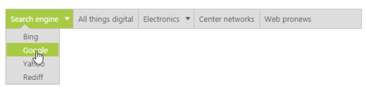

# Navigation

Navigation in Menu control is the default usage to navigate into the other web page. You can navigate to another page in the menu item by giving link to the menu items. Navigation in Menu control can be achieved by placing “href” path to the URL property in Menu items. Use following code example for navigating in Menu control.

Add the following code example in your ASPX page.



<ej:Menu ID="weblink" Width="600" runat="server">

    <Items>

        <ej:MenuItem Id="searchengine" Text="Search engine">

            <Items>

                <ej:MenuItem Text="Bing" Url="http://www.bing.com/"></ej:MenuItem>

            </Items>

            <Items>

                <ej:MenuItem Text="Google" Url="https://www.google.co.in/"></ej:MenuItem>

            </Items>

            <Items>

                <ej:MenuItem Text="Yahoo" Url="http://in.yahoo.com/"></ej:MenuItem>

            </Items>

            <Items>

                <ej:MenuItem Text="Rediff" Url="https://www.rediff.com/"></ej:MenuItem>

            </Items>

        </ej:MenuItem>

        <ej:MenuItem Text="All things digital" Url="http://allthingsd.com/"></ej:MenuItem>

        <ej:MenuItem Text="Electronics">

            <Items>

                <ej:MenuItem Text="Engagdget" Url="http://www.engadget.com/"></ej:MenuItem>

            </Items>

            <Items>

                <ej:MenuItem Text="Electronista" Url="http://www.electronista.com/"></ej:MenuItem>

            </Items>

            <Items>

                <ej:MenuItem Text="Gearlog" Url="http://www.gearlog.com/"></ej:MenuItem>

            </Items>

        </ej:MenuItem>

        <ej:MenuItem Text="Center networks" Url="http://centernetworks.com/"></ej:MenuItem>

        <ej:MenuItem Text="Web pronews" Url="http://webpronews.com/"></ej:MenuItem>

    </Items>

</ej:Menu>



The following screenshot displays the output for the above code example.  

 

When you click on “Google” that is present under “Search engine”, it navigates to the link that you have specified in the code example. Then the output is as follows.

 

