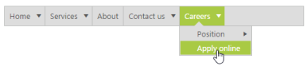
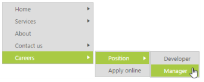

# Orientation

Gets or sets the direction to render the Menu control.  Specifies the orientation of the normal menu.  According to the orientation property the Menu control renders in horizontal or vertical.

## Horizontal Menu

Horizontal orientation displays the menu items horizontally and it is the default orientation behavior of menu control. The following steps explains the Horizontal orientation of Menu.

In the ASPX page, add the following code example to configure Menu control.



<ej:Menu ID="MenuControl" Width="500" runat="server" Orientation="Horizontal" >

    <Items>

        <ej:MenuItem Id="Home" Text="Home">

            <Items>

                <ej:MenuItem Text="Foundation"></ej:MenuItem>

            </Items>

            <Items>

                <ej:MenuItem Text="Launch"></ej:MenuItem>

            </Items>

            <Items>

                <ej:MenuItem Text="About">

                    <Items>

                        <ej:MenuItem Text="Company"></ej:MenuItem>

                    </Items>

                    <Items>

                        <ej:MenuItem Text="Location"></ej:MenuItem>

                    </Items>

                </ej:MenuItem>

            </Items>

        </ej:MenuItem>

        <ej:MenuItem Id="Services" Text="Services">

            <Items>

                <ej:MenuItem Text="Consulting"></ej:MenuItem>

            </Items>

            <Items>

                <ej:MenuItem Text="Outsourcing"></ej:MenuItem>

            </Items>

        </ej:MenuItem>

        <ej:MenuItem Id="About" Text="About"></ej:MenuItem>

        <ej:MenuItem Id="Contact" Text="Contact us">

            <Items>

                <ej:MenuItem Text="Contact Number"></ej:MenuItem>

            </Items>

            <Items>

                <ej:MenuItem Text="Email"></ej:MenuItem>

            </Items>

        </ej:MenuItem>

        <ej:MenuItem Id="Careers" Text="Careers">

            <Items>

                <ej:MenuItem Text="Position">	

                    <Items>

                        <ej:MenuItem Text="Developer"></ej:MenuItem>

                    </Items>

                    <Items>

                        <ej:MenuItem Text="Manager"></ej:MenuItem>

                    </Items>

                </ej:MenuItem>

            </Items>

            <Items>

                <ej:MenuItem Text="Apply online"></ej:MenuItem>

            </Items>

        </ej:MenuItem>

    </Items>

</ej:Menu>



The following screenshot displays the output of the above code example.        

 

## Vertical Menu

Menu can also be rendered in vertical direction by using orientation. To set the vertical orientation of Menu control, replace the following script in the above code example.

Add the following code example in the ASPX page.



<ej:Menu ID="MenuControl" Width="200" Orientation="Vertical" runat="server">

    <Items>

        <ej:MenuItem Id="Home" Text="Home">

            <Items>

                <ej:MenuItem Text="Foundation"></ej:MenuItem>

            </Items>

            <Items>

                <ej:MenuItem Text="Launch"></ej:MenuItem>

            </Items>

            <Items>

                <ej:MenuItem Text="About">

                    <Items>

                        <ej:MenuItem Text="Company"></ej:MenuItem>

                    </Items>

                    <Items>

                        <ej:MenuItem Text="Location"></ej:MenuItem>

                    </Items>

                </ej:MenuItem>

            </Items>

        </ej:MenuItem>

        <ej:MenuItem Id="Services" Text="Services">

            <Items>

                <ej:MenuItem Text="Consulting"></ej:MenuItem>

            </Items>

            <Items>

                <ej:MenuItem Text="Outsourcing"></ej:MenuItem>

            </Items>

        </ej:MenuItem>

        <ej:MenuItem Id="About" Text="About"></ej:MenuItem>

        <ej:MenuItem Id="Contact" Text="Contact us">

            <Items>

                <ej:MenuItem Text="Contact Number"></ej:MenuItem>

            </Items>

            <Items>

                <ej:MenuItem Text="Email"></ej:MenuItem>

            </Items>

        </ej:MenuItem>

        <ej:MenuItem Id="Careers" Text="Careers">

            <Items>

                <ej:MenuItem Text="Position">

                    <Items>

                        <ej:MenuItem Text="Developer"></ej:MenuItem>

                    </Items>

                    <Items>

                        <ej:MenuItem Text="Manager"></ej:MenuItem>

                    </Items>

                </ej:MenuItem>

            </Items>

            <Items>

                <ej:MenuItem Text="Apply online"></ej:MenuItem>

            </Items>

        </ej:MenuItem>

    </Items>

</ej:Menu>



The following screen shot displays the output of the above code example.                       

 

