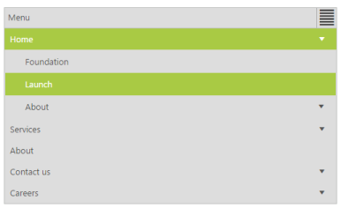

## Responsive Layout

Responsive Layout is aimed at crafting sites to provide an optimal viewing experience—easy reading and navigation with a minimum of resizing, panning, and scrolling—across a wide range of devices (from mobile phones to desktop computer monitors). In order to get responsive layout, add ej.responsive.css file in your sample. CDN link for the responsive CSS file is as follows.

[http://cdn.syncfusion.com/js/web/responsive-css/ej.responsive-latest.css](http://cdn.syncfusion.com/js/web/responsive-css/ej.responsive-latest.css)

Add the above CSS link in the sample code example.         

Add the following code example in your ASPX page.



        <ej:Menu ID="MenuControl" Width="500" runat="server">

            <Items>

                <ej:MenuItem Id="Home" Text="Home">

                    <Items>

                        <ej:MenuItem Text="Foundation"></ej:MenuItem>

                    </Items>

                    <Items>

                        <ej:MenuItem Text="Launch"></ej:MenuItem>

                    </Items>

                    <Items>

                        <ej:MenuItem Text="About">

                            <Items>

                                <ej:MenuItem Text="Company"></ej:MenuItem>

                            </Items>

                            <Items>

                                <ej:MenuItem Text="Location"></ej:MenuItem>

                            </Items>

                        </ej:MenuItem>

                    </Items>

                </ej:MenuItem>

                <ej:MenuItem Id="Services" Text="Services">

                    <Items>

                        <ej:MenuItem Text="Consulting"></ej:MenuItem>

                    </Items>

                    <Items>

                        <ej:MenuItem Text="Outsourcing"></ej:MenuItem>

                    </Items>

                </ej:MenuItem>

                <ej:MenuItem Id="About" Text="About"></ej:MenuItem>

                <ej:MenuItem Id="Contact" Text="Contact us">

                    <Items>

                        <ej:MenuItem Text="Contact Number"></ej:MenuItem>

                    </Items>

                    <Items>

                        <ej:MenuItem Text="Email"></ej:MenuItem>

                    </Items>

                </ej:MenuItem>

                <ej:MenuItem Id="Careers" Text="Careers">

                    <Items>

                        <ej:MenuItem Text="Position">

                            <Items>

                                <ej:MenuItem Text="Developer"></ej:MenuItem>

                            </Items>

                            <Items>

                                <ej:MenuItem Text="Manager"></ej:MenuItem>

                            </Items>

                        </ej:MenuItem>

                    </Items>

                    <Items>

                        <ej:MenuItem Text="Apply online"></ej:MenuItem>

                    </Items>

                </ej:MenuItem>

            </Items>

        </ej:Menu>



The following screenshot displays the output for the above code example. 

{  | markdownify }
{:.image }

