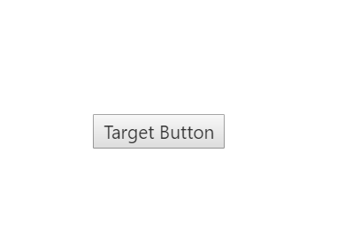

# Animations

You can set the transition type of the Navigation Drawer by using type property. The possible transition types are slide and overlay.

* Slide - both navigation panel and content page slides towards left/right direction to view the navigation panel items.
* Overlay - Only the navigation panel slides over the content page to view the navigation panel items. That is, part of the content page is hidden under navigation panel.

N> Transition slide type works only with fixed position.

The default value is Overlay.



       

              <button id="drawerTarget" style="top:200px;left:50%;position:absolute">Target Button</button>

        <ej:NavigationDrawer runat="server"  ID="navpane" Position="Fixed" Type="Slide"  EnableListView="true" TargetId="drawerTarget" >
                        <ListViewSettings Width="300" SelectedItemIndex="0" />
                        <Items>
                            <ej:NavigationDrawerItems  Text="Home"  />
                            <ej:NavigationDrawerItems  Text="Profile" />
                            <ej:NavigationDrawerItems  Text="Photos" />
                            <ej:NavigationDrawerItems  Text="Location" />
                        </Items>
                    </ej:NavigationDrawer>
                



Add following code in style section,



    



The following screenshot illustrates the output.

 

 

