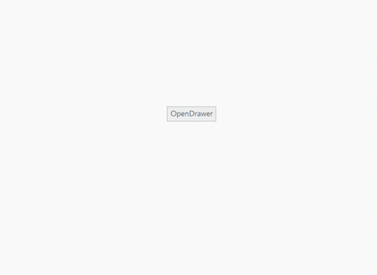

# Animations

You can set the transition type of the Navigation Drawer by using type property. The possible transition types are slide and overlay.

* Slide - both navigation panel and content page slides towards left/right direction to view the navigation panel items.
* Overlay - Only the navigation panel slides over the content page to view the navigation panel items. That is, part of the content page is hidden under navigation panel.

_Note:_ _Transition slide type works only with fixed position._

The default value is Overlay.



    

        

            <ul>

                <li>Settings</li>

                <li>Read</li>

                <li>Help</li>

                <li>About</li>

            </ul>

        

        <button id="drawerTarget" style="top:200px;left:600px;position:absolute"></button>

    

    



The following screenshot illustrates the output.

 

 

