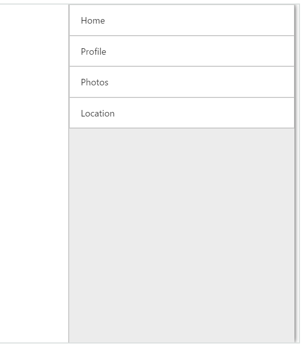

# Customize Direction

Using this property you can set the drawer to be open from right to left direction or left to right direction. The possible direction values are Right, Left and the default value is Left. Refer to the following code example.


 
    

    

    <ej:NavigationDrawer runat="server" Direction="Right" ID="navpane" Position="Normal"  EnableListView="true" TargetId="butdrawer" >
                        <ListViewSettings Width="300" SelectedItemIndex="0" />
                        <Items>
                            <ej:NavigationDrawerItems  Text="Home"  />
                            <ej:NavigationDrawerItems  Text="Profile" />
                            <ej:NavigationDrawerItems  Text="Photos" />
                            <ej:NavigationDrawerItems  Text="Location" />
                        </Items>
                    </ej:NavigationDrawer>        
        



Add the following code in style section


    
    


The following screenshot displays the output by swiping from right to left at the right side end of the screen.

 

