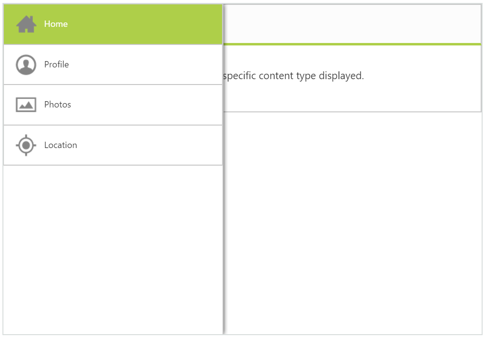
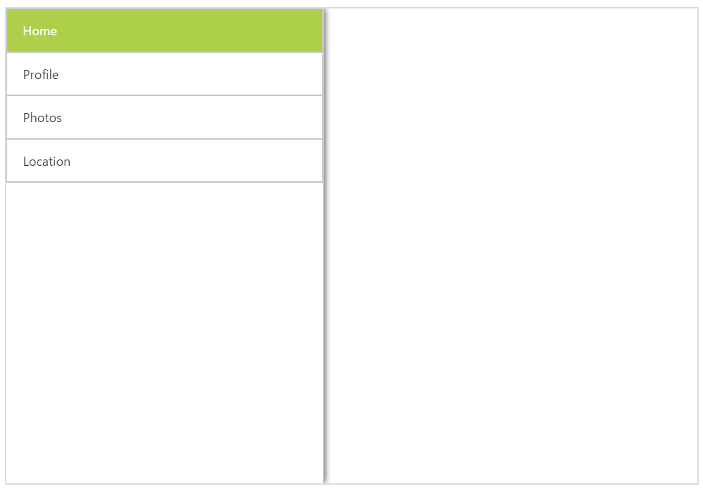
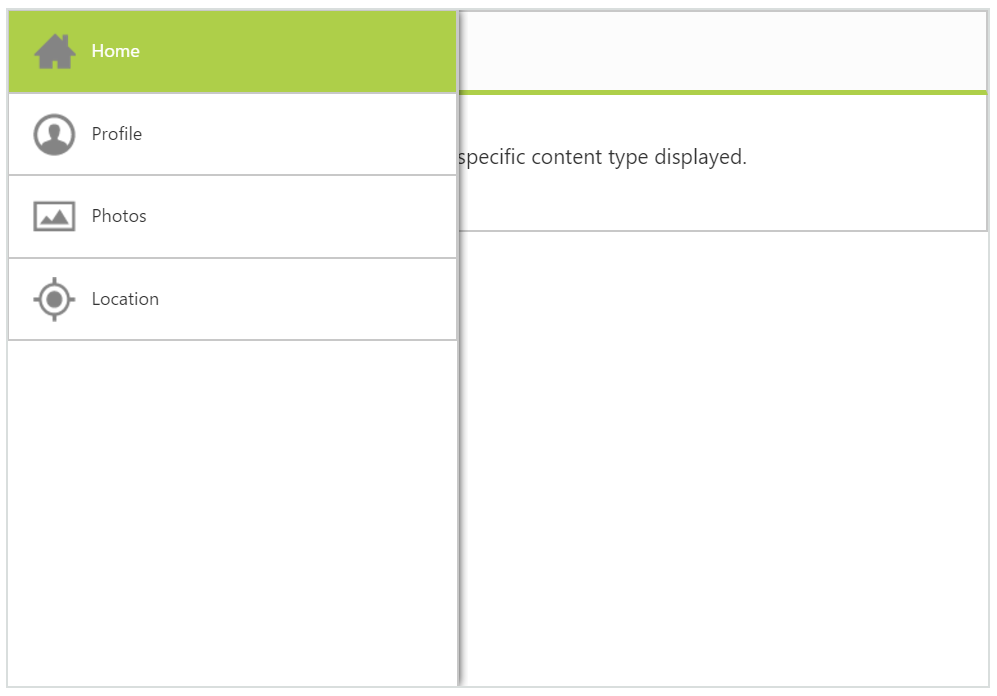

# Getting Started

## Create your first Navigation Drawer control in ASP.NET Webforms

NavigationDrawer is a sliding panel that displays the list of navigation options on demand. That is, by default, it is not visible but you can display it on the left/right side of the screen by swiping or by clicking with desired target icon.                       

 

### Create Navigation Drawer Widget

The following steps guide you in adding a Navigation Drawer control for a web application that displays a list of items such as home, profile, photos and location where you can navigate to desired page by clicking on the option available in the drawer. 

     1. Create a Syncfusion ASP.NET Web Forms application.
     2. Add the following code in .aspx file you have



     

    <ej:NavigationDrawer runat="server" ID="navpane" Direction="Left" Type="Overlay" EnableListView="true" TargetId="butDrawer" >
                        <ListViewSettings Width="300" SelectedItemIndex="0" PersistSelection="true" />
                        <Items>
                            <ej:NavigationDrawerItems  Text="Home"  ID="navhome" />
                            <ej:NavigationDrawerItems  Text="Profile"  ID="navprofile" />
                            <ej:NavigationDrawerItems  Text="Photos"  ID="navphotos" />
                            <ej:NavigationDrawerItems  Text="Location"  ID="navlocation" />
                        </Items>
                    </ej:NavigationDrawer>



Create a div element that acts as a container for Navigation Drawer's Content. Refer to the following code example.



    

                        

                            

                                

                                <h2>Home</h2>
                            

                        

                        

                        

                            

                               The Home screen allows you to choose the specific content type displayed.
                            

                        

                         

                               The Profile page content is displayed.
                             

                        

                            The Photos page content is displayed.
                        

                        

                            The Location page content is displayed.
                        

                    



From the above code you can create the target element as follows to display the drawer by clicking target icon.

To set the target icon image from sprite and to positioning the target icon and contents properly use the following styles.



    



Create the navigation drawer control as follows. You can display the navigation items as a list (or it can be any template) by using listview control. This is achieved by setting enableListView property as true. Also you can open the drawer by clicking on target element by setting the targetId property. 

## Navigation Drawer

You can display the drawer either by clicking on the target icon or by swiping from left on the page. Refer to the following screenshot.

 

You can set contents and navigate to the contents from the navigationDrawers listview, by using the following code.



    <ej:NavigationDrawer runat="server" ID="navpane" Direction="Left" Type="Overlay" EnableListView="true" TargetId="butDrawer" ContentId="content_container">
                        <ListViewSettings Width="300" SelectedItemIndex="0" PersistSelection="true" MouseUp="headChange" />
                        <Items>
                            <ej:NavigationDrawerItems ImageURL="../Content/images/navigationdrawer/home.png" Text="Home" Href="#home" ID="navhome" />
                            <ej:NavigationDrawerItems ImageURL="../Content/images/navigationdrawer/profile.png" Text="Profile" Href="#profile" ID="navprofile" />
                            <ej:NavigationDrawerItems ImageURL="../Content/images/navigationdrawer/photo.png" Text="Photos" Href="#photos" ID="navphotos" />
                            <ej:NavigationDrawerItems ImageURL="../Content/images/navigationdrawer/locations.png" Text="Location" Href="#location" ID="navlocation" />
                        </Items>
                    </ej:NavigationDrawer>



In the above code we have added targetId and contentId to find and navigate to sub pages.

Run the above code to render the following output.

 

You can load the appropriate content for the navigation items by updating the content through mouseDown handler of listview. You can define the handler and pass the method name with mouseDown attribute through listViewSettings. Also to view which item’s content is being loaded in the page, make the list selection to persist in the drawer by setting persistSelection as true. Refer to the following code example.



    



In the mouse down handler, you can hide the other content and display the respective selected item’s content.

Run the above code to render the following output. 

 

