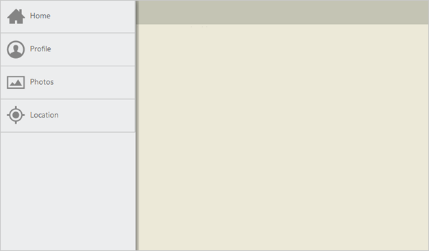
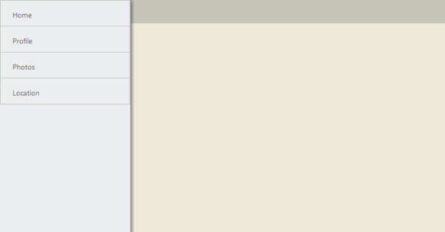

# Getting Started

## Create your first Navigation Drawer control in JavaScript

EssentialJavaScriptNavigation Drawer is a sliding panel that displays the list of navigation options on demand. That is, by default, it is not visible but you can display it on the left/right side of the screen by swiping or by clicking with desired target icon.                       

 

### Create Navigation Drawer Widget

The following steps guide you in adding a Navigation Drawer control for a web application that displays a list of items such as home, profile, photos and location where you can navigate to desired page by clicking on the option available in the drawer. 

Create an HTML file and paste the following template for web layout.       



<head>

    <title>Navigation Drawer</title>

    <link href="[http://cdn.syncfusion.com/13.1.0.21/js/web/flat-azure/ej.web.all.min.css](http://cdn.syncfusion.com/13.1.0.21/js/web/flat-azure/ej.web.all.min.css)" rel="stylesheet" />

     

    

</head>

<body>

        <!-- Add Navigation Drawer control Here -->

        <!-- Add Page Content content Here -->

</body>

</html>



Create a div element that acts as a container for Navigation Drawer. Refer to the following code example.



     <ul>

          <li data-ej-text="Home"></li>

          <li data-ej-text="Profile"></li>

          <li data-ej-text="Photos"></li>

          <li data-ej-text="Location"></li>

     </ul>



Create the target element as follows to display the drawer by clicking target icon.



     
 Drawer



To set the target icon image from sprite and to position the target icon properly use the following styles.





Create the navigation drawer control as follows. You can display the navigation items as a list (or it can be any template) by using listview control. This is achieved by setting enableListView property as true. Also you can open the drawer by clicking on target element by setting the targetId property. 





## Navigation Drawer

You can display the drawer either by clicking on the target icon or by swiping from left on the page. Refer to the following screenshot.

 

You can set the images for Navigation Drawer by using data-ej-imageclass attribute in the inner list elements.



   <ul>

     <li data-ej-imageclass="icon-home" data-ej-text="Home"></li>

     <li data-ej-imageclass="icon-profile" data-ej-text="Profile"></li>

     <li data-ej-imageclass="icon-photo" data-ej-text="Photos"></li>

     <li data-ej-imageclass="icon-locations" data-ej-text="Location"></li>

  </ul>



You can define the image classes specified for the list items as follows.





Run the above code to render the following output.

 

You can add desired page content while selecting the options in navigation drawer as follows.



<!-- Home Page Content-->

  The Home screen allows you to choose the specific content type displayed.

<!-- Profile Page Content-->

   The Profile page content is displayed.

<!-- Photos Page Content-->

    The Photos page content is displayed.

<!-- Location Page Content-->

     The Location page content is displayed.



You can load the appropriate content for the navigation items by updating the content through mouseDown handler of listview. You can define the handler and pass the method name with mouseDown attribute through listViewSettings. Also to view which item’s content is being loaded in the page, make the list selection to persist in the drawer by setting persistSelection as true. Refer to the following code example.





In the mouse down handler, you can hide the other content and display the respective selected item’s content.





Run the above code to render the following output. 

 

