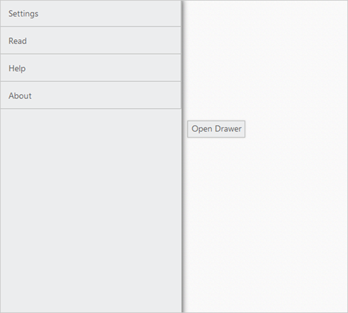

# TargetId

This property is used to define the target Id for Navigation Drawer. The drawer opens while you click on the specified target element.



<button id="drawerTarget" style="top:200px;left:600px;position:absolute"></button>

        <ul>

            <li>Settings</li>

            <li>Read</li>

            <li>Help</li>

            <li>About</li>

        </ul>



The following screenshots illustrates the output.

 
{:.image }

 
{:.image }

