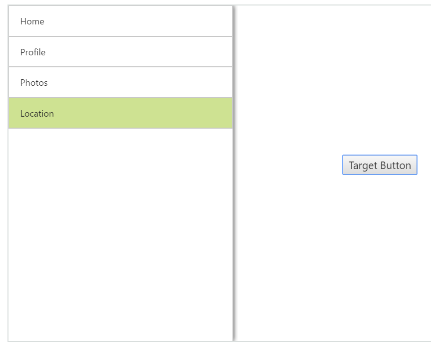

# TargetId

This property is used to define the target Id for Navigation Drawer. The drawer opens while you click on the specified target element.



       

              <button id="drawerTarget" style="top:200px;left:50%;position:absolute">Target Button</button>

        <ej:NavigationDrawer runat="server"  ID="navpane"  EnableListView="true" TargetId="drawerTarget" >
                        <ListViewSettings Width="300" SelectedItemIndex="0" />
                        <Items>
                            <ej:NavigationDrawerItems  Text="Home"  />
                            <ej:NavigationDrawerItems  Text="Profile" />
                            <ej:NavigationDrawerItems  Text="Photos" />
                            <ej:NavigationDrawerItems  Text="Location" />
                        </Items>
                    </ej:NavigationDrawer>
                



Add following code in style section,



    



The following screenshot illustrates the output.

 

