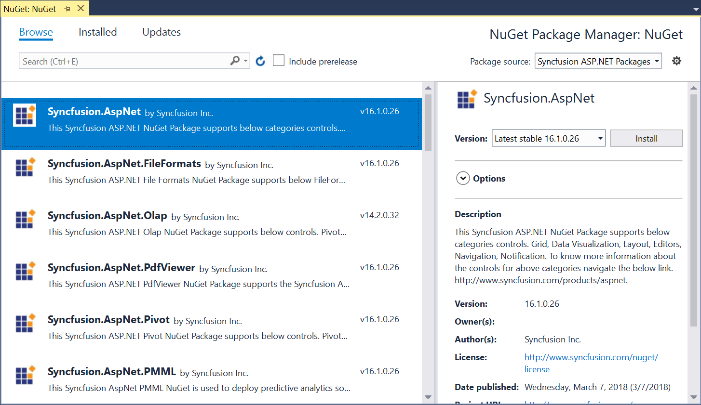
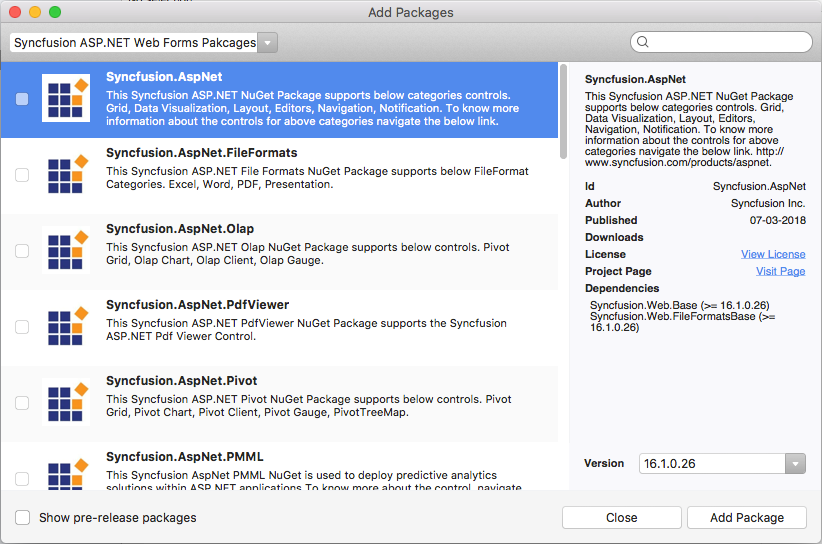
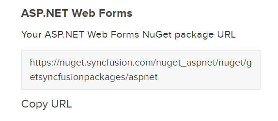
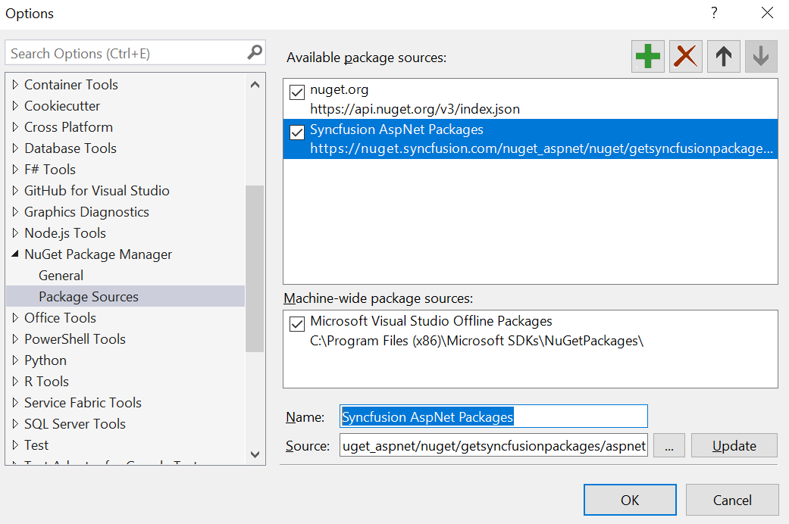

# NuGet Packages

[NuGet](https://www.nuget.org/) can be used to automatically add files and references to your Visual Studio projects. You can use the Syncfusion ASP.NET Web Forms NuGet packages without installing the Essential Studio or ASP.NET Web Forms platform installation to development with the Syncfusion ASP.NET controls. From v16.2.0.46 (2018 Volume 2 Service Pack 1) onwards, all the Syncfusion components are available as NuGet packages at [nuget.org](https://www.nuget.org/profiles/SyncfusionInc). 

N> Starting from v17.1.0.32 (2018 Volume 1), Syncfusion will no longer publish NuGet packages at [nuget.syncfusion.com](https://nuget.syncfusion.com/).

## Installing NuGet Packages

### Using NuGet Package Manager

The NuGet Package Manager can be used to search and install NuGet packages in the Visual Studio solution or project:

1.	Right-click the project or solution in the Solution Explorer tab, and choose **Manage NuGet Packages…**

    

    Alternatively, click **Tools** menu, `NuGet Package Manager | Manage NuGet Packages for Solution...`

2.	By default, the NuGet.org package is selected in the **Package source** drop-down. If NuGet.org is not configured in your Visual Studio, refer to the [Microsoft docs](https://docs.microsoft.com/en-us/nuget/tools/package-manager-ui#package-sources) to configure NuGet.org feed URL in your Visual Studio. 

                  

3.	The Syncfusion ASP.NET Web Forms NuGet Packages are listed and available in the package source feed URL. Search and install the required packages in your application, by clicking **Install** button.

N> The Syncfusion NuGet packages are published in public [NuGet.org](https://www.nuget.org/) from v16.2.0.46. So, If you need to Install earlier version of 16.2.0.46 Syncfusion NuGet packages, [configure Syncfusion private feed URL](https://help.syncfusion.com/extension/syncfusion-nuget-packages/nuget-packages#syncfusion-nuget-feed-url-configuration).

### Using Package Manager Console

To reference the Syncfusion ASP.NET Web Forms component using the Package Manager Console as NuGet packages, follow the below steps. 

1.	On the **Tools** menu, select **NuGet Package Manager** and then **Package Manager Console**. 

2.	Run the following NuGet installation commands. 

    ~~~
    #install specified package in default project
    Install-Package <Package Name>

    #install specified package in specified project 
    Install-Package <Package Name> - ProjectName <Project Name>
    ~~~

    **For example:**

    ~~~
    #install specified package in default project
    Install-Package Syncfusion.AspNet

    #install specified package in specified project 
    Install-Package Syncfusion.AspNet -ProjectName SyncfusionDemoApplication
    ~~~

### Using Visual Studio for macOS

Add packages can be used to search and install NuGet packages to the Visual Studio project in macOS.

1.	Right-click the folder in the project, and then select **Add Packages…** 

      
              
2.	By default, the NuGet.org package is selected in the **Package source** drop-down. 

      

3.	The Syncfusion ASP.NET Web Forms NuGet Packages available in the package source location will be listed. Search and install the required packages in your application, by clicking **Add Package** button.

## Managing NuGet package using NuGet CLI

The NuGet Command Line Interface (CLI), nuget.exe, provides the full extent of NuGet functionality to install, create, publish, and manage packages without making any change to the project files.

1.	Download the latest NuGet CLI from [here](https://dist.nuget.org/win-x86-commandline/latest/nuget.exe).

    N> To update the existing nuget.exe to latest version use the following command.

    ~~~
    nuget update -self
    ~~~

2.	Open the downloaded executable location in the command window, and run the following commands to download and install the required NuGet packages to a project specified in the package.config.  

    ~~~
    #install specified package in default project from specified package source for Windows Platform 
    nuget.exe install <Package name | ConfigFilePath > <Options>

    #install specified package in default project from specified package source for MAC/Linux Platform 
    mono nuget.exe install <Package name | ConfigFilePath > <Options>
    ~~~

    N> configFilePath is optional. This identifies the packages.config or solutions file that lists the packages utilized in the project. 

    **For example:**

    ~~~
    #install specific package for Windows 
    nuget.exe install “Syncfusion.AspNet”

    #install all package which mention in package.config path for Windows 
    nuget.exe install “C:\Users\SyncfusionApplication\package.config”

    #install specific package for Mac and Linux 
    mono nuget.exe install “Syncfusion.AspNet”

    #install all package which mention in package.config path for Mac and Linux 
    mono nuget.exe install “C:\Users\SyncfusionApplication\package.config”
    ~~~

N> If you need to Install earlier version of 16.2.0.46 Syncfusion NuGet packages, [configure Syncfusion private feed URL](https://help.syncfusion.com/extension/syncfusion-nuget-packages/nuget-packages#syncfusion-nuget-feed-url-configuration).

## Upgrading NuGet packages

### Using NuGet Package Manager 

NuGet packages can be updated to their specific version or latest version available in the Visual Studio solution or project.

1. Right-click the project or solution in the Solution Explorer tab, and choose **Manage NuGet Packages…**
   Alternatively, click **Tools** menu, `NuGet Package Manager | Manage NuGet Packages for Solution...`

2. Select the **Updates** tab to see the packages available for update from the desired package sources. Select the required packages and the specific version from the dropdown, and click the **Update** button.

### Using Visual Studio for macOS

Using **Update** context menu from Visual Studio for Mac application, NuGet packages can be updated:

1.	Right-click the Packages folder in the project, and select **Update**. 

     

2.	This will update the NuGet package to the latest version. You can double-click the Add packages and choose the specific version.

N> To update all the projects from solution, use update option in the solution level. 

### Using Package Manger Console

To update the installed Syncfusion ASP.NET Web Forms NuGet packages using the Package Manager Console, follow the below steps. 

1.	On the **Tools** menu, select **NuGet Package Manager**, and then **Package Manager Console.** 

2.	Run the following NuGet installation commands.

    ~~~ 
    #Update specific NuGet package in default project
    Update-Package <Package Name>

    #Update all the packages in default project
    Update-Package 

    #Update specified package in specified project 
    Update-Package <Package Name> - ProjectName <Project Name>
    ~~~

    **For example:**

    ~~~
    #Update specified Syncfusion ASP.NET Web Forms NuGet package 
    Update-Package Syncfusion.AspNet

    #Update specified package in specified project 
    Update-Package Syncfusion.AspNet -ProjectName SyncfusionDemoApplication
    ~~~

### Using NuGet CLI

Using the NuGet CLI, all the NuGet packages in the project can be updated to the available latest version. 

1.	Download the latest NuGet CLI from [here](https://dist.nuget.org/win-x86-commandline/latest/nuget.exe).

    N> To update the existing nuget.exe to latest version use the following command.

    ~~~
    nuget update -self
    ~~~

2.	Open the downloaded executable location in the command window. Run the following “update commands” to update the Syncfusion ASP.NET Web Forms NuGet packages.

    ~~~ 
    #update all NuGet packages from config file
    nuget update <configPath> [options]

    #update all NuGet packages
    nuget update 
    ~~~      

    N> configPath is optional. This identifies the packages.config or solutions file lists the packages utilized in the project. 
	
    **For example:**

    ~~~          
    #Update all NuGet packages from config file
    nuget update “C:\Users\SyncfusionApplication\package.config”
    ~~~

    N> Update command is not working as expected in Mono (Mac and Linux) and projects using PackageReference format.
   
## Syncfusion NuGet feed URL Configuration

### Get the Syncfusion NuGet feed URL 

You should get the private Syncfusion ASP.NET Web Forms NuGet feed URL to install or upgrade the Syncfusion ASP.NET Web Forms NuGet packages. To get the URL from Syncfusion website use the following steps:

1. Navigate to [nuget.syncfusion.com](https://nuget.syncfusion.com/), and select the **WEB** tab.     

2. Navigate to **WEB (Essential JS1)**, click the Copy URL label under ASP.NET Web Forms platform to copy the Syncfusion ASP.NET Web Forms platform NuGet feed to clipboard or directly use the following URL: 

    [https://nuget.syncfusion.com/nuget_aspnet/nuget/getsyncfusionpackages/aspnet](https://nuget.syncfusion.com/nuget_aspnet/nuget/getsyncfusionpackages/aspnet) 

    

3. Now, use this NuGet feed URL to access the Syncfusion NuGet Packages in Visual Studio. 

### Add the Syncfusion NuGet feed URL

#### Windows

1.	Open your Visual Studio application. 

2.	On the **Tools** menu, select **Options**.

3.	Expand the **NuGet Package Manager** and select **Package Sources**.

4.	Click the **Add** button (green plus), and enter the ‘Package Name’ and ‘Package Source URL’ of the Syncfusion ASP.NET Web Forms NuGet packages.
    
    **Name:** Name of the package listed in the available package sources.
    
    **Source:** Syncfusion ASP.NET NuGet Feed URL      
    [https://nuget.syncfusion.com/nuget_aspnet/nuget/getsyncfusionpackages/aspnet](https://nuget.syncfusion.com/nuget_aspnet/nuget/getsyncfusionpackages/aspnet).

5.	Click the **Update** button to add the name and source details to package sources. 

    

#### macOS 

1.	Open your Visual Studio application. 

2.	Right-click the Packages folder in the project, and then select **Add Packages…**
 
    

3.	Choose the **Configure Sources…** from the dropdown that appears in the left corner of the Add Packages dialog. 

    

4.	At the bottom right corner of the dialog, click the **Add** button to enter the feed name and the URL. 
   
    **Name:** Enter the name (For e.g., Syncfusion ASP.NET Web Forms Packages).
   
    **Location:** Enter the following URL – [https://nuget.syncfusion.com/nuget_aspnet/nuget/getsyncfusionpackages/aspnet](https://nuget.syncfusion.com/nuget_aspnet/nuget/getsyncfusionpackages/aspnet).

    
 
5.	Now, click **Add Source** and then click **OK**.

#### NuGet CLI 

1.	Download the latest NuGet CLI from [here](https://dist.nuget.org/win-x86-commandline/latest/nuget.exe).

    N> To update the existing nuget.exe to latest version use the following command.

    ~~~
    nuget update -self
    ~~~

2.	Open the downloaded executable location in the command window, and run the following commands to configure the Syncfusion ASP.NET Web Forms NuGet packages. 

    ~~~
    #Add specified package source in NuGet.config file for Windows platform
    nuget.exe Sources Add –Name <Source name> –Source <Source location>

    #Add specified Package Source in Nuget.config file for MAC/Linux platform
    mono nuget.exe Sources Add –Name <Source name> –Source <Source location>
    ~~~

    **For example:**

    ~~~
    #For Windows platform
    nuget.exe Sources Add –Name “Syncfusion Source” –Source “https://nuget.syncfusion.com/nuget_aspnet/nuget/getsyncfusionpackages/aspnet”

    #For MAC/Linux platform
    mono nuget.exe Sources Add –Name “Syncfusion Source” –Source “https://nuget.syncfusion.com/nuget_aspnet/nuget/getsyncfusionpackages/aspnet”
    ~~~

