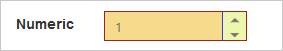
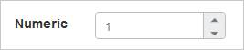
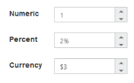

# Appearance

## Theme

The NumericTextbox controls’ style and appearance can be controlled based on the CSS classes. In order to apply styles to the NumericTextbox control, you need to refer two files namely, ej.widgets.core.min.css and ej.theme.min.css. When the ej.web.all.min.css file is referred, then it is not necessary to include the ej.widgets.core.min.css and ej.theme.min.css files in your project, as ej.web.all.min.css is the combination of these two. 

By default, there are 17 themes support available for NumericTextbox control namely

* bootstrap
* flat-azure
* flat-azure-dark
* fat-lime
* flat-lime-dark
* flat-saffron
* flat-saffron-dark
* gradient-azure
* gradient-azure-dark
* gradient-lime
* gradient-lime-dark
* gradient-saffron
* gradient-saffron-dark
* high-contrast-01
* high-contrast-02
* material
* office-365

## CSS Class

The CSS properties can be customized by using the CssClass in the NumericTextbox. You can customize the NumericTextbox with various CSS properties to appear like your likable control.

### Configure CSS Class

Add the following code example in your ASPX page to render the NumericTextbox control with the customized style.



<ej:NumericTextBox ID="numeric" CssClass="customCss" runat="server"> </ej:NumericTextBox>



Customize the CSS properties in custom CSS class.



        .customCss .e-box {

            border-color: #9d241b;

        }

        .customCss .e-input {

            background-color: #f6db8d;            

        }

        .customCss .e-select {

            background-color: #ecf6ac;

            border-color: #3c36e7;

        }



The following screenshot displays the output of the NumericTextbox after applying “CssClass”.

 

## Rounded Corner Support

The NumericTextbox provides you with rounded corner support that the appearance is different from the normal NumericTextbox control. The default value of ShowRoundedCorner property is false in the NumericTextbox.

### Configure Rounded Corner Support

Add the following code example in your ASPX page to render the NumericTextbox control with rounded corner.



<ej:NumericTextBox ID="numeric" Value="1" ShowRoundedCorner="true" runat="server"></ej:NumericTextBox>



The following screenshot displays the output of the NumericTextbox when the “ShowRoundedCorner” is set to “true”.

 

## Spin Button Support

The NumericTextbox provides the option whether to display the spin button in the widget or remove it from the control by using the ShowSpinButton property. The default value of the ShowSpinButton property is true in the NumericTextbox.

### Configure Spin Button

Add the following code example in your ASPX page to render the NumericTextbox control with the SpinButton.



<ej:NumericTextBox ID="numeric" Value="1" ShowSpinButton="true" runat="server"> </ej:NumericTextBox>



The following screenshot displays the output of the NumericTextbox when the “ShowSpinButton” is set to “true”.

 

 

## Water Mark Text Support

The NumericTextbox provides water mark text support that helps you to display the initial value in the control by water mark. The default value of WatermarkText property is empty string (“”) in the NumericTextbox.

### Configure Water Mark Text

Add the following code example in your ASPX page to render the NumericTextbox control with the water mark text.



<ej:NumericTextBox ID="numeric" WaterMarkText="1111" runat="server"> </ej:NumericTextBox>



The following screenshot displays the output of the NumericTextbox after applying “WatermarkText”.

 

