# Behavior Settings

## Decimal Places

The DecimalPlaces declares the decimal point to the value of NumericTextbox control. The default value of DecimalPlaces is 0 in NumericTextbox control. To set the DecimalPlaces to “-1”, that allows the decimals without any limit in NumericTextBox control.

### Configure Decimal Places

Add the following code example in your ASPX page to render the NumericTextbox control with decimal.



<ej:NumericTextBox ID="numeric" DecimalPlaces="3" Value="333" runat="server" ></ej:NumericTextBox>



The following screenshot displays the output for the above code.

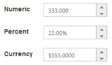 

## Persistence Support

The NumericTextbox control provides state maintenance support. You can maintain the previous changes made in the control after the page load while the EnablePersistence property is in the enabled state. EnablePersistence accepts Boolean values, by default the value is false.

### Configure Persistence Support 

Add the following code example in your ASPX page to render the NumericTextbox control with the state maintenance.



<ej:NumericTextBox ID="numeric"  Value="11" EnablePersistence="true" runat="server"></ej:NumericTextBox>



The following screenshot displays the output of the NumericTextbox with EnablePersistence before page load and after page load.

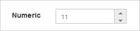 

## Strict Mode Support

The NumericTextbox control provides you the strict mode option by setting the EnableStrictMode property. You can set the MinValue and MaxValue to the control to enable the strict mode functionality. When the NumericTextbox value exceeds the MaxValue, it restricts the exceeded value and returns the MaxValue. Likewise, when the NumericTextbox value goes below the MinValue, it restricts the new value and returns the MinValue. When the EnableStrictMode property is enabled, then it highlights the NumericTextbox in red color.

### Configure Strict Mode Support 

Add the following code example in your ASPX page to render the NumericTextbox control with strict mode.



        <ej:NumericTextBox ID="NumericTextBox1" MinValue="-3" MaxValue="5" EnableStrictMode="false" runat="server"></ej:NumericTextBox>

    

    

        <ej:NumericTextBox ID="numeric" MinValue="-3" MaxValue="5" EnableStrictMode="true" runat="server"></ej:NumericTextBox>

    



The following screenshot displays the output of the NumericTextbox with and without enableStrictMode.

 

## Enabled or Disabled

The NumericTextbox control have an option to enable or disable its element. You can set the Enabled property as true to enable the NumericTextbox control. Enabled property accepts Boolean value. By default the value of the enabled property is true.
Also you can enable/disable the **NumericTextBox** by using [enable](https://help.syncfusion.com/api/js/ejtextboxes#methods:enable) and [disable](https://help.syncfusion.com/api/js/ejtextboxes#methods:disable) methods.

### Configure Enabled or Disabled 

Add the following code example in your ASPX page to render the NumericTextbox control with the enabled state.

<ej:NumericTextBox ID="numeric"  Value="1" Enabled="true" runat="server"> </ej:NumericTextBox>

The output for the NumericTextbox when “Enabled” is “true” and “Enabled” is “false”.

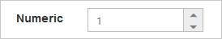 

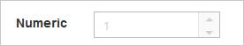 

## Adjusting NumericTextbox Size

The NumericTextbox size can be customized by using the Height and Width property. 

### Configure Height and Width 

Add the following code example in your ASPX page to render the NumericTextbox control with the customized height and width.



<ej:NumericTextBox ID="numeric"  Width="100" Height="20" runat="server"> </ej:NumericTextBox>



The following screenshot displays the output of the NumericTextbox after setting “Height” and “Width” values.

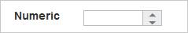 

## Increment Step

The IncrementStep property is used to increase or decrease the amount of value in the NumericTextbox control. 

### Configure Increment Step

Add the following code example in your ASPX page to render the NumericTextbox control with the IncrementStep property.



<ej:NumericTextBox ID="numeric" IncrementStep="2" runat="server"> </ej:NumericTextBox>



The following screenshot displays the output of the NumericTextboxes with “IncrementStep”.

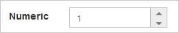 

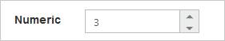

## Define Name

When you place the NumericTextbox in a form, the Name property is used to send the field value at form submission. The default value of the name property is null.

### Configure Name

Add the following code example in your ASPX page to render the NumericTextbox control with the Name property.



<ej:NumericTextBox ID="numeric"  Name="numeric" nat="server"> </ej:NumericTextBox>



The following screenshot displays the output of the NumericTextbox with the Name property.

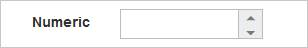 

## Define Value

The value of the NumericTextbox can be assigned by using the Value property. The default value ofValue property is null.
You can get the value of **NumericTextBox** by using [getValue](https://help.syncfusion.com/api/js/ejtextboxes#methods:getvalue) method.

### Configure Value

Add the following code example in your ASPX page to render the NumericTextbox control with the Value property.



<ej:NumericTextBox ID="numeric"  Value="12" runat="server"></ej:NumericTextBox>



The following screenshot displays the output of the NumericTextbox with the Value property.

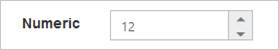 

## Basic Properties

The NumericTextbox contain the basic behaviors like Name, Value, MaxValue and MinValue.

### maxValue

The maximum value limit can be assigned to the NumericTextbox by using the MaxValue property. The default value of MaxValue property is 1.7976931348623157e+308. 

### minValue

The minimum value limit can be assigned to the NumericTextbox by using the MinValue property. The default value of MinValue property is -1.7976931348623157e+308.

### Configure Basic Properties

Add the following code example in your ASPX page to render the NumericTextbox control with the MaxValue and MinValue properties.



<ej:NumericTextBox ID="numeric" Value="1" MinValue="-1" MaxValue="2" runat="server" ></ej:NumericTextBox>



The following screenshot displays the output of the NumericTextbox with the basic properties.

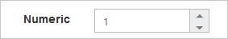 

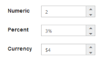 

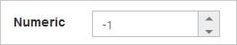 

## Read Only Support

The NumericTextbox supports read only option. When enabling read only property to the control, the value can not be changed or editable in the NumericTextbox. You can set the ReadOnly property as true to enable this option.

### Configure Read Only

Add the following code example in your ASPX page to render to NumericTextbox control with the ReadOnly property.



<ej:NumericTextBox ID="numeric" Value="1" ReadOnly="true" runat="server"> </ej:NumericTextBox>



The following screenshot displays the output of the NumericTextbox when “ReadOnly” is set to “true”. The NumericTextbox values cannot be edited or changed.

 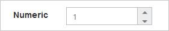

