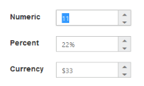

# Keyboard Interaction

With the keyboard navigation enabled in the NumericTextbox control, you can control the actions of the NumericTextbox with the provided shortcut keys. Almost all the NumericTextbox actions that are done through mouse can be controlled with shortcut keys.

The various keyboard shortcuts available within the NumericTextbox control are as follows. 

<table>
<tr>
<th>
Shortcut Key</th><th>
Description</th></tr>
<tr>
<td>
{ Access key } + j</td><td>
Focuses the control</td></tr>
<tr>
<td>
Up</td><td>
Increments the value</td></tr>
<tr>
<td>
Down</td><td>
Decrements the value</td></tr>
<tr>
<td>
Tab</td><td>
Focuses the next element</td></tr>
</table>

## Configuring Keyboard Navigation

The following steps explain the implementation of the keyboard interaction in the NumericTextbox.

Add the following code example in your ASPX page to render the NumericTextbox control.



<ej:NumericTextBox ID="numeric" Value="11"  runat="server" ></ej:NumericTextBox> 



Add the following code example in your script section



$(document).on("keydown", function (e) 

{

    if (e.altKey && e.keyCode === 74) 

    { // j- key code.

          $("#<%=numeric.ClientID%>").siblings(".e-input").focus();

    }

});



Run the sample and press [Access key](http://en.wikipedia.org/wiki/Access_key) + j key to focus the NumericTextbox control. Perform provided functionality by using the keyboard shortcuts.

 

