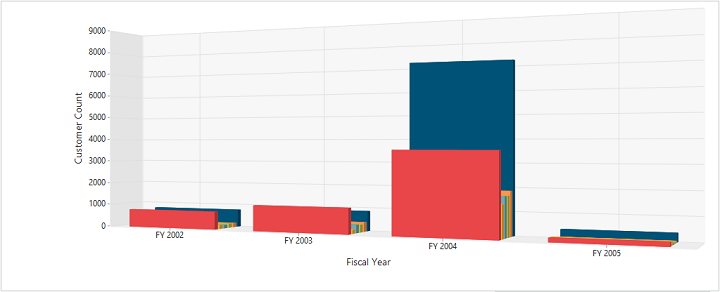

# 3D

The OlapChart control provides three dimensional view for Bar, Column, StackingBar, StackingColumn and Pie Charts. The representation of data in 3D Chart is very clear and easy to understand when compared to 2D Chart. Three dimensions of the series are seen by rotating them. To enable this functionality, we need to set `enable3D` property to "true".

The following code example explains on how to enable 3D in the Olapchart control.



<ej:OlapChart ID="OlapChart1" runat="server" Url="../wcf/OlapChartService.svc" Enable3D="true" Rotation="24" ClientIDMode="Static">
    <CommonSeriesOptions Type="Column" />
    <Size Width="100%" Height="460px"></Size>
</ej:OlapChart>



 
 
 

