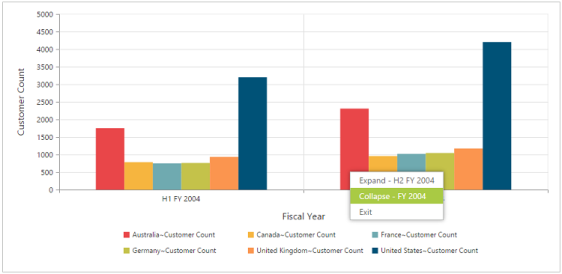

# Drill Operation

Drill Operation is a basic feature of OlapChart where the amount of information can be limited for a better view. It allows you to drill down to access the detailed level of data or drill up to display the summarized data by using the context menu present in the OlapChart. 

Drill up is also called as roll up that navigates from more detailed data to less detailed data. That is, by climbing up a concept hierarchy for a dimension. 

Drill down also called as roll down that is the reverse of drill up. It navigates from less detailed data to more detailed data. That is, by climbing down a concept hierarchy for a dimension.

_Figure : Drill-down operation in OlapChart_

_Figure : Drill-up operation in OlapChart_

DrillSuccess event gets triggered when you right-click on the OlapChart and select any option available from the context menu to perform drill up or drill down operation.



<ej:OlapChart ID="OlapChart1" runat="server" Url="../wcf/OlapChartService.svc">;

    <ClientSideEvents DrillSuccess="DrillSuccess" />

</ej:OlapChart>







