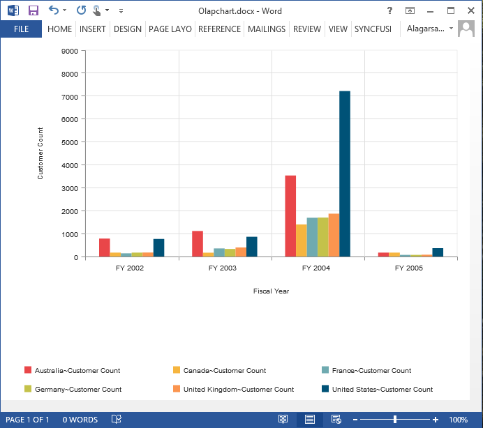

#Exporting

The OlapChart control can be exported to the following file formats.

* Excel
* Word
* PDF
* CSV
* Image

The OlapChart control can be exported by invoking **“exportOlapChart”** method, with an appropriate export option as parameter.



<html xmlns="http://www.w3.org/1999/xhtml">
//...

<body>
    //...
    <ej:OlapChart ID="OlapChart1" runat="server" Url="../wcf/OlapChartService.svc" IsResponsive="true">
    <Size Width="950px" Height="460px"></Size>
    </ej:OlapChart>
    <ej:Button runat="server" ClientSideOnClick="ExportBtnClick" Text="Export">
    </ej:Button>
    
</body>

</html>                                            



For WebAPI controller, the below method needs to be added to perform exporting.



[System.Web.Http.ActionName("Export")]
[System.Web.Http.HttpPost]
public void Export() {
    string args = HttpContext.Current.Request.Form.GetValues(0)[0];
    OlapDataManager DataManager = new OlapDataManager(connectionString);
    string fileName = "Sample";
    htmlHelper.ExportOlapChart(DataManager, args, fileName, System.Web.HttpContext.Current.Response);
}



For WCF service, the below service method needs to be added to perform exporting.



public void Export(Stream stream) {
    System.IO.StreamReader sReader = new System.IO.StreamReader(stream);
    string args = System.Web.HttpContext.Current.Server.UrlDecode(sReader.ReadToEnd()).Remove(0, 5);
    OlapDataManager DataManager = new OlapDataManager(connectionString);
    string fileName = "Sample";
    htmlHelper.ExportOlapChart(DataManager, args, fileName, System.Web.HttpContext.Current.Response);
}



##Excel Export
User can export contents of the OlapChart to Excel document for future archival, references and analysis purposes. To achieve Excel export, we need to add the following dependency libraries into the application.

* Syncfusion.Compression.Base
* Syncfusion.XlsIO.Base

For Excel export, **“ej.olap.OlapChart.ExportOptions.Excel”** enumeration value is sent as the parameter.



function exportBtnClick(args) {
    var chartObj = $('#OlapChart1').data("ejOlapChart ");
        //set export option as Excel in the exportOlapChart method
        chartObj.exportOlapChart(ej.olap.OlapChart.ExportOptions.Excel);
    }
  

##Word Export
User can export contents of the OlapChart to Word document for future archival, references and analysis purposes. To achieve Word export, we need to add the following dependency libraries into the application.

* Syncfusion.Compression.Base
* Syncfusion.DocIo.Base

For Word export, **“ej.olap.OlapChart.ExportOptions.Word”** enumeration value is sent as the parameter.



function exportBtnClick(args) {
    var chartObj = $('#OlapChart1').data("ejOlapChart ");
        //set export option as Word in the exportOlapChart method
        chartObj.exportOlapChart(ej.olap.OlapChart.ExportOptions.Word);
    }



##CSV Export
User can export contents of the OlapChart to CSV document for future archival, references and analysis purposes.

For CSV export, **“ej.olap.OlapChart.ExportOptions.CSV”** enumeration value is sent as the parameter.



function exportBtnClick(args) {
    var chartObj = $('#OlapChart1').data("ejOlapChart ");
        //set export option as CSV in the exportOlapChart method
        chartObj.exportOlapChart(ej.olap.OlapChart.ExportOptions.CSV);
    }



##PDF Export
User can export contents of the OlapChart to PDF document for future archival, references and analysis purposes. To achieve PDF export, we need to add the following dependency libraries into the application.

* Syncfusion.Compression.Base
* Syncfusion.Pdf.Base

For PDF export, **“ej.olap.OlapChart.ExportOptions.PDF”** enumeration value is sent as the parameter.



function exportBtnClick(args) {
    var chartObj = $('#OlapChart1').data("ejOlapChart ");
        //set export option as PDF in the exportOlapChart method
        chartObj.exportOlapChart(ej.olap.OlapChart.ExportOptions.PDF);
    }

 

##Image Export
User can export contents of the OlapChart to image format for future archival, references and analysis purposes. We can export OlapChart to the following image formats.

* PNG
* EMF
* JPG
* GIF
* BMP

For EMF export, **“ej.olap.OlapChart.ExportOptions.EMF”** enumeration value is sent as the parameter.



function exportBtnClick(args) {
    var chartObj = $('#OlapChart1').data("ejOlapChart ");
        //set export option as EMF in the exportOlapChart method
        chartObj.exportOlapChart(ej.olap.OlapChart.ExportOptions.EMF);
    }

  

##Customize the export document name

The document name could be customized inside the method in WebAPI Controller. Following code sample illustrates the same.



[System.Web.Http.ActionName("Export")]
[System.Web.Http.HttpPost]
public void Export() {
    string args = HttpContext.Current.Request.Form.GetValues(0)[0];
    OlapDataManager DataManager = new OlapDataManager(connectionString);
    string fileName = "File name is customized here";
    htmlHelper.ExportOlapChart(DataManager, args, fileName, System.Web.HttpContext.Current.Response);
}



For customizing name in WCF Service, below code snippet is used.



public void Export(System.IO.Stream stream) {
    System.IO.StreamReader sReader = new System.IO.StreamReader(stream);
    string args = System.Web.HttpContext.Current.Server.UrlDecode(sReader.ReadToEnd()).Remove(0, 5);
    OlapDataManager DataManager = new OlapDataManager(connectionString);
    string fileName = " File name is customized here ";
    htmlHelper.ExportOlapChart(DataManager, args, fileName, System.Web.HttpContext.Current.Response);
}


