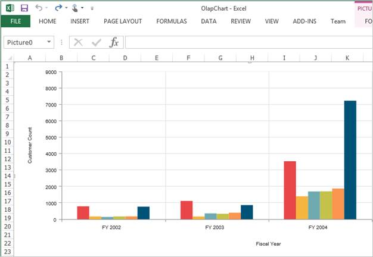
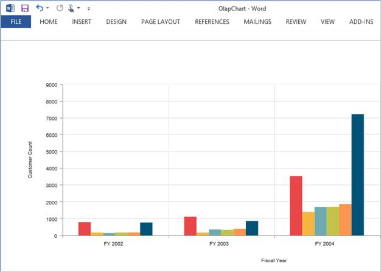
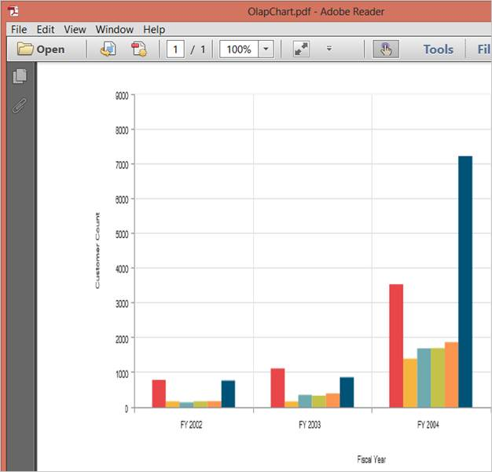

## Exporting

The OLAP Chart control can be exported to the following formats:

* Excel
* Word
* PDF
* CSV
* PNG
* EMF
* GIF
* JPG
* BMP



<ej:OlapChart ID="OlapChart1" runat="server" Url="../wcf/OlapChartService.svc"

        IsResponsive="true"></ej:OlapChart>

<ej:Button runat="server" ClientSideOnClick="ExportBtnClick" Text="Export"></ej:Button>





function ExportBtnClick(args) {

    var chartObj = $('#OlapChart1').data("ejOlapChart");

    chartObj.exportOlapChart(ej.olap.OlapChart.ExportOptions.Excel);   

}



The Export type that is to be mentioned in the parameter takes any one of the following enumerated values.

* Excel
* Word
* PDF
* CSV
* PNG
* EMF
* GIF
* JPG
* BMP

The following code example of the service method needs to be added in-order to perform exporting in the OlapChart.



public void Export(System.IO.Stream stream)

{

    System.IO.StreamReader sReader = new System.IO.StreamReader(stream);

    string args = System.Web.HttpContext.Current.Server.UrlDecode(sReader.ReadToEnd());

    OlapDataManager DataManager = new OlapDataManager(connectionString);

    string fileName = "OlapChart";

    htmlHelper.ExportOlapChart(DataManager, args, fileName,

    System.Web.HttpContext.Current.Response);

}

 

 

 

 

  

