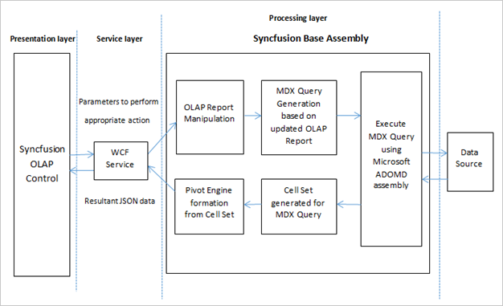
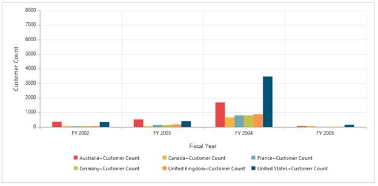
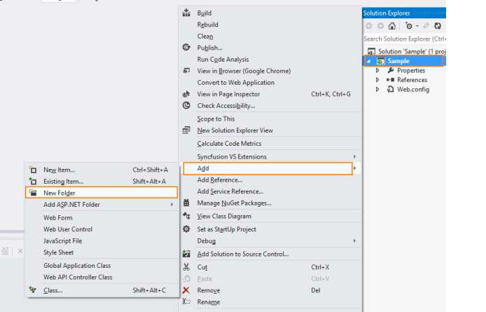
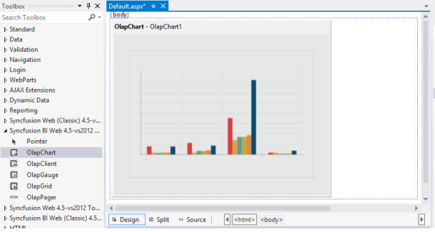

# Getting Started

This section explains briefly about how to create an OLAP Chart in your application with ASP.NET.

## Create your first OLAP Chart in ASP.NET

### Control Structure

The following screenshot shows the OLAP Chart for ASP.NET control.

 

### Syncfusion OLAP Controls – Architecture

The architecture gives a clear idea about how the control rendering takes place at client-side and all other analytical operations on each action takes place at server-side.

### Service for OLAP Controls

The primary reasons for using service in an OLAP processing are as follows:

1. DataSource Connectivity: You  can establish a connection between different cube data sources such as
1. Offline Cube
2. Online Cube (XML/A)
3. Cube within SQL Server (locally or through remote), you can move the connectivity related coding to service-side as it is impossible at client-side other than Online Cube (XML/A) option. Using service you can connect any type of cube data source without any limitation.

2. Cube Schema: As the connection is moved to service side, you obviously use Microsoft__ADOMD__assembly, to get the entire cube schema. Only with the cube schema the following details are achieved for control rendering.
4. Availability of cubes.
5. A complete end-to-end detail such as name, caption, unique name, parent information, child information, its properties etc. about the dimension, hierarchy, level, members are available in cube schema only. 
6. Localized information is also available in cube schema.  

3.  MDX Generator:  You can frame the MDX query using a  MDX generator in Syncfusion.Olap.Base assembly. To execute the framed MDX from the cube data source, you need to send framed MDX via Microsoft__ADOMD__assembly_._ The executed query is returned back in the form of cell set (contains values) that is converted to Pivot Engine and then to JSON data to render any OLAP controls.

OLAP Report: The OlapReport class in the Syncfusion.Olap.Base assembly holds the complete information about each axes such as column, row and slicer. Using OlapReport class you can maintain the dimension element, measure element, hierarchy name, level name as well as member information that is included and excluded.

As the OlapControl is the key for each and every operation, initially you need to serialize the OlapReport and send to client-side in a form of string.

When you perform any operation such as drill up/down, filtering, sorting etc., you need to send OlapReport from the client-side to the service in a de-serialized and updated format.

Further operations are carried with updated OlapReports only and you can send the updated OlapReport back to client-side with JSON data in a serialized format again. 

This process has the OlapReport always updated. You cannot operate serialized OlapReport in client-side and hence it is carried to service having its class in Syncfusion.Olap.Base assembly to perform the update operation_._

### Create an application

This section encompasses on how to configure the OLAP Chart component in an application. You can also learn how to pass the required data to OLAP Chart and to customize its various options according to your requirements. 

In the following example, the OLAP Chart component displays the customer count over different fiscal years against various geographical locations. This helps you to analyze the summarized data over different fiscal years.

 

Open Visual Studio and create a new project using by clicking New Project. Select the category Web and select the ASP.NET Empty Web Application template, and then click OK.

The following screenshot displays the Project Creation Wizard.

 

### Add Control in Application

1. Right-click on the project and select Add > New Folder.  Name the folder as olapchart.

 

2. Now right-click on the olapchart folder newly created and select Add > New Item.

 

3. Select Web Form and name it as Default.aspx.

 

4. Drag the OlapChart control from the Syncfusion BI Web Toolbox onto the Design page.

 

 

5. Enter the service URL value after dragging and dropping the control.

_NOTE: Instructions to create a service is explained briefly in the upcoming sections._

 

6. Initialize the control by using the following code example.

_Note: Define URL value, in order to fetch the data from the service. And initialize the default properties values as follows, to render the control appropriately._ 



<body>

    <form id="form1" runat="server">

    
   

     <ej:OlapChart ID="OlapChart1" runat="server" Url="../wcf/OlapChartService.svc">

       </ej:OlapChart>

    

    </form>

</body>


### Add References, Scripts, Styles and Control

#### Add References

1. In the Solution Explorer, right-click on the References folder, and then click Add Reference.

 

The following screenshot illustrates how to reference Syncfusion.Olap.Base.

 

2. Select the following assemblies: 
* Microsoft.AnalysisServices.AdomdClient.dll
* Syncfusion.Core.dll
* Syncfusion.Linq.Base.dll
* Syncfusion.EJ.dll
* Syncfusion.EJ.Olap.dll 
* Syncfusion.Olap.Base.dll
3. Click OK.

#### Add Scripts and Styles

Add the script files and CSS files in the <head> tag of the Default.aspx page.

_Note: 1. Use the following code example while adding scripts and styles_

_2. Same files can also acquire from the following location_ 

> _C:\Users\<UserName>\AppData\Local\Syncfusion\EssentialStudio\<Version>\JavaScript\assets\_

_3. Please download jquery.globalize.min.js from jQuery site to local machine and refer from the following code example._



<head>

<link href="http://cdn.syncfusion.com/13.1.0.21/js/web/flat-azure/ej.web.all.min.css" rel="stylesheet" />

</head>


### Add WCF service for OLAP Chart

#### Create WCF Services

1. Right-click on the project and select Add>New Folder.  Name the folder as wcf.
2. Now right-click the wcf folder created and select Add > New Item.  In the Add New Item window, select WCF Service and name it OlapChartService.svc
3. Click Add. 

 

#### Add service methods inside Interface

Add the following code example inside the IOlapChartService interface available in the IOlapChartService.cs file.



    [ServiceContract]

    public interface IOlapChartService

    {

        [OperationContract]

        Dictionary<string, object> InitializeChart(string action, string customObject);                [OperationContract]

        Dictionary<string, object> DrillChart(string action, string drilledSeries, string olapReport, string customObject);

    }


#### Add Namespaces

Add the following necessary namespaces to implement the service methods.


[C#]

using System;

using System.Collections.Generic;

using System.Linq;

using System.Runtime.Serialization;

using System.ServiceModel;

using System.Text;

using System.ServiceModel.Activation;

using Syncfusion.Olap.Manager;

using Syncfusion.Olap.Reports;

using Syncfusion.JavaScript.Olap;

using System.Web.Script.Serialization;


#### Create Class in Service file

Create the OlapChartService class to implement the service methods. Inherit the class from the IOlapChartService interface that is created automatically when any new service is added.


[C#]

namespace Sample

{

    [AspNetCompatibilityRequirements(RequirementsMode = AspNetCompatibilityRequirementsMode.Allowed)]

    public class OlapChartService : IOlapChartService

    {

    }

}


#### Implement Service Methods

Add the following methods to the service that is invoked for any server-side operations performed in OlapChart.

1. Initialize the OlapCharts helper class and OlapDataManager with appropriate connection string. 


[C#]

JavaScriptSerializer serializer = new JavaScriptSerializer();

OlapChart htmlHelper = new OlapChart();        

static string connectionString = "Data Source=http://bi.syncfusion.com/olap/msmdpump.dll; Initial Catalog=Adventure Works DW 2008 SE;";   

OlapDataManager DataManager = new OlapDataManager(connectionString);


2. Initialize the following service methods.



//This method provides the required information from the server side for initializing the OlapChart.

         public Dictionary<string, object> InitializeChart(string action, string customObject)

        {

            OlapDataManager DataManager = null;

            dynamic customData = serializer.Deserialize<dynamic>(customObject.ToString());

                DataManager = new OlapDataManager(connectionString); 

            DataManager.SetCurrentReport(CreateOlapReport());

            return htmlHelper.GetJsonData(action, DataManager);

        }

//This method provides the required information from the server side while drill up/down operation is performed in OlapChart.

        public Dictionary<string, object> DrillChart(string action, string drilledSeries, string olapReport)

        {

            DataManager.SetCurrentReport(Utils.DeserializeOlapReport(olapReport)); 

dynamic customData = serializer.Deserialize<dynamic>(customObject.ToString());            

            return htmlHelper.GetJsonData(action, DataManager, drilledSeries);

        }

//This method carries the information about the default report which would be rendered within OlapChart initially. 

        private OlapReport CreateOlapReport()

        {

            OlapReport olapReport = new OlapReport();

            olapReport.Name = "Default Report";

            olapReport.CurrentCubeName = "Adventure Works";

            DimensionElement dimensionElementColumn = new DimensionElement();

            dimensionElementColumn.Name = "Customer";

            dimensionElementColumn.AddLevel("Customer Geography", "Country");

            MeasureElements measureElementColumn = new MeasureElements();

            measureElementColumn.Elements.Add(new MeasureElement { Name = "Customer Count" });

            DimensionElement dimensionElementRow = new DimensionElement();

            dimensionElementRow.Name = "Date";

            dimensionElementRow.AddLevel("Fiscal", "Fiscal Year");

            olapReport.SeriesElements.Add(dimensionElementRow);

            olapReport.CategoricalElements.Add(dimensionElementColumn);

            olapReport.CategoricalElements.Add(measureElementColumn);

            return olapReport;

        }


#### Configure Web.Config

1. You can expose services through the properties such as binding, contract and address etc., using an endpoint. In your application the service name is "Sample.OlapChartService" where "OlapChartService" is the service class name and “Sample" is the namespace name where service class appears.

The following are the properties that meet the appropriate endpoint.  

* contract: This property indicates the contract of the endpoint is exposing. Here you are referring IOlapChartService contract and hence it is "Sample.IOlapChartService".
* binding: In your application, you use webHttpBinding to post and receive the requests and responses between the client-end and the service-end.
* behaviorConfiguration: This property contains the name of the behavior to be used in the endpoint. endpointBehaviors are illustrated as follows


[web.config]

<system.serviceModel>

    <services>

      <service name="Sample.OlapChartService">

        <endpoint address="" behaviorConfiguration="Sample.OlapChartServiceAspNetAjaxBehavior"

          binding="webHttpBinding" contract="Sample.IOlapChartService" />

      </service>

    </services>

</system.serviceModel>


2. The endpointBehaviors contain all the behaviors for an endpoint. You can link each endpoint to the respective behavior only using this name property. In the following code example "Sample.OlapChartServiceAspNetAjaxBehavior" points the OlapChartService class under the namespace Sample in OlapChartService.svc.cs file that is the appropriate behavior for the endpoint. 


[web.config]

<system.serviceModel>

    <behaviors>

      <endpointBehaviors>

        <behavior name="Sample.OlapChartServiceAspNetAjaxBehavior">

          <enableWebScript />

        </behavior>

      </endpointBehaviors>

    </behaviors>

</system.serviceModel>


> 3. Register the assembly in web.config file by adding the following code example.



<system.web>

      <compilation debug="true" targetFramework="4.5" >

        <assemblies>

          <add assembly="Syncfusion.EJ, Version=X.X.X.X, Culture=neutral, PublicKeyToken=3d67ed1f87d44c89" />

          <add assembly="Syncfusion.EJ.Olap, Version=X.X.X.X, Culture=neutral, PublicKeyToken=3d67ed1f87d44c89" />

           <add assembly="Syncfusion.Olap.Base, Version=X.X.X.X, Culture=neutral, PublicKeyToken=3D67ED1F87D44C89"/>

        </assemblies>

      </compilation>

 </system.web> 


_Note: x.x.x.x in the above code example refers to the current version of the Essential Studio running in your system._

> 4. Register the namespace in web.config file by adding the following codes.



<system.web>

   <pages validateRequest="false">

      <controls>

          <add  namespace="Syncfusion.JavaScript.Web.Olap" assembly="Syncfusion.EJ.Olap, Version=X.X.X.X, Culture=neutral, PublicKeyToken=3d67ed1f87d44c89" tagPrefix="ej"/>

      </controls>

   </pages>

</system.web> 


_Note: In this example, “Sample” indicates the name of the project and “_OlapChartService_” indicates the name of the WCF service created. And x.x.x.x in the above code example refers to the current version of the Essential Studio running in your system._

This getting started tutorial gives you an overview of OlapChart, its architecture, and process flow, how to configure and integrate with a VS application using a simple example.

 

