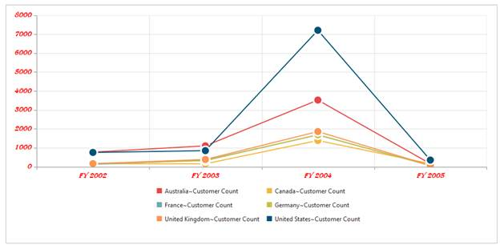

## Label

Label represents the text on the axis data points in the Chart. Each axis data point are represented by separate label text information in order to provide precise information about each points. Label text is displayed in a customizable format.

### Label font and color customization 

Font style and color of the label text is customized with the help of font and color properties within its respective axis.

 

<ej:OlapChart ID="OlapChart1" runat="server" Url="../wcf/OlapChartService.svc" Title-Text="OLAP Chart in Essential Studio">

     <primaryxaxis Font-Color="red" Font-FontFamily="Algerian" Font-FontStyle="Italic" Font-FontSize="14px" Font-Opacity=1 Font-FontWeight="lighter"/>

     <primaryyaxis Font-Color="red" Font-FontFamily="Algerian" Font-FontStyle="Italic" Font-FontSize="14px" Font-Opacity=1 Font-FontWeight="lighter"/>

</ej:OlapChart>



  

### Rotating Axis Labels

You can rotate the labels to desired angle. The axis labels are rendered in the degree specified in the label rotation property.

 

<ej:OlapChart ID="OlapChart1" runat="server" Url="../wcf/OlapChartService.svc" Title-Text="OLAP Chart in Essential Studio">

     <primaryxaxis labelRotation=45/>

</ej:OlapChart>



  

