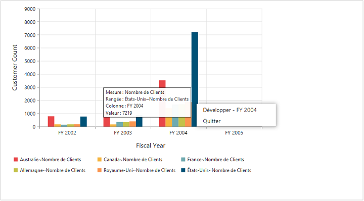

# Localization

## Localization in OlapChart

We can localize the OlapChart controls text with a collection of localized strings using **"ej.olap.OlapChart.locale"** for different cultures. By default, the OlapChart control is localized in **“en-US”.**

Following code example illustrates on how to localize OlapChart based on **“French”** culture.



<html>
//...

<body>
    <ej:OlapChart ID="OlapChart1" runat="server" Url="../wcf/OlapChartService.svc" Locale="fr-FR" ClientIDMode="Static">
    </ej:OlapChart>
    
</body>

</html>



<table>
<tr>
<th>
KEYWORDS</th><th>
VALUES</th></tr>
<tr>
<td>
Measure</td><td>
“Mesure”</td></tr>
<tr>
<td>
Row</td><td>
"Rangée "</td></tr>
<tr>
<td>
Column</td><td>
"Colonne”</td></tr>
<tr>
<td>
Value</td><td>
" Valeur "</td></tr>
<tr>
<td>
Expand</td><td>
" Développer "</td></tr>
<tr>
<td>
Collapse</td><td>
" Effondrement "</td></tr>
<tr>
<td>
Exit</td><td>
“Quitter "</td></tr>
<tr>
<td>
MDXqueryExecutionFailed</td><td>
"L'exécution de la requête MDX pas "</td></tr>
<tr>
<td>
PreparingAndExecutingMDXquery</td><td>
"La préparation et l'exécution de la requête MDX "</td></tr>
<tr>
<td>
MDXqueryExecutedSuccessfully</td><td>
" MDX requête exécutée avec succès "</td></tr>
<tr>
<td>
RenderingSucceeded</td><td>
“Rendu réussi "</td></tr>
<tr>
<td>
RenderingStarted</td><td>
“Rendu commencé ",</td></tr>
<tr>
<td>
RenderingFailed</td><td>
"Rendant pas "</td></tr>
</table>

## Localization and Globalization of Cube Info

Content displayed within the OlapChart control are obtained from the OLAP Cube. So following are the steps that needs to be done to get the localized and globalized Cube content.

* To get the localized string based on different cultures, from OLAP Cube, we need to set **"Locale Identifier"** in the connection string to a specific culture. 
* To bind the globalized content in PivotGrid control, we need to set **"Culture"** and **"OverrideDefaultFormatStrings"** properties in OlapDataManager class to a specific culture. 
 
 

//1036 refers to “fr-FR” culture.
string connectionString = "Data Source=localhost; Initial Catalog=Adventure Works DW; Locale Identifier=1036;";
DataManager = new OlapDataManager(connectionString);
DataManager.Culture = new System.Globalization.CultureInfo(1036);
DataManager.OverrideDefaultFormatStrings = true;



 